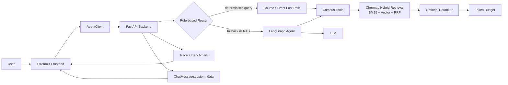

# Campus AI Agent - 校园场景智能助理

Campus AI Agent 是一个面向校园场景的 AI Agent 项目，支持课程查询、校园活动查询、制度 RAG 问答、学习计划生成与 MCP 工具暴露。

它不是一个只展示对话效果的简单 Demo：项目围绕**可观测、低延迟、可信 RAG、低 token 成本、模型可靠性、多轮上下文管理和容器化部署**完成了多阶段工程优化，并以 Trace、固定问题集 Benchmark 和 pytest 测试安全网验证结果。

| 可量化结果 | Before | After |
| --- | ---: | ---: |
| 课程 Fast Path 平均请求耗时 | `3535.00 ms` | `1.19 ms` |
| 课程 Fast Path 平均 total tokens | `5519.00` | `0.00` |
| RAG Retriever Cache 同题平均检索耗时 | `16876.33 ms` | `38.21 ms` |
| RAG Token Budget 平均 prompt tokens | `10809.60` | `10680.60` |

详细技术复盘与数据口径见 [Final Optimization Report](docs/optimization/final_optimization_report.md)。

## Project Overview

| Capability | Description |
| --- | --- |
| 课程查询 | 根据星期、时间段或课程名查询本地课程表；明确查询可命中 Fast Path |
| 校园活动查询 | 根据关键词、日期范围、类型和适合人群查询校园活动；明确查询可命中 Fast Path |
| 校园制度 RAG | 基于制度知识库回答请假、奖学金、宿舍、考试等问题，并提供来源引用与 no-answer |
| 学习计划生成 | 结合课程表与学生画像，生成避开课程时间的结构化学习安排 |
| 多轮对话 | 通过 checkpoint 恢复会话历史，并限制进入模型的历史上下文规模 |
| MCP Server Adapter | 将课程、活动、制度查询三个只读工具通过 MCP stdio server 暴露给外部 Agent |
| Docker 本地部署 | 通过 FastAPI backend + Streamlit frontend 的双服务 compose 方案复现运行环境 |

## Architecture



一次请求的主链路为：

```text
Streamlit -> AgentClient -> FastAPI -> Rule-based Router / LangGraph Agent
          -> Tools / RAG / LLM -> Trace + custom_data -> Streamlit
```

确定性的课程和活动查询可在 Router 判定并完成参数解析后，直接调用原生工具并返回模板化结果；无法可靠解析的问题继续进入原 Agent 链路。

## Tech Stack

| Category | Technology |
| --- | --- |
| Language & Runtime | Python 3.11 |
| Backend / UI | FastAPI, Streamlit |
| Agent Orchestration | LangGraph, LangChain |
| RAG Storage | Chroma |
| Retrieval | BM25, Vector Retrieval, Reciprocal Rank Fusion (RRF) |
| Ranking / Context | Optional RAG Reranker, Token Budget |
| Schema / Settings | Pydantic, pydantic-settings |
| Package Management | uv |
| Deployment | Docker, Docker Compose |
| Tool Interoperability | MCP Python SDK |
| Testing | pytest |

## Core Features

### Course & Event Fast Path

普通 Agent 对任何问题都调用 LLM，成本并不总是合理。项目为明确的课程查询和校园活动查询实现了保守的规则路由与参数解析：

- 课程查询直接调用 `get_course_schedule`；
- 活动查询直接调用 `get_campus_events`；
- Fast Path 输出使用统一 Markdown 模板；
- 无法解析参数、意图不明确或普通聊天仍 fallback 到原 Agent；
- Fast Path 继续写入 Trace，但 `llm_time_ms` 与 token 消耗为 `0`。

### Campus Policy RAG

校园制度问答强调“有依据才回答”。RAG 链路包括：

```text
Markdown Knowledge Base
-> Cleaning + Heading-aware Chunking + Metadata
-> Chroma Vector Retrieval / Hybrid Retrieval
-> Optional Reranker
-> No-answer + Source Citation
-> Token Budget
-> RAG Agent Answer
```

关键可信度机制：

- 无检索结果或低相关结果直接返回 no-answer；
- 有效回答保留 `source` 与 `chunk_id`；
- chunk metadata 包含 `section`、`heading_path` 与 `policy_type`；
- Hybrid Retrieval 结合向量语义召回与 BM25 关键词召回，并使用 RRF 融合排序；
- Reranker 默认关闭，可选开启并在失败时安全降级；
- Token Budget 控制进入 LLM 的 evidence context，不丢失来源信息。

### Study Plan

学习计划工具读取学生画像与课程表，按目标、天数和可用时间生成结构化学习计划。计划安排会参考既有课程时间，避免把学习任务简单叠加在上课时段上；它属于规则与数据驱动能力，而不是依赖模型自由编写日程。

### MCP Server Adapter

项目提供旁路 MCP Server Adapter，将已有只读能力包装为标准 MCP tools：

| MCP Tool | Native Capability |
| --- | --- |
| `get_course_schedule` | 课程表查询 |
| `get_campus_events` | 校园活动查询 |
| `query_campus_policy` | 校园制度 RAG 查询 |

MCP server 使用 `stdio` transport，供外部 MCP Client 或 Agent 启动复用；它不替换 FastAPI、Streamlit 或主 LangGraph 流程，也不暴露写文件、shell 执行或其他副作用工具。

## Optimization Highlights

| Optimization | Problem Solved | Key Idea | Validation |
| --- | --- | --- | --- |
| Agent Trace + Benchmark | 优化没有可比证据 | JSONL Trace 记录 latency、tokens、tool/RAG/model 状态；导出 Markdown benchmark | Trace tests + benchmark runs |
| Rule-based Router + Fast Path | 确定性查询仍调用 LLM | 明确课程/活动问题直接调用 native tools，解析失败回退 Agent | Router/service tests + course benchmark |
| RAG Retriever Cache | 重复初始化 embedding / Chroma / retriever | 缓存可复用资源，每次 query 仍真实检索 | Cache tests + same-query benchmark |
| No-answer + Source Citation | 无依据时可能编造制度 | 空/低相关召回在工具层拒答；有效结果保留 `source` / `chunk_id` | Tool/RAG agent tests |
| Heading-aware Chunking + Metadata | Chunk 结构与来源信息不足 | Markdown 清洗、按标题切分，增加 `section` / `policy_type` 等字段 | Build/chunk/retrieval tests |
| Hybrid Retrieval: BM25 + Vector + RRF | 强关键词召回不稳定 | 语义与关键词双路召回，使用排名融合并按 chunk 去重 | Hybrid tests + golden questions |
| RAG Reranker | 候选证据顺序缺少精选层 | 可选轻量重排，在 Hybrid 与 Token Budget 之间工作，异常回退原顺序 | Reranker tests + top-k source checks |
| RAG Token Budget | Evidence context 与 token 不可控 | 限制文档数、单 chunk 与总 context，保留 citations | Budget tests + token benchmark |
| Model Timeout / Retry / Fallback | 外部模型故障缺少恢复路径 | 配置化 timeout/retry；主模型失败时可尝试一次不同候补模型 | Fake/mock model tests |
| History Trimming | 多轮对话上下文无限增长 | 历史接口可筛选；模型仅保留最近消息窗口 | Multi-turn history tests |
| `ChatMessage.custom_data` | 文本回答难承载结构化来源与指标 | 兼容透传 citations、metrics、tool execution 与 fallback 信息 | Serialization + SSE tests |
| MCP Server Adapter | 领域工具难被外部 Agent 复用 | 只读旁路 adapter，复用原工具函数并提供安全 envelope | MCP tool consistency tests |
| Docker Deployment | 本地环境复现成本高 | Python 3.11 + uv 统一镜像，backend/frontend 双服务编排 | Compose structure check + run guide |

## Quantitative Results

所有结果均来自 `docs/optimization/benchmark_runs/` 与配套对比文档；缺少严格 before/after 样本的能力不推断提升比例。

| Optimization | Metric | Before | After | Result |
| --- | --- | ---: | ---: | --- |
| Course Fast Path | Average `total_latency_ms`, same 5 questions | `3535.00 ms` | `1.19 ms` | 下降 `99.97%` |
| Course Fast Path | Average `total_tokens`, same 5 questions | `5519.00` | `0.00` | 每题仍保留课程工具调用 |
| Event Fast Path | Two recorded after samples | - | `1.21 ms` / `0.85 ms` | 两条均为 `0` LLM tokens；无同题 before 样本 |
| RAG Retriever Cache | Average `retrieval_time_ms`, 2 overlapping questions | `16876.33 ms` | `38.21 ms` | 下降约 `99.8%` |
| RAG Retriever Cache | Average `total_latency_ms`, 2 overlapping questions | `24804.17 ms` | `7627.18 ms` | 下降约 `69.3%` |
| RAG Token Budget | Average `prompt_tokens`, same 5 RAG questions | `10809.60` | `10680.60` | 减少 `129.00` (`1.2%`) |
| RAG Token Budget | Average `total_tokens`, same 5 RAG questions | `11308.20` | `11113.20` | 减少 `195.00` (`1.7%`) |
| RAG Reranker | Before/after benchmark | - | - | 已通过排序与黄金来源测试，待采集独立 benchmark |

召回质量观察：

- Retriever Cache 后，“考试作弊”仍召回 `exam_policy.md`；
- Retriever Cache 后，“生病缺考”仍召回 `leave_policy.md` 与 `exam_policy.md`；
- Token Budget 五题对比中核心制度来源仍保留；
- Reranker 开启后的测试验证正确制度来源仍位于 top-k。

最近一次已验证全量测试结果：

```text
326 passed, 2 skipped, 9 warnings
```

更完整的数据口径与限制说明请阅读：

- [Final Optimization Report](docs/optimization/final_optimization_report.md)
- [Course Fast Path Comparison](docs/optimization/course_fast_path_comparison.md)
- [RAG Retriever Cache Comparison](docs/optimization/rag_retriever_cache_comparison.md)
- [RAG Token Budget Comparison](docs/optimization/rag_token_budget_comparison.md)

## How to Run Locally

### 1. Prepare Environment

```bash
cp .env.example .env
# Edit .env and configure at least one model provider, for example OPENAI_API_KEY

uv sync --frozen
```

如需重新构建校园制度向量库：

```bash
uv run python scripts/build_campus_kb.py
```

### 2. Start FastAPI Backend

```bash
uv run python src/run_service.py
```

FastAPI docs: [http://localhost:8080/docs](http://localhost:8080/docs)

### 3. Start Streamlit Frontend

在另一个终端执行：

```bash
uv run streamlit run src/streamlit_app.py --server.port=8501
```

Streamlit UI: [http://localhost:8501](http://localhost:8501)

### 4. Run Tests

```bash
uv run pytest
```

## Run with Docker

项目提供最小双服务 Docker 方案。由于仓库还保留原有 `compose.yaml`，请显式选择新的 `docker-compose.yml`：

```bash
cp .env.example .env
# Edit .env and configure at least one model provider
mkdir -p data logs

docker compose -f docker-compose.yml build
docker compose -f docker-compose.yml up
```

| Service | URL |
| --- | --- |
| FastAPI backend | [http://localhost:8080/docs](http://localhost:8080/docs) |
| Streamlit frontend | [http://localhost:8501](http://localhost:8501) |

说明：

- `./data` 挂载到容器，用于本地数据、Chroma 向量库与 SQLite checkpoint；
- `./logs` 挂载到容器，用于保存 Agent Trace；
- `.env` 只读挂载，不写入镜像；
- 首次 RAG 查询若需要加载或下载 HuggingFace embedding 模型，可能较慢；
- 当前执行环境未验证实际容器启动结果，完整命令与边界见 [Docker Deployment](docs/deployment/docker_deployment.md)。

## Run the MCP Server

MCP adapter 使用 stdio transport，应由 MCP client 拉起，而不是作为 HTTP 服务访问。本地手动启动命令：

```bash
PYTHONPATH=src uv run python -m mcp_server.server
```

更多说明见 [MCP Integration](docs/optimization/mcp_integration.md)。

## Project Structure

```text
src/
  agents/              # LangGraph agents and campus native tools
  core/                # settings, LLM, trace, router, token budget, templates
  rag/                 # document cleaning, chunking, hybrid retrieval, reranker
  memory/              # SQLite / Postgres / Mongo checkpoint and store adapters
  mcp_server/          # read-only MCP tool adapter
  schema/              # request/response schemas and ChatMessage
  service/             # FastAPI endpoints and message handling
  streamlit_app.py     # frontend application
scripts/
  build_campus_kb.py   # build local campus policy vector store
  export_benchmark_run.py
data/
  knowledge_base/      # source policy Markdown documents
  vector_store/        # local Chroma persistence
docs/
  optimization/        # phase notes, comparisons, final report
  deployment/          # Docker deployment guide
tests/                 # safety nets and retrieval-quality evaluation
```

## Documentation

| Document | Purpose |
| --- | --- |
| [Final Optimization Report](docs/optimization/final_optimization_report.md) | 完整工程优化路线、指标和面试复盘 |
| [Performance Baseline](docs/optimization/performance_baseline.md) | Phase 1 Trace 与 baseline 设计 |
| [Hybrid Retrieval](docs/optimization/hybrid_retrieval.md) | BM25 + Vector + RRF 设计 |
| [RAG Reranker](docs/optimization/rag_reranker.md) | 可选 reranker 设计与验证边界 |
| [Model Fallback Strategy](docs/optimization/model_fallback_strategy.md) | 模型可靠性策略 |
| [History Memory Optimization](docs/optimization/history_memory_optimization.md) | 多轮历史与上下文裁剪 |
| [Schema custom_data Extension](docs/optimization/schema_custom_data_extension.md) | 结构化响应扩展 |
| [MCP Integration](docs/optimization/mcp_integration.md) | 只读工具 MCP 暴露 |
| [Docker Deployment](docs/deployment/docker_deployment.md) | Docker 本地运行方案 |

## Interview Summary

这个项目最值得讨论的部分，不是“调用了一个大模型”，而是完整走通了从观察问题到验证优化的工程路径：

1. 用 Trace 与 Benchmark 建立测量基础；
2. 用 Fast Path 为确定性查询去掉不必要 LLM 成本；
3. 用缓存、Hybrid、Reranker 与 Token Budget 分层优化 RAG；
4. 用 no-answer、来源引用与 `custom_data` 强化可信度与可解释性；
5. 用 fallback 与 history trimming 提升可靠性和长期会话可控性；
6. 用 MCP 与 Docker 将系统能力转化为可复用、可交付的工程接口。

## License

This project is licensed under the MIT License. See [LICENSE](LICENSE) for details.
