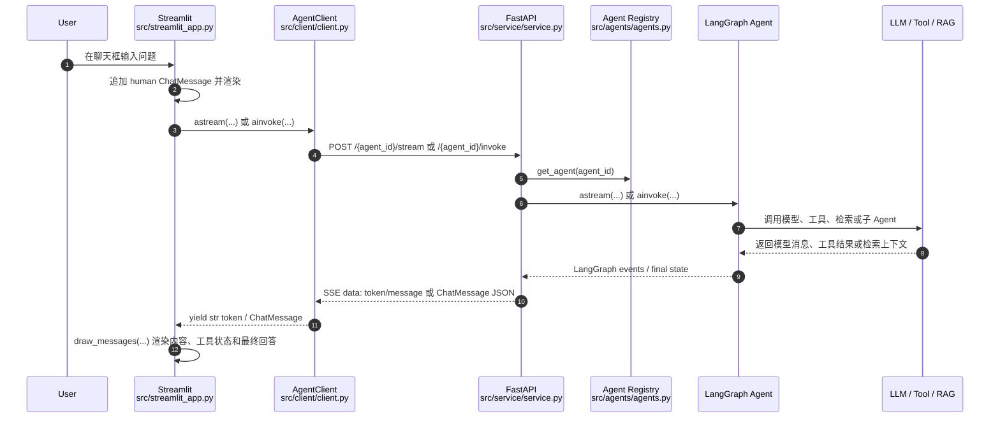

# Request Flow

本文档说明一次用户提问从 Streamlit 前端输入，到 FastAPI 后端，再到 LangGraph Agent 执行，最后返回前端展示的完整调用链路。

## 总览



## 1. Streamlit 前端输入入口

用户输入处理在 `src/streamlit_app.py` 的 `main()` 中。

- `main()` 初始化页面、用户 `user_id`、`AgentClient`、`thread_id`、侧边栏模型和 Agent 选择。
- 用户文本输入来自 `st.chat_input()`；如果启用了语音能力，则来自 `voice.get_chat_input()`。
- 收到输入后，代码先把用户问题追加到 `st.session_state.messages`，并用 `st.chat_message("human").write(...)` 显示。
- 之后根据 `use_streaming` 开关选择流式或非流式调用后端。

关键代码位置：

- `src/streamlit_app.py:83` 到 `src/streamlit_app.py:97`：创建并缓存 `AgentClient`。
- `src/streamlit_app.py:134` 到 `src/streamlit_app.py:144`：侧边栏选择模型、Agent、是否流式。
- `src/streamlit_app.py:249` 到 `src/streamlit_app.py:264`：读取用户输入并调用 `agent_client.astream(...)`。
- `src/streamlit_app.py:279` 到 `src/streamlit_app.py:292`：非流式调用 `agent_client.ainvoke(...)` 并渲染结果。

默认情况下 `use_streaming = st.toggle("Stream results", value=True)`，因此一次普通提问优先走流式链路。

## 2. 前端调用后端的 client

前端通过 `src/client/client.py` 中的 `AgentClient` 调用 FastAPI。

初始化时：

- `AgentClient.__init__()` 保存 `base_url` 和认证信息。
- `retrieve_info()` 请求 `GET /info`，读取可用 Agent、可用模型、默认 Agent 和默认模型。
- 如果前端未显式选择 Agent，则 `AgentClient.agent` 会设置为后端返回的 `default_agent`。

提问时：

- 流式：`AgentClient.astream()` 构造 `StreamInput`，请求 `POST /{agent}/stream`，逐行解析 SSE。
- 非流式：`AgentClient.ainvoke()` 构造 `UserInput`，请求 `POST /{agent}/invoke`，解析单个 `ChatMessage`。

关键代码位置：

- `src/client/client.py:60` 到 `src/client/client.py:73`：请求 `/info` 并设置默认 Agent。
- `src/client/client.py:86` 到 `src/client/client.py:130`：`ainvoke()` 请求 `/{agent}/invoke`。
- `src/client/client.py:177` 到 `src/client/client.py:200`：`_parse_stream_line()` 解析 `data: ...` SSE 行。
- `src/client/client.py:259` 到 `src/client/client.py:317`：`astream()` 请求 `/{agent}/stream` 并 yield `ChatMessage | str`。

## 3. FastAPI 接口定义

后端接口定义在 `src/service/service.py`。

主要接口：

- `GET /info`：返回服务元数据，包括可用 Agent、模型、默认 Agent、默认模型。
- `POST /{agent_id}/invoke` 和 `POST /invoke`：非流式调用 Agent，返回最终 `ChatMessage`。
- `POST /{agent_id}/stream` 和 `POST /stream`：流式调用 Agent，返回 `text/event-stream`。
- `POST /history`：根据 `thread_id` 读取历史消息。
- `POST /feedback`：提交反馈到 LangSmith。

关键代码位置：

- `src/service/service.py:103` 到 `src/service/service.py:104`：创建 `FastAPI` 和带认证依赖的 `APIRouter`。
- `src/service/service.py:107` 到 `src/service/service.py:116`：`/info`。
- `src/service/service.py:176` 到 `src/service/service.py:214`：`/invoke`。
- `src/service/service.py:217` 到 `src/service/service.py:327`：流式 `message_generator()`。
- `src/service/service.py:351` 到 `src/service/service.py:372`：`/stream`。
- `src/service/service.py:395` 到 `src/service/service.py:411`：`/history`。

服务启动生命周期在 `lifespan()` 中初始化 checkpointer、store，并加载所有 Agent；随后把 checkpointer 和 store 注入到每个 Agent graph 上，用于对话线程记忆和跨会话存储。

## 4. 请求体和响应体 schema

schema 定义在 `src/schema/schema.py`。

| 场景 | 请求 schema | 响应 schema |
| --- | --- | --- |
| `GET /info` | 无 | `ServiceMetadata` |
| `POST /invoke` | `UserInput` | `ChatMessage` |
| `POST /stream` | `StreamInput` | SSE 文本流，事件内容为 `token`、`message`、`error` 或 `[DONE]` |
| `POST /history` | `ChatHistoryInput` | `ChatHistory` |
| `POST /feedback` | `Feedback` | `FeedbackResponse` |

核心字段：

- `UserInput`：`message`、`model`、`thread_id`、`user_id`、`agent_config`。
- `StreamInput`：继承 `UserInput`，额外包含 `stream_tokens`。
- `ChatMessage`：`type`、`content`、`tool_calls`、`tool_call_id`、`run_id`、`response_metadata`、`custom_data`。
- `ServiceMetadata`：`agents`、`models`、`default_agent`、`default_model`。

关键代码位置：

- `src/schema/schema.py:22` 到 `src/schema/schema.py:37`：`ServiceMetadata`。
- `src/schema/schema.py:40` 到 `src/schema/schema.py:67`：`UserInput`。
- `src/schema/schema.py:70` 到 `src/schema/schema.py:76`：`StreamInput`。
- `src/schema/schema.py:91` 到 `src/schema/schema.py:123`：`ChatMessage`。
- `src/schema/schema.py:165` 到 `src/schema/schema.py:175`：`ChatHistoryInput` 和 `ChatHistory`。

流式响应不是 Pydantic response model，而是 `StreamingResponse`。后端发送的 SSE 形态如下：

```text
data: {"type": "token", "content": "..."}

data: {"type": "message", "content": {...ChatMessage...}}

data: [DONE]
```

前端 client 将 `type=token` 转成字符串 token，将 `type=message` 转成 `ChatMessage`。

## 5. 后端如何选择和调用 Agent

Agent 注册表在 `src/agents/agents.py`。

- `DEFAULT_AGENT = "research-assistant"`。
- `agents` 字典把 `agent_id` 映射到具体 LangGraph graph 或 lazy agent。
- `/info` 通过 `get_all_agent_info()` 暴露所有 Agent 给前端。
- 前端侧边栏把用户选择写入 `agent_client.agent`。
- `AgentClient` 请求路径包含该 Agent：`/{self.agent}/stream` 或 `/{self.agent}/invoke`。
- FastAPI 路由从 URL 中接收 `agent_id`，再调用 `get_agent(agent_id)` 取出 graph。

关键代码位置：

- `src/agents/agents.py:19`：默认 Agent。
- `src/agents/agents.py:34` 到 `src/agents/agents.py:64`：Agent 注册表。
- `src/agents/agents.py:67` 到 `src/agents/agents.py:85`：lazy load 和 `get_agent()`。
- `src/service/service.py:192`：非流式 `get_agent(agent_id)`。
- `src/service/service.py:225`：流式 `get_agent(agent_id)`。

在真正调用 Agent 之前，后端会先执行 `_handle_input()`：

- 生成 `run_id`。
- 取请求中的 `thread_id` 和 `user_id`，没有则生成新的 UUID。
- 把 `thread_id`、`user_id`、`model`、`agent_config` 放入 `RunnableConfig.configurable`。
- 如果启用 Langfuse tracing，则添加 callback。
- 查询当前 graph state，如果发现 LangGraph interrupt，则把本次输入包装成 `Command(resume=...)`；否则包装成 `{"messages": [HumanMessage(...)]}`。

关键代码位置：`src/service/service.py:119` 到 `src/service/service.py:173`。

## 6. Agent 执行中可能调用的 LLM、Tool 或 RAG

### LLM 选择

所有主要 Agent 都通过 `core.get_model(...)` 获取模型。模型优先来自请求体中的 `model`，否则使用 `settings.DEFAULT_MODEL`。

`src/core/llm.py` 根据枚举类型选择具体 LangChain chat model：

- OpenAI：`ChatOpenAI`
- OpenAI-compatible / DeepSeek / OpenRouter：兼容 OpenAI API 的 `ChatOpenAI`
- Azure OpenAI：`AzureChatOpenAI`
- Anthropic：`ChatAnthropic`
- Google Gemini：`ChatGoogleGenerativeAI`
- Vertex AI：`ChatVertexAI`
- Groq：`ChatGroq`
- AWS Bedrock：`ChatBedrock`
- Ollama：`ChatOllama`
- Fake：测试用 `FakeToolModel`

关键代码位置：`src/core/llm.py:67` 到 `src/core/llm.py:140`。

### 默认 research-assistant

默认 Agent 是 `research-assistant`。它是一个 LangGraph `StateGraph`：

1. `guard_input`：使用 `Safeguard` 检查 prompt injection 或不安全输入。
2. 如果 unsafe，进入 `block_unsafe_content` 并结束。
3. 如果 safe，进入 `model`。
4. `model` 调用 `get_model(...)`，并通过 `model.bind_tools(tools)` 绑定工具。
5. 如果 AIMessage 中有 `tool_calls`，进入 `tools` 节点执行工具。
6. 工具执行后回到 `model`，直到没有工具调用后结束。

可用工具：

- `WebSearch`：`DuckDuckGoSearchResults`。
- `Calculator`：本地 `numexpr` 计算器。
- `Weather`：如果配置了 `OPENWEATHERMAP_API_KEY`，添加 `OpenWeatherMapQueryRun`。

关键代码位置：

- `src/agents/research_assistant.py:28` 到 `src/agents/research_assistant.py:37`：工具列表。
- `src/agents/research_assistant.py:54` 到 `src/agents/research_assistant.py:60`：模型绑定工具和 system prompt。
- `src/agents/research_assistant.py:70` 到 `src/agents/research_assistant.py:85`：调用模型。
- `src/agents/research_assistant.py:99` 到 `src/agents/research_assistant.py:142`：LangGraph 节点和条件边。
- `src/agents/tools.py:10` 到 `src/agents/tools.py:42`：`Calculator`。

### rag-assistant

`rag-assistant` 的结构与 `research-assistant` 相似，但工具只有 `Database_Search`。

- `Database_Search` 在 `src/agents/tools.py` 中通过 `OpenAIEmbeddings` 加载本地 Chroma 向量库 `./chroma_db`。
- 检索器 `as_retriever(search_kwargs={"k": 5})` 返回相关文档。
- 工具把检索到的 `page_content` 拼成上下文返回给模型。
- Agent system prompt 要求只基于数据库内容回答。

关键代码位置：

- `src/agents/rag_assistant.py:30`：工具列表。
- `src/agents/rag_assistant.py:50` 到 `src/agents/rag_assistant.py:56`：模型绑定 `Database_Search`。
- `src/agents/rag_assistant.py:95` 到 `src/agents/rag_assistant.py:137`：LangGraph 节点和条件边。
- `src/agents/tools.py:50` 到 `src/agents/tools.py:80`：Chroma 检索逻辑。

### knowledge-base-agent

`knowledge-base-agent` 是另一条 RAG 路径，使用 AWS Bedrock Knowledge Base：

- `retrieve_documents` 根据最后一条 human message 调用 `AmazonKnowledgeBasesRetriever`。
- `prepare_augmented_prompt` 把文档格式化为 `kb_documents`。
- `model` 把检索内容注入 system prompt 后调用模型。

关键代码位置：

- `src/agents/knowledge_base_agent.py:27` 到 `src/agents/knowledge_base_agent.py:44`：创建 AWS KB retriever。
- `src/agents/knowledge_base_agent.py:85` 到 `src/agents/knowledge_base_agent.py:121`：检索文档。
- `src/agents/knowledge_base_agent.py:124` 到 `src/agents/knowledge_base_agent.py:154`：增强 prompt 并调用模型。
- `src/agents/knowledge_base_agent.py:157` 到 `src/agents/knowledge_base_agent.py:174`：graph 流程。

### 其他 Agent 分支

- `chatbot`：简单调用 `get_model(...).ainvoke(messages)`，并保存历史。
- `interrupt-agent`：可触发 LangGraph interrupt；后端 `_handle_input()` 会在后续输入中使用 `Command(resume=...)` 恢复执行。
- `langgraph-supervisor-agent` / `langgraph-supervisor-hierarchy-agent`：使用 supervisor 和 sub-agent，流式输出中会出现 handoff tool calls。
- `bg-task-agent`：通过 LangGraph custom stream 写出任务状态，前端按 `custom` 消息渲染任务状态。
- `github-mcp-agent`：lazy load GitHub MCP tools，使用 `create_agent(model, tools=...)` 构建 Agent。

## 7. 结果如何返回并展示到 Streamlit

### 流式路径

1. Streamlit 调用 `agent_client.astream(...)`。
2. `AgentClient.astream()` 请求 `POST /{agent}/stream`。
3. FastAPI `stream()` 返回 `StreamingResponse(message_generator(...), media_type="text/event-stream")`。
4. `message_generator()` 调用 `agent.astream(..., stream_mode=["updates", "messages", "custom"], subgraphs=True)`。
5. 对 `updates` / `custom` 事件，后端转换 LangChain message 为 `ChatMessage`，发送 `type=message`。
6. 对 `messages` 事件，后端从 `AIMessageChunk` 中取 token，发送 `type=token`。
7. `AgentClient._parse_stream_line()` 将 `token` 返回为 `str`，将 `message` 转成 `ChatMessage`。
8. Streamlit 的 `draw_messages()` 消费 async generator：
   - 字符串 token 写入 `streaming_placeholder`。
   - `ChatMessage(type="ai")` 写入 AI 消息容器。
   - `ChatMessage(type="tool")` 写入对应工具调用的 `st.status`。
   - `ChatMessage(type="custom")` 用于任务状态展示。
9. 流式结束后，后端发送 `data: [DONE]`，client 停止迭代。
10. Streamlit 调用 `st.rerun()` 清理临时容器，页面从 `st.session_state.messages` 重放最终消息。

关键代码位置：

- `src/service/service.py:217` 到 `src/service/service.py:327`：生成 SSE。
- `src/client/client.py:177` 到 `src/client/client.py:200`：解析 SSE。
- `src/streamlit_app.py:304` 到 `src/streamlit_app.py:429`：渲染 token、AI 消息、工具调用和工具结果。

### 非流式路径

1. Streamlit 调用 `agent_client.ainvoke(...)`。
2. `AgentClient.ainvoke()` 请求 `POST /{agent}/invoke`。
3. FastAPI `invoke()` 调用 `agent.ainvoke(..., stream_mode=["updates", "values"])`。
4. 后端取最后一个 response event：
   - `values`：取 `response["messages"][-1]` 作为最终回复。
   - `updates` 且包含 `__interrupt__`：把 interrupt value 包装为 `AIMessage`。
5. `langchain_to_chat_message(...)` 转为 `ChatMessage`，写入 `run_id` 后返回。
6. Streamlit 把返回的 `ChatMessage` 加入 `messages`，并用 `st.chat_message("ai")` 渲染。

关键代码位置：

- `src/service/service.py:176` 到 `src/service/service.py:214`：非流式后端处理。
- `src/service/utils.py:27` 到 `src/service/utils.py:64`：LangChain message 转 `ChatMessage`。
- `src/streamlit_app.py:279` 到 `src/streamlit_app.py:292`：非流式前端展示。

## 8. 一次默认提问的端到端路径

以默认 `research-assistant` 且开启流式为例：

1. 用户在 Streamlit 页面输入问题。
2. `main()` 从 `st.chat_input()` 得到 `user_input`。
3. 前端把问题追加为 `ChatMessage(type="human", content=user_input)`。
4. 前端调用 `AgentClient.astream(message=user_input, model=model, thread_id=..., user_id=...)`。
5. client 构造 `StreamInput` 并请求 `POST /research-assistant/stream`。
6. FastAPI `stream()` 调用 `message_generator(user_input, agent_id="research-assistant")`。
7. `message_generator()` 通过 `get_agent("research-assistant")` 取得 graph。
8. `_handle_input()` 构造 LangGraph `input` 和 `RunnableConfig`。
9. graph 从 `guard_input` 开始，必要时调用 `Safeguard`。
10. graph 进入 `model`，通过 `get_model(model or settings.DEFAULT_MODEL)` 取得 LLM。
11. LLM 如需工具，会返回 `tool_calls`；graph 进入 `tools` 执行 `WebSearch`、`Calculator` 或 `Weather`。
12. 工具结果作为 `ToolMessage` 回到 graph，再进入 `model` 生成最终答案。
13. 后端把 token、AIMessage、ToolMessage 转为 SSE。
14. client 解析 SSE 并逐个 yield 给 Streamlit。
15. `draw_messages()` 实时展示 token、最终回答和工具状态。
16. 回答结束后 `st.session_state.messages` 保存本轮消息，`run_id` 用于后续反馈。

