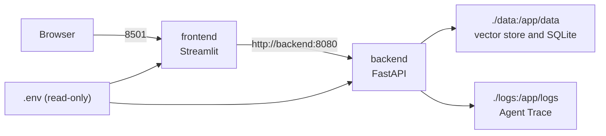

# Campus AI Agent Docker Deployment

## 1. Why Docker

Docker 为 Campus AI Agent 提供一个可重复的本地运行环境：FastAPI 后端与 Streamlit 前端使用同一套锁定依赖启动，知识库数据和 Trace 日志通过宿主机目录持久化。本方案用于项目交付、演示和本地复现，不改变 Agent、RAG 或 MCP 业务流程。

## 2. Service Structure

本项目新增的最小部署入口是 `docker-compose.yml`：



| Service | Command | Published Port | Responsibility |
| --- | --- | --- | --- |
| `backend` | `uv run python src/run_service.py` | `8080:8080` | FastAPI Agent API |
| `frontend` | `uv run streamlit run src/streamlit_app.py --server.address=0.0.0.0 --server.port=8501` | `8501:8501` | Streamlit chat UI |

仓库仍保留原有 `compose.yaml` 供上游开发编排参考。为了明确使用本次最小双服务方案，以下命令均显式传入 `-f docker-compose.yml`。

## 3. Prerequisites and Environment

先在项目根目录准备 `.env`。文件不会写入镜像，而是以只读 volume 挂入容器：

```bash
cp .env.example .env
# 编辑 .env，至少设置一个可用模型 provider 的 API key 或本地模型配置
mkdir -p data logs
```

不要把包含真实密钥的 `.env` 提交到版本库。

## 4. Build and Start

构建镜像：

```bash
docker compose -f docker-compose.yml build
```

前台启动，适合首次确认启动输出：

```bash
docker compose -f docker-compose.yml up
```

后台启动：

```bash
docker compose -f docker-compose.yml up -d
```

## 5. Access Services

| Service | URL |
| --- | --- |
| FastAPI OpenAPI docs | [http://localhost:8080/docs](http://localhost:8080/docs) |
| Streamlit UI | [http://localhost:8501](http://localhost:8501) |

Compose 为前端设置 `AGENT_URL=http://backend:8080`，因此浏览器访问 Streamlit 时，前端容器会通过 Docker 网络访问后端容器。

## 6. Logs and Shutdown

查看所有服务日志：

```bash
docker compose -f docker-compose.yml logs -f
```

只查看后端日志：

```bash
docker compose -f docker-compose.yml logs -f backend
```

停止并删除服务容器：

```bash
docker compose -f docker-compose.yml down
```

挂载在宿主机的 `data/` 和 `logs/` 不会随容器删除。

## 7. Data, Vector Store, and Trace Volumes

| Host Path | Container Path | Usage |
| --- | --- | --- |
| `./data` | `/app/data` | 校园 mock 数据、Chroma 向量库、容器内 SQLite checkpoint |
| `./logs` | `/app/logs` | `agent_trace.jsonl` 等观测日志 |
| `./.env` | `/app/.env:ro` | 运行配置与 API keys，只读挂载 |

当前 `data/vector_store` 体积较小，`.dockerignore` 不默认排除它；运行时 `./data` volume 会以宿主机现有知识库和向量库为准。若未来向量库明显增大，可以选择只通过 volume 提供它，或在部署环境中重新建库，而不将其放入构建上下文。

制度 RAG 首次实际查询可能需要加载本地 embedding 资源；若运行环境尚未缓存 HuggingFace / sentence-transformers 模型，首次下载或初始化会较慢，并可能需要网络访问。

## 8. Optional MCP Server

Campus Tools MCP Server Adapter 采用 `stdio` transport，是由 MCP client 启动和通过标准输入输出通信的工具进程，不是 HTTP Web 服务，因此不放入 `backend` / `frontend` 的主 compose 长驻服务中。

在容器环境中手动验证 MCP 进程可使用：

```bash
docker compose -f docker-compose.yml run --rm --no-deps \
  -e PYTHONPATH=/app/src backend uv run python -m mcp_server.server
```

实际使用时，应由支持 stdio MCP 的客户端以同等命令启动该进程。

## 9. Verification

容器构建与启动验证也可以合并为一次本地 smoke check：

```bash
docker compose -f docker-compose.yml up --build
```

本地测试验证：

```bash
uv run pytest
```

该 Docker E2E 验证是开发者本地按需执行的 smoke test，不进入默认 `uv run pytest`
测试套件，避免测试依赖宿主机 Docker daemon、模型下载缓存或端口状态。

若 `8080` 或 `8501` 已被本机其他进程占用，请先停止冲突服务，或在
`docker-compose.yml` 中临时调整宿主机侧端口映射后再运行 smoke check。
若构建期间 Docker Hub 镜像拉取失败，请先确认 Docker Desktop/daemon、网络
与镜像仓库访问状态，随后重新执行构建；此类外部镜像拉取故障不属于应用逻辑失败。

## 10. Limitations

这是最小可用的本地 Docker 方案，不是生产级云部署：

- 没有 Nginx 反向代理或 HTTPS 终止。
- 没有 Kubernetes、自动扩容或滚动发布。
- 没有专门的 secrets manager、集中日志或权限隔离。
- 默认以 SQLite 和宿主机 volume 服务本地演示需求；生产部署仍需单独设计数据库、备份与安全策略。
