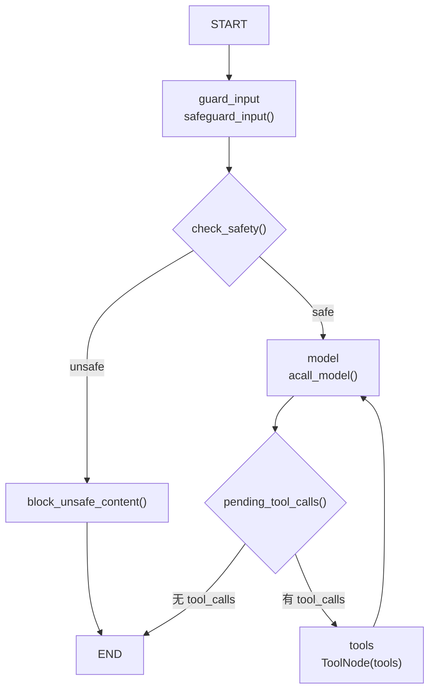

# 默认 Campus AI Agent 执行逻辑分析

本文重点分析 `src/agents/research_assistant.py` 中默认 Campus AI Agent 的执行逻辑。

这个文件定义的是项目默认 Agent：`research-assistant`。它基于 LangGraph 的 `StateGraph` 构建，核心能力包括：

- 输入安全检查
- 调用大模型
- 判断是否需要工具
- 执行工具
- 将工具结果交回模型
- 最终生成回答

## 1. 核心代码结构

`src/agents/research_assistant.py` 大致可以分成 7 个部分：

```text
1. import 依赖
2. 定义 AgentState
3. 定义 tools 工具列表
4. 定义 system instructions
5. 定义节点函数
6. 创建 StateGraph 并添加 node / edge
7. compile 得到 research_assistant
```

整体结构：

```python
class AgentState(MessagesState, total=False):
    safety: SafeguardOutput
    remaining_steps: RemainingSteps


tools = [
    web_search,
    calculator,
    get_course_schedule,
    get_campus_events,
    generate_study_plan,
    query_campus_policy,
]


def wrap_model(...):
    ...


async def acall_model(...):
    ...


async def safeguard_input(...):
    ...


async def block_unsafe_content(...):
    ...


agent = StateGraph(AgentState)

agent.add_node("model", acall_model)
agent.add_node("tools", ToolNode(tools))
agent.add_node("guard_input", safeguard_input)
agent.add_node("block_unsafe_content", block_unsafe_content)

agent.set_entry_point("guard_input")

agent.add_conditional_edges(...)
agent.add_edge(...)
agent.add_edge(...)
agent.add_conditional_edges(...)

research_assistant = agent.compile()
```

## 2. 文件中定义了哪些变量、函数和对象？

### 主要变量

#### `web_search`

```python
web_search = DuckDuckGoSearchResults(name="WebSearch")
```

DuckDuckGo 搜索工具。

#### `tools`

默认 Agent 绑定的工具列表。

#### `current_date`

```python
current_date = datetime.now().strftime("%B %d, %Y")
```

当前日期，会拼进 system prompt。

#### `instructions`

默认 Agent 的完整系统提示词。

它由两部分组成：

- `CAMPUS_AI_AGENT_SYSTEM_PROMPT`
- 当前文件中补充的工具说明、工具选择规则、回答格式、真实性边界

#### `agent`

```python
agent = StateGraph(AgentState)
```

LangGraph 图构建器。

#### `research_assistant`

```python
research_assistant = agent.compile()
```

编译后的可执行 LangGraph Agent。

### 主要函数

```text
wrap_model()
format_safety_message()
acall_model()
safeguard_input()
block_unsafe_content()
check_safety()
pending_tool_calls()
```

### 主要对象

```text
AgentState
ToolNode(tools)
StateGraph(AgentState)
research_assistant
```

## 3. tools 列表是如何定义的？每个工具来自哪里？

工具列表定义在 `research_assistant.py` 中：

```python
tools = [
    web_search,
    calculator,
    get_course_schedule,
    get_campus_events,
    generate_study_plan,
    query_campus_policy,
]
```

### 工具来源

#### `web_search`

来自：

```python
from langchain_community.tools import DuckDuckGoSearchResults
```

定义：

```python
web_search = DuckDuckGoSearchResults(name="WebSearch")
```

作用：网络搜索。

#### `calculator`

来自：

```python
from agents.tools import calculator
```

实际定义在：

```text
src/agents/tools.py
```

作用：基于 `numexpr` 做数学计算。

#### `get_course_schedule`

来自：

```python
from agents.tools import get_course_schedule
```

实际定义在：

```text
src/agents/tools.py
```

作用：读取本地 mock 课程表：

```text
data/campus/course_schedule.json
```

用于回答课程安排、教室、教师、上课时间等问题。

#### `get_campus_events`

来自：

```python
from agents.tools import get_campus_events
```

实际定义在：

```text
src/agents/tools.py
```

作用：读取本地 mock 校园活动：

```text
data/campus/campus_events.json
```

用于回答讲座、比赛、社团、招聘会等问题。

#### `generate_study_plan`

来自：

```python
from agents.tools import generate_study_plan
```

实际定义在：

```text
src/agents/tools.py
```

作用：结合学生画像和课程表生成学习计划。

读取：

```text
data/campus/student_profile.json
data/campus/course_schedule.json
```

#### `query_campus_policy`

来自：

```python
from agents.tools import query_campus_policy
```

实际定义在：

```text
src/agents/tools.py
```

作用：基于本地 Chroma 向量库进行校园制度 RAG 问答。

读取：

```text
data/vector_store/campus_policy
```

### 可选 Weather 工具

如果配置了：

```text
OPENWEATHERMAP_API_KEY
```

则会额外加入：

```python
OpenWeatherMapQueryRun(name="Weather", api_wrapper=wrapper)
```

所以最终 tools 可能是：

```text
WebSearch
Calculator
get_course_schedule
get_campus_events
generate_study_plan
query_campus_policy
Weather，可选
```

## 4. model 是如何创建和绑定工具的？

模型不是在文件顶部固定创建的，而是在每次执行 `acall_model()` 时根据请求配置动态获取。

核心代码：

```python
m = get_model(config["configurable"].get("model", settings.DEFAULT_MODEL))
model_runnable = wrap_model(m)
response = await model_runnable.ainvoke(state, config)
```

模型来自：

```text
src/core/llm.py
```

核心函数是：

```python
get_model(model_name)
```

它会根据 model name 返回对应的 LangChain Chat Model，例如 OpenAI、Anthropic、Google、Groq、Ollama 等。

工具绑定发生在 `wrap_model()` 中：

```python
bound_model = model.bind_tools(tools)
```

这一步的意思是：告诉模型当前可以使用哪些工具。

绑定工具后，模型在生成回复时可以返回：

```python
AIMessage(tool_calls=[...])
```

如果返回了 `tool_calls`，LangGraph 就会进入工具节点。

## 5. wrap_model() 的作用是什么？

`wrap_model()` 的作用是：**把 system prompt、历史消息和绑定工具后的模型组合成一个 Runnable。**

代码逻辑：

```python
def wrap_model(model: BaseChatModel) -> RunnableSerializable[AgentState, AIMessage]:
    bound_model = model.bind_tools(tools)
    preprocessor = RunnableLambda(
        lambda state: [SystemMessage(content=instructions)] + state["messages"],
        name="StateModifier",
    )
    return preprocessor | bound_model
```

它做了两件事：

### 1. 给模型绑定工具

```python
bound_model = model.bind_tools(tools)
```

绑定后，模型知道可以调用：

```text
get_course_schedule
get_campus_events
generate_study_plan
query_campus_policy
Calculator
WebSearch
```

### 2. 给模型输入前面加 system prompt

```python
[SystemMessage(content=instructions)] + state["messages"]
```

也就是说，模型真正看到的消息是：

```text
system prompt
历史消息 / 当前用户消息
```

### 3. 组合成 runnable pipeline

```python
return preprocessor | bound_model
```

这表示：

```text
先执行 preprocessor
再执行 bound_model
```

所以 `wrap_model()` 是模型调用前的包装器。

## 6. acall_model() 的完整执行流程是什么？

`acall_model()` 是 graph 中 `"model"` 节点对应的函数。

核心流程：

```python
async def acall_model(state: AgentState, config: RunnableConfig) -> AgentState:
    m = get_model(config["configurable"].get("model", settings.DEFAULT_MODEL))
    model_runnable = wrap_model(m)
    response = await model_runnable.ainvoke(state, config)

    if state["remaining_steps"] < 2 and response.tool_calls:
        return {
            "messages": [
                AIMessage(
                    id=response.id,
                    content="Sorry, need more steps to process this request.",
                )
            ]
        }

    return {"messages": [response]}
```

### 分解说明

#### 第一步：根据配置获取模型

```python
m = get_model(config["configurable"].get("model", settings.DEFAULT_MODEL))
```

优先使用请求中传入的 model。

如果没有传，则使用：

```python
settings.DEFAULT_MODEL
```

#### 第二步：包装模型

```python
model_runnable = wrap_model(m)
```

这一步会：

- 绑定工具
- 注入 system prompt
- 保留历史消息

#### 第三步：异步调用模型

```python
response = await model_runnable.ainvoke(state, config)
```

返回值通常是一个 `AIMessage`。

这个 `AIMessage` 可能有两种情况：

```text
1. 普通回答：content 有内容，tool_calls 为空
2. 工具调用：content 可能为空，但 tool_calls 不为空
```

#### 第四步：检查剩余步数

```python
if state["remaining_steps"] < 2 and response.tool_calls:
```

如果 LangGraph 剩余步骤太少，同时模型还想调用工具，就返回兜底消息：

```text
Sorry, need more steps to process this request.
```

这是为了避免 graph 没有足够步骤执行工具和返回最终结果。

#### 第五步：把模型响应写回 state

```python
return {"messages": [response]}
```

LangGraph 会把这条 AIMessage 追加到 state 的 messages 中。

## 7. safeguard_input() 的作用是什么？

`safeguard_input()` 是 graph 的入口节点 `guard_input` 对应的函数。

代码逻辑：

```python
async def safeguard_input(state: AgentState, config: RunnableConfig) -> AgentState:
    safeguard = Safeguard()
    safety_output = await safeguard.ainvoke(state["messages"])
    return {"safety": safety_output, "messages": []}
```

作用：

1. 创建 `Safeguard`
2. 检查当前输入是否有 prompt injection 或不安全内容
3. 把检查结果写入 state 的 `safety` 字段

`safety_output` 类型是：

```python
SafeguardOutput
```

后续 `check_safety()` 会根据它决定走哪条边：

```text
safe   -> model
unsafe -> block_unsafe_content
```

如果没有配置 Groq safeguard 模型，`Safeguard` 会默认放行。

## 8. pending_tool_calls() 是如何判断是否进入工具节点的？

`pending_tool_calls()` 是 `"model"` 节点后的条件路由函数。

代码逻辑：

```python
def pending_tool_calls(state: AgentState) -> Literal["tools", "done"]:
    last_message = state["messages"][-1]
    if not isinstance(last_message, AIMessage):
        raise TypeError(f"Expected AIMessage, got {type(last_message)}")
    if last_message.tool_calls:
        return "tools"
    return "done"
```

判断流程：

```text
取 state["messages"] 最后一条消息
    ↓
确认它是 AIMessage
    ↓
如果 last_message.tool_calls 非空
    ↓
进入 tools 节点
    ↓
否则结束
```

也就是说，是否执行工具不是人工判断，而是看模型返回的 `AIMessage` 里有没有 `tool_calls`。

## 9. StateGraph 是如何创建的？

代码：

```python
agent = StateGraph(AgentState)
```

这里创建了一个 LangGraph 状态图。

状态类型是：

```python
AgentState
```

`AgentState` 继承自：

```python
MessagesState
```

所以它天然包含：

```python
messages
```

同时额外声明：

```python
safety: SafeguardOutput
remaining_steps: RemainingSteps
```

因此这个 graph 的状态大致是：

```text
messages          # 对话消息
safety            # 安全检查结果
remaining_steps   # LangGraph 剩余步骤
```

## 10. 图里面有哪些 node？

图中添加了 4 个节点：

```python
agent.add_node("model", acall_model)
agent.add_node("tools", ToolNode(tools))
agent.add_node("guard_input", safeguard_input)
agent.add_node("block_unsafe_content", block_unsafe_content)
```

### `guard_input`

入口节点。

负责安全检查。

对应函数：

```python
safeguard_input()
```

### `block_unsafe_content`

如果输入不安全，进入这个节点。

对应函数：

```python
block_unsafe_content()
```

它会生成一条拒绝/拦截消息。

### `model`

模型节点。

对应函数：

```python
acall_model()
```

负责调用 LLM，并让模型决定是否要调用工具。

### `tools`

工具节点。

对应对象：

```python
ToolNode(tools)
```

负责执行模型提出的工具调用。

## 11. 图里面有哪些 edge / conditional edge？

### 入口节点

```python
agent.set_entry_point("guard_input")
```

表示 graph 一开始先进入：

```text
guard_input
```

### 安全检查条件边

```python
agent.add_conditional_edges(
    "guard_input", check_safety, {"unsafe": "block_unsafe_content", "safe": "model"}
)
```

含义：

```text
guard_input
    ↓
check_safety()
    ↓
unsafe -> block_unsafe_content
safe   -> model
```

### unsafe 后直接结束

```python
agent.add_edge("block_unsafe_content", END)
```

如果被安全检查拦截，就不再调用模型工具，直接结束。

### tools 执行完回到 model

```python
agent.add_edge("tools", "model")
```

工具执行完后，不直接结束，而是回到模型节点。

原因：工具结果只是原始信息，最终还需要模型把工具结果整理成自然语言回答。

### model 后判断是否继续调用工具

```python
agent.add_conditional_edges("model", pending_tool_calls, {"tools": "tools", "done": END})
```

含义：

```text
model
    ↓
pending_tool_calls()
    ↓
有 tool_calls -> tools
无 tool_calls -> END
```

## 12. 执行流程图



## 13. ToolNode(tools) 在什么时候执行？

`ToolNode(tools)` 会在模型返回工具调用时执行。

触发条件是：

```python
last_message.tool_calls
```

也就是：

```text
模型节点 acall_model()
    ↓
返回 AIMessage
    ↓
AIMessage 中包含 tool_calls
    ↓
pending_tool_calls() 返回 "tools"
    ↓
进入 ToolNode(tools)
```

例如用户问：

```text
我今天有哪些课程？
```

模型根据 prompt 规则可能返回：

```text
调用 get_course_schedule
```

于是 graph 进入 `tools` 节点，执行 `get_course_schedule`。

## 14. 工具结果是如何回到 model 节点的？

工具执行后会生成 `ToolMessage`，并追加到 graph state 的 `messages` 中。

然后由于这条边：

```python
agent.add_edge("tools", "model")
```

graph 会回到 `model` 节点。

此时模型看到的消息上下文包括：

```text
HumanMessage 用户问题
AIMessage 工具调用请求
ToolMessage 工具返回结果
```

模型会基于 ToolMessage 中的工具结果生成最终自然语言回答。

所以工具结果不是直接返回给用户，而是先回到模型，由模型整理。

## 15. research_assistant = agent.compile() 之后得到的是什么？

```python
research_assistant = agent.compile()
```

这一步会把 `StateGraph` 编译成一个可执行的 LangGraph graph。

得到的对象通常是：

```python
CompiledStateGraph
```

它具备类似 Runnable 的能力，可以被后端调用：

```python
agent.ainvoke(...)
agent.astream(...)
agent.aget_state(...)
```

也就是说，`research_assistant` 已经不是“图的草稿”，而是可以真正运行的 Agent。

## 16. 后端为什么可以调用 agent.astream() / agent.ainvoke()？

因为后端从注册中心拿到的是编译后的 LangGraph graph。

注册位置：

```text
src/agents/agents.py
```

类似：

```python
"research-assistant": Agent(
    description="...",
    graph_like=research_assistant,
)
```

后端调用：

```python
agent = get_agent(agent_id)
```

拿到的就是：

```python
research_assistant
```

也就是 `agent.compile()` 后的可执行 graph。

因此在 `src/service/service.py` 中可以调用：

```python
await agent.ainvoke(...)
```

或者：

```python
async for stream_event in agent.astream(...):
```

## 17. 新手版解释

可以把这个 Agent 理解成一个“带工具箱的流程机器人”。

它的工作流程是：

```text
先检查用户输入是否安全
    ↓
安全的话，把问题交给大模型
    ↓
大模型先判断自己能不能直接回答
    ↓
如果需要查课程、活动、制度、学习计划，就发起工具调用
    ↓
LangGraph 执行对应工具
    ↓
工具把结果放回消息列表
    ↓
大模型再读工具结果
    ↓
整理成人能看懂的最终回答
```

重点是：

```text
模型决定是否调用工具
LangGraph 负责执行工具
工具结果再交给模型总结
```

不是 Python 代码主动写死“用户问课程就调用课程工具”。Python 代码提供了工具和提示词，模型根据提示词生成 `tool_calls`，LangGraph 再执行。

## 18. 面试表达

可以这样描述这个默认 Agent：

> 这个项目的默认 Campus AI Agent 是基于 LangGraph `StateGraph` 实现的。它的状态继承自 `MessagesState`，额外包含安全检查结果和剩余步数。Graph 的入口是 `guard_input`，先通过 `Safeguard` 做 prompt injection 检测。如果输入安全，则进入 `model` 节点。`model` 节点会通过 `core.get_model()` 根据请求配置获取模型，并在 `wrap_model()` 中注入系统提示词和绑定工具。模型如果返回 `tool_calls`，`pending_tool_calls()` 会把流程路由到 `ToolNode(tools)`，执行课程查询、活动查询、学习计划生成或校园制度 RAG 等工具。工具执行结果以 `ToolMessage` 写回状态，然后通过 `tools -> model` 的边回到模型节点，由模型基于工具结果生成最终自然语言回答。最后 `agent.compile()` 将图编译成可执行的 `CompiledStateGraph`，所以 FastAPI 后端可以通过 `ainvoke()` 或 `astream()` 调用它。

再简短一点：

> 它是一个典型的 ReAct 风格 LangGraph Agent：LLM 负责思考和发起工具调用，ToolNode 负责执行工具，工具结果回流给 LLM，最后由 LLM 生成面向用户的回答。

## 19. 后续优化切入点

### 1. Trace 优化

适合加入 Trace 的位置：

#### `safeguard_input()`

记录：

```text
输入消息
安全检查结果
unsafe category
耗时
```

#### `acall_model()`

记录：

```text
使用的 model
输入 token
输出 token
是否产生 tool_calls
模型耗时
```

#### `pending_tool_calls()`

记录：

```text
是否进入工具节点
工具名
工具参数
```

#### `ToolNode(tools)`

可以结合 LangGraph / LangSmith trace 观察：

```text
每个工具耗时
工具返回内容长度
工具异常
```

#### `query_campus_policy_func()`

记录：

```text
RAG query
检索耗时
返回 chunk 数量
source
相关性判断结果
```

### 2. Router 优化

当前工具选择主要依赖 system prompt 和模型自己生成 `tool_calls`。

可优化方向：

```text
用户问题
    ↓
显式 router / classifier
    ↓
课程类 -> course tool
活动类 -> event tool
制度类 -> RAG tool
学习计划类 -> study plan tool
普通问答 -> model
```

适合改造位置：

```text
research_assistant.py
```

可以在 `model` 前增加一个 `router` 节点，减少模型乱选工具或漏选工具的问题。

### 3. Prompt 优化

重点位置：

```text
src/agents/campus_prompt.py
src/agents/research_assistant.py 中的 instructions
```

可优化方向：

- 缩短过长 prompt
- 把工具选择规则结构化
- 加入 few-shot 示例
- 明确什么时候不要调用工具
- 明确 RAG 不足时的回答模板
- 明确 mock 数据边界

尤其是这几类规则：

```text
课程问题 -> get_course_schedule
活动问题 -> get_campus_events
学习计划 -> generate_study_plan
制度问题 -> query_campus_policy
```

### 4. 异常兜底

适合加入异常处理的位置：

#### `acall_model()`

可能问题：

```text
模型 API 失败
模型超时
模型返回格式异常
```

兜底策略：

```text
返回友好错误消息
切换备用模型
记录 trace
```

#### `ToolNode(tools)`

可能问题：

```text
工具参数错误
本地 JSON 文件读取失败
RAG 向量库不存在
外部搜索失败
天气 API 失败
```

兜底策略：

```text
工具级 try/except
返回结构化错误
提示用户当前数据源不可用
```

#### `query_campus_policy_func()`

可能问题：

```text
Chroma 加载失败
embedding model 加载失败
检索结果为空
检索结果不相关
```

兜底策略：

```text
返回“当前知识库不可用”或“未找到明确依据”
不要让异常直接中断整个 Agent
```

### 5. RAG 优化

重点位置：

```text
src/agents/tools.py
scripts/build_campus_kb.py
```

可优化方向：

- 调整 `k`
- 调整 chunk size / overlap
- 增加 metadata
- 增加 reranker
- 增加 query rewrite
- 增加 source citation
- 缓存 retriever，避免每次工具调用都重新加载 Chroma
- 对制度类问题增加更细粒度分类

### 6. 性能优化

当前潜在性能点：

```text
acall_model() 每次都 wrap_model()
query_campus_policy_func() 每次都 load_chroma_db()
Safeguard 每次创建 Safeguard()
工具执行缺少统一耗时统计
```

可优化方向：

- 缓存 retriever
- 缓存已绑定工具的 model runnable
- 对 safeguard 做可配置开关
- 为慢工具加 timeout
- 减少流式过程中重复消息处理

## 20. 总结

`research_assistant.py` 是默认 Campus AI Agent 的核心执行文件。

它的本质是：

```text
一个 LangGraph StateGraph
    +
一个带工具调用能力的 LLM
    +
一组校园场景工具
    +
一个安全检查入口
```

核心执行链路：

```text
guard_input
    ↓
check_safety
    ↓
model
    ↓
pending_tool_calls
    ↓
tools
    ↓
model
    ↓
END
```

最关键的理解点：

```text
1. tools 只是被绑定给模型，是否调用由模型输出的 tool_calls 决定
2. ToolNode(tools) 负责真正执行工具
3. 工具结果会作为 ToolMessage 回到 messages
4. tools 节点执行完一定回到 model
5. 最终回答由 model 基于工具结果生成
6. compile 后的 research_assistant 是后端可直接 ainvoke / astream 的 graph
```
