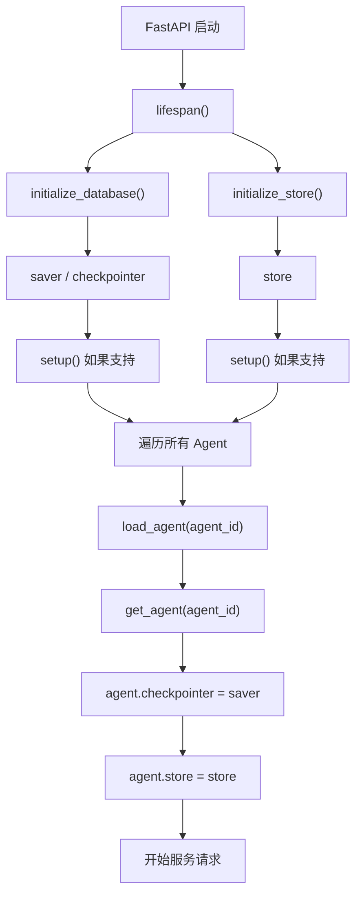
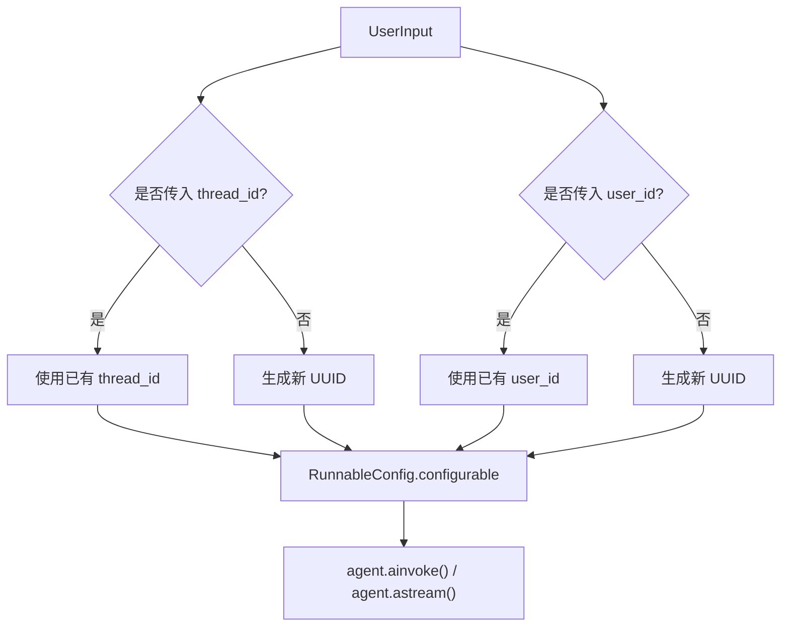

# Memory、Checkpointer 与会话状态逻辑分析

本文分析 `src/memory/*` 以及 `src/service/service.py` 中与 memory、checkpointer、store 和历史消息有关的实现。

## 1. Memory 模块文件说明

| 文件 | 作用 |
| --- | --- |
| `src/memory/__init__.py` | 根据 `DATABASE_TYPE` 选择 checkpointer 和 store 实现 |
| `src/memory/sqlite.py` | 提供 SQLite checkpointer；长期 store 使用内存实现 |
| `src/memory/postgres.py` | 提供 Postgres checkpointer 和 Postgres store |
| `src/memory/mongodb.py` | 提供 MongoDB checkpointer |
| `src/service/service.py` | 启动时初始化 memory，并在请求和历史查询中使用 |
| `src/core/settings.py` | 定义数据库后端和连接配置 |
| `src/schema/schema.py` | 定义 `ChatHistoryInput`、`ChatHistory`、`ChatMessage` |

整体链路：

```text
settings.DATABASE_TYPE
    ↓
memory.initialize_database() / initialize_store()
    ↓
service.lifespan()
    ↓
agent.checkpointer / agent.store
    ↓
thread_id / user_id 驱动状态保存与读取
```

## 2. src/memory 目录整体负责什么？

`src/memory` 负责给 LangGraph Agent 提供两类持久化能力：

```text
checkpointer：保存某个对话线程中的 graph state 和消息历史
store：保存可以跨线程复用的长期信息
```

在当前项目中：

- 多轮聊天历史主要依赖 `checkpointer`
- 长期记忆示例主要体现在 `interrupt_agent.py` 对 `store` 的使用
- 后端服务启动时会把这两个对象注入所有 Agent

## 3. sqlite.py、postgres.py、mongodb.py 分别实现了什么？

### `src/memory/sqlite.py`

提供：

```python
get_sqlite_saver()
get_sqlite_store()
```

`get_sqlite_saver()` 返回：

```python
AsyncSqliteSaver.from_conn_string(settings.SQLITE_DB_PATH)
```

作用：

```text
将 thread 级别的 LangGraph checkpoint 保存到 SQLite 文件
```

默认文件路径：

```text
checkpoints.db
```

`get_sqlite_store()` 返回的是：

```python
InMemoryStore
```

注意：SQLite 模式下，checkpointer 会写入 SQLite，但 store 只存在于当前进程内存中，服务重启后长期记忆会丢失。

### `src/memory/postgres.py`

提供：

```python
validate_postgres_config()
get_postgres_connection_string()
get_postgres_saver()
get_postgres_store()
```

作用：

| 组件 | 实现 |
| --- | --- |
| checkpointer | `AsyncPostgresSaver` |
| store | `AsyncPostgresStore` |
| 连接管理 | `AsyncConnectionPool` |

Postgres 模式下：

```text
对话 checkpoint 可以持久化
长期 store 也可以持久化
适合多实例部署和较正式的服务环境
```

### `src/memory/mongodb.py`

提供：

```python
validate_mongo_config()
get_mongo_connection_string()
get_mongo_saver()
```

作用：

```text
使用 AsyncMongoDBSaver 保存 LangGraph checkpoint
```

当前只实现了 MongoDB checkpointer，没有实现 MongoDB store。

在 `src/memory/__init__.py` 中，如果 `DATABASE_TYPE=mongo`：

```text
checkpointer -> MongoDB
store        -> 仍回退到 SQLite 分支中的 InMemoryStore
```

## 4. Checkpointer 是什么？

`checkpointer` 是 LangGraph 的状态保存组件。

它会按 `thread_id` 保存 graph 执行过程中的状态，例如：

```text
messages
interrupt 状态
节点执行后的 state
可恢复的 conversation state
```

在本项目中，checkpointer 的主要用途是：

```text
同一个 thread_id 下保留多轮聊天历史
支持 history() 查询历史消息
支持 interrupt-agent 恢复中断流程
```

简单理解：

```text
checkpointer = 某一次会话线程的状态档案
```

## 5. Store 是什么？它和 checkpointer 有什么区别？

`store` 是 LangGraph 中用于长期、跨线程数据存储的组件。

区别如下：

| 对比项 | Checkpointer | Store |
| --- | --- | --- |
| 核心范围 | 单个 thread 的执行状态 | 跨 thread 的长期数据 |
| 主要 key | `thread_id` | 通常使用 `user_id` 或 namespace |
| 保存内容 | messages、graph state、interrupt 状态 | 用户画像、偏好、长期事实 |
| 典型用途 | 多轮对话恢复 | 跨会话记住用户信息 |
| 当前项目示例 | `/history` 读取聊天记录 | `interrupt_agent` 保存 birthdate |

简单理解：

```text
thread_id + checkpointer = 这次聊天聊过什么
user_id + store = 这个用户长期有哪些信息
```

## 6. DATABASE_TYPE 如何决定 memory 后端？

配置定义在：

```text
src/core/settings.py
```

枚举：

```python
class DatabaseType(StrEnum):
    SQLITE = "sqlite"
    POSTGRES = "postgres"
    MONGO = "mongo"
```

字段：

```python
DATABASE_TYPE: DatabaseType = DatabaseType.SQLITE
```

选择逻辑在：

```text
src/memory/__init__.py
```

### Checkpointer 选择

```python
def initialize_database():
    if settings.DATABASE_TYPE == DatabaseType.POSTGRES:
        return get_postgres_saver()
    if settings.DATABASE_TYPE == DatabaseType.MONGO:
        return get_mongo_saver()
    else:
        return get_sqlite_saver()
```

### Store 选择

```python
def initialize_store():
    if settings.DATABASE_TYPE == DatabaseType.POSTGRES:
        return get_postgres_store()
    else:
        return get_sqlite_store()
```

对应关系：

| `DATABASE_TYPE` | Checkpointer | Store |
| --- | --- | --- |
| `sqlite` | SQLite | InMemoryStore |
| `postgres` | Postgres | Postgres |
| `mongo` | MongoDB | InMemoryStore |

## 7. lifespan() 如何初始化 checkpointer 和 store？

位置：

```text
src/service/service.py
```

核心函数：

```python
@asynccontextmanager
async def lifespan(app: FastAPI):
```

执行流程：

```text
FastAPI 服务启动
    ↓
initialize_database() 创建 saver
    ↓
initialize_store() 创建 store
    ↓
必要时调用 saver.setup()
    ↓
必要时调用 store.setup()
    ↓
遍历所有 Agent
    ↓
load_agent(a.key)
    ↓
get_agent(a.key)
    ↓
agent.checkpointer = saver
agent.store = store
    ↓
服务开始接收请求
```

流程图：



## 8. 每个 Agent 如何拿到 checkpointer / store？

在 `lifespan()` 中：

```python
agent = get_agent(a.key)
agent.checkpointer = saver
agent.store = store
```

这表示所有已注册、成功加载的 Agent graph 都会共享当前服务生命周期中的：

```text
同一个 checkpointer
同一个 store
```

因此当后端执行：

```python
agent.ainvoke(...)
agent.astream(...)
agent.aget_state(...)
```

LangGraph 可以根据请求 config 中的 `thread_id` 读取或写入对应 checkpoint。

## 9. _handle_input() 中 thread_id 和 user_id 如何进入配置？

位置：

```text
src/service/service.py
```

核心函数：

```python
async def _handle_input(user_input: UserInput, agent: AgentGraph)
```

关键逻辑：

```python
thread_id = user_input.thread_id or str(uuid4())
user_id = user_input.user_id or str(uuid4())

configurable = {
    "thread_id": thread_id,
    "user_id": user_id,
}
```

如果请求指定模型，还会加入：

```python
configurable["model"] = user_input.model
```

最后包装成：

```python
config = RunnableConfig(
    configurable=configurable,
    run_id=run_id,
    callbacks=callbacks,
)
```

配置流程：



## 10. thread_id 如何关联一次多轮对话？

`thread_id` 表示一个具体聊天线程。

只要多次请求使用同一个：

```text
thread_id
```

LangGraph checkpointer 就能读取这个线程之前保存的 state，并继续追加消息。

例如：

```text
第一次请求：
thread_id = abc
用户：请问请假流程是什么？

第二次请求：
thread_id = abc
用户：那需要提交什么材料？
```

第二次请求中，Agent 可以基于第一次请求的历史继续回答。

Streamlit 中的 `thread_id` 保存在：

```python
st.session_state.thread_id
```

新建聊天时会生成新的 UUID：

```python
st.session_state.thread_id = str(uuid.uuid4())
```

## 11. user_id 的作用是什么？和 thread_id 有什么区别？

| 对比项 | `thread_id` | `user_id` |
| --- | --- | --- |
| 表示对象 | 一次聊天线程 | 一个用户 |
| 生命周期 | 一段会话 | 跨多个会话 |
| 主要用途 | 读取同一聊天的历史 state | 保存用户长期信息 |
| 典型数据 | 对话消息、interrupt 状态 | 用户偏好、生日、画像 |
| 前端来源 | session state / URL 参数 | session state / URL 参数 |

例如：

```text
user_id = student-001
thread_id = chat-a    # 咨询课程
thread_id = chat-b    # 咨询奖学金
```

两个聊天线程不同，但都属于同一个用户。

当前项目中，`interrupt_agent.py` 会使用 `user_id` 作为 store namespace，保存用户生日：

```python
namespace = (user_id,)
await store.aput(namespace, "birthdate", {...})
```

## 12. history() 接口如何读取历史消息？

位置：

```text
src/service/service.py
```

接口：

```python
@router.post("/history")
async def history(input: ChatHistoryInput) -> ChatHistory:
```

执行流程：

```text
收到 thread_id
    ↓
get_agent(DEFAULT_AGENT)
    ↓
agent.aget_state(config={"thread_id": input.thread_id})
    ↓
从 state_snapshot.values["messages"] 读取 LangChain 消息
    ↓
逐条调用 langchain_to_chat_message()
    ↓
封装为 ChatHistory(messages=...)
    ↓
返回给前端
```

核心代码逻辑：

```python
state_snapshot = await agent.aget_state(
    config=RunnableConfig(configurable={"thread_id": input.thread_id})
)
messages = state_snapshot.values["messages"]
chat_messages = [langchain_to_chat_message(m) for m in messages]
return ChatHistory(messages=chat_messages)
```

## 13. ChatHistory 和 ChatMessage 如何用于历史记录？

Schema 定义在：

```text
src/schema/schema.py
```

### 请求结构

```python
class ChatHistoryInput(BaseModel):
    thread_id: str
```

### 响应结构

```python
class ChatHistory(BaseModel):
    messages: list[ChatMessage]
```

后端保存的是 LangChain 内部消息：

```text
HumanMessage
AIMessage
ToolMessage
```

返回前端之前，会转换为：

```text
ChatMessage(type="human")
ChatMessage(type="ai")
ChatMessage(type="tool")
```

前端在恢复历史聊天时调用：

```python
agent_client.get_history(thread_id=thread_id)
```

然后将返回的：

```python
ChatHistory.messages
```

交给 `draw_messages()` 重新渲染。

## 14. SQLite / Postgres / Mongo 分别适合什么场景？

| 后端 | 当前能力 | 适合场景 | 局限 |
| --- | --- | --- | --- |
| SQLite | 持久化 checkpointer；store 仅内存 | 本地开发、单进程演示 | 不适合多实例；长期记忆不持久 |
| Postgres | 持久化 checkpointer + store | 正式部署、多用户、多实例 | 需要数据库和连接池配置 |
| MongoDB | 持久化 checkpointer；store 仍内存 | 已有 Mongo 基础设施、文档型状态存储 | 当前没有 Mongo store |

### 推荐理解

```text
本地开发：SQLite
正式持久化部署：Postgres
仅需 Mongo checkpoint 的特定环境：MongoDB
```

## 15. 当前实现风险点

### 1. SQLite 模式下 store 不持久化

默认数据库类型是：

```python
DATABASE_TYPE = sqlite
```

但 SQLite 下：

```text
checkpointer -> SQLite
store -> InMemoryStore
```

所以跨线程长期记忆会在服务重启后丢失。

### 2. Mongo 模式下没有真正的长期 store

`DATABASE_TYPE=mongo` 时：

```text
checkpointer -> MongoDB
store -> InMemoryStore
```

这容易让使用者误以为 Mongo 已完整支持长期记忆。

### 3. history() 固定读取 DEFAULT_AGENT

当前代码中：

```python
agent = get_agent(DEFAULT_AGENT)
```

注释也指出：

```text
Hard-coding DEFAULT_AGENT here is wonky
```

如果用户实际使用的是其他 Agent，其历史读取可能不符合预期。

### 4. 新请求不传 thread_id 会自动生成，但不会显式返回给 client

`_handle_input()` 会生成缺失的 `thread_id`，但当前响应 schema 没有稳定把新生成的 thread_id 返回给调用方。

Streamlit 自己预先生成 thread_id，因此页面路径没有明显问题；但其他 client 若省略 thread_id，后续不容易继续同一线程。

### 5. user_id 缺失会自动随机生成

如果调用方没有维护固定 `user_id`，每次请求都会变成不同用户，长期记忆无法连续使用。

### 6. 所有 Agent 共享一个 saver 和 store

这是正常且方便的设计，但需要保证：

```text
thread_id 不冲突
user namespace 设计清晰
不同 Agent 状态结构兼容历史读取方式
```

### 7. Agent 加载失败后的启动逻辑可能继续访问未加载 Agent

`lifespan()` 捕获了 `load_agent()` 的异常并记录日志，但随后仍然执行：

```python
agent = get_agent(a.key)
```

对于懒加载失败的 Agent，可能进一步抛错并影响服务启动。

### 8. 没有历史消息裁剪

同一个 `thread_id` 长时间持续对话后，messages 会持续增长。

影响：

```text
上下文越来越长
模型成本增加
响应变慢
可能超过上下文窗口
```

### 9. 没有 memory 清理接口

当前没有明显提供：

```text
删除某个 thread 历史
清空某个用户长期记忆
设置历史过期时间
```

## 16. 后续优化切入点

### 历史消息裁剪

适合修改位置：

```text
Agent 调用前的消息处理逻辑
src/service/service.py 的 _handle_input()
各 Agent 的 model preprocessor / wrap_model()
```

可采用：

```text
保留最近 N 轮
摘要早期消息
按 token 数裁剪
保存 summary + recent messages
```

### 长期记忆

适合修改位置：

```text
src/memory/*
src/agents/interrupt_agent.py 的 store 使用方式
未来新增的用户画像节点
```

建议：

```text
正式环境优先使用 Postgres store
定义统一 namespace 规则
区分用户事实、偏好、画像和系统生成总结
```

### 用户画像

可以围绕 `user_id` 存储：

```text
专业
年级
学习目标
课程偏好
常问主题
已确认的个人信息
```

适合通过：

```text
store.aget()
store.aput()
```

读取和更新。

### 会话级 Trace

适合扩展：

```text
src/service/service.py
src/schema/schema.py
```

关联字段：

```text
run_id
thread_id
user_id
trace_id
agent_id
model
latency_ms
```

### 记忆清理

适合增加：

```text
删除 thread checkpoint 的 API
清理用户 store namespace 的 API
TTL / retention policy
管理端清理脚本
```

涉及模块：

```text
src/service/service.py
src/memory/*
src/schema/schema.py
```

### History 接口优化

适合修改：

```text
src/service/service.py
src/schema/schema.py
src/client/client.py
```

可以让 history 请求增加：

```text
agent_id
limit
before_message_id
include_tools
```

避免固定读取默认 Agent，并支持分页和精简展示。

## 17. 面试表达

可以这样解释当前多轮记忆机制：

> 项目使用 LangGraph 的 checkpointer 和 store 区分短期会话状态与长期用户记忆。`checkpointer` 以 `thread_id` 为核心保存某一条对话线程的 graph state 和消息历史，因此用户在同一个 thread 下连续提问时，Agent 能够恢复之前的上下文；`store` 则面向 `user_id` 保存跨线程长期信息，例如用户画像或已确认的个人事实。FastAPI 在 `lifespan()` 阶段根据 `DATABASE_TYPE` 初始化对应的 saver 和 store，并把它们注入所有 Agent graph。请求进入后，`_handle_input()` 会把 `thread_id` 和 `user_id` 放入 `RunnableConfig.configurable`，LangGraph 就可以在执行期间读取和写入相应状态。

更精简一点：

> `thread_id` 解决“这一轮聊天如何连续”，`user_id` 解决“同一个人在不同聊天中如何被记住”。SQLite 适合本地演示，Postgres 同时支持 checkpoint 和长期 store，更适合正式部署。

## 18. 总结

当前 memory 体系可以概括为：

```text
DATABASE_TYPE
    ↓
initialize_database() / initialize_store()
    ↓
lifespan() 注入 Agent
    ↓
请求携带 thread_id / user_id
    ↓
checkpointer 保存线程状态
store 保存长期用户信息
    ↓
history() 根据 thread_id 恢复历史消息
```

最关键的理解点：

```text
1. checkpointer 面向 thread_id，保存对话线程状态
2. store 面向 user_id，保存跨线程长期信息
3. 默认 SQLite 只持久化 checkpoint，不持久化长期 store
4. Postgres 当前是最完整的持久化后端
5. Mongo 当前只有 checkpointer，没有长期 store
6. history() 当前固定读取默认 Agent
7. 后续重点优化方向是历史裁剪、持久化长期记忆、用户画像、Trace 和记忆清理
```
