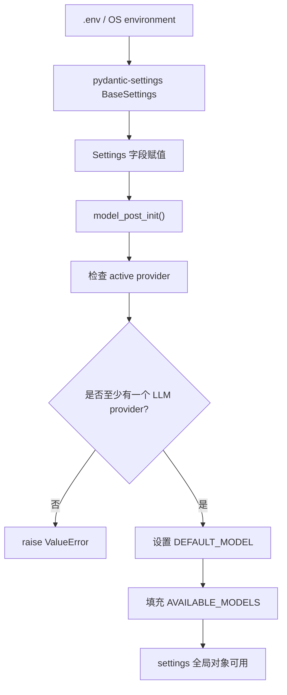
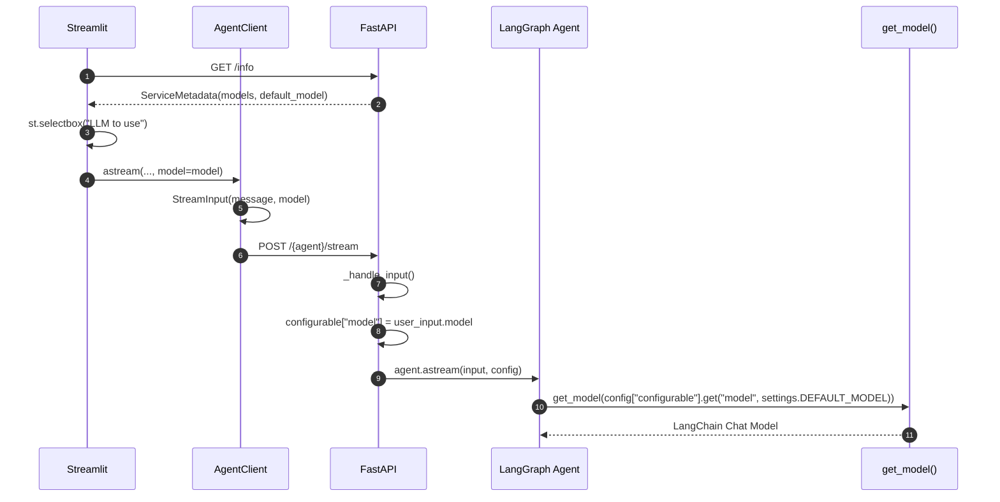

# 模型配置层逻辑分析

本文分析 `src/core/settings.py`、`src/core/llm.py`、`.env.example`、`src/schema/models.py` 以及模型配置相关调用链路。

模型配置层负责解决三个问题：

```text
1. 从 .env / 环境变量读取配置
2. 根据可用 API key 推断可用模型列表和默认模型
3. 根据 model_name 创建对应 LangChain Chat Model
```

## 1. 相关文件

| 文件 | 作用 |
| --- | --- |
| `.env.example` | 展示可配置的环境变量模板 |
| `src/core/settings.py` | 读取环境变量，生成全局 settings |
| `src/core/llm.py` | 根据 model_name 创建具体 LLM 实例 |
| `src/schema/models.py` | 定义 Provider 和模型枚举 |
| `src/schema/schema.py` | `UserInput.model` 和 `ServiceMetadata.models` 使用模型枚举 |
| `src/service/service.py` | 把请求中的 model 放入 RunnableConfig |
| `src/streamlit_app.py` | 前端选择模型 |
| `src/client/client.py` | 把前端选择的 model 放入 UserInput / StreamInput |

## 2. settings.py 的整体作用

`src/core/settings.py` 是项目配置中心。

它基于 Pydantic Settings 定义：

```python
class Settings(BaseSettings):
```

主要负责：

```text
读取 .env 和环境变量
校验配置类型
保存 API key
设置服务 host / port / mode
设置数据库配置
设置 LangSmith / Langfuse 配置
根据已有 API key 推断 DEFAULT_MODEL
根据已有 API key 生成 AVAILABLE_MODELS
```

文件最后创建全局配置对象：

```python
settings = Settings()
```

其他模块通过：

```python
from core import settings
```

读取配置。

## 3. .env 到 settings.py 的读取流程

### 读取方式

`Settings` 使用：

```python
model_config = SettingsConfigDict(
    env_file=find_dotenv(),
    env_file_encoding="utf-8",
    env_ignore_empty=True,
    extra="ignore",
    validate_default=False,
)
```

含义：

| 配置 | 作用 |
| --- | --- |
| `find_dotenv()` | 自动查找 `.env` 文件 |
| `env_file_encoding="utf-8"` | 用 UTF-8 读取 |
| `env_ignore_empty=True` | 空环境变量忽略 |
| `extra="ignore"` | 未定义字段忽略 |
| `validate_default=False` | 默认值不强制校验 |

### 流程图



## 4. 核心配置项总览表

### 服务配置

| 配置项 | 默认值 | 作用 |
| --- | --- | --- |
| `MODE` | `None` | 如果为 `dev`，uvicorn 开启 reload |
| `HOST` | `0.0.0.0` | FastAPI 监听地址 |
| `PORT` | `8080` | FastAPI 端口 |
| `GRACEFUL_SHUTDOWN_TIMEOUT` | `30` | 优雅关闭超时 |
| `LOG_LEVEL` | `WARNING` | 日志级别 |
| `AUTH_SECRET` | `None` | 如果设置，后端接口需要 Bearer token |

服务启动位置：

```text
src/run_service.py
```

使用：

```python
uvicorn.run(
    "service:app",
    host=settings.HOST,
    port=settings.PORT,
    reload=settings.is_dev(),
)
```

### 模型 Provider 配置

| 配置项 | 作用 |
| --- | --- |
| `OPENAI_API_KEY` | OpenAI |
| `DEEPSEEK_API_KEY` | DeepSeek |
| `ANTHROPIC_API_KEY` | Anthropic Claude |
| `GOOGLE_API_KEY` | Google Gemini API |
| `GOOGLE_APPLICATION_CREDENTIALS` | Vertex AI |
| `GROQ_API_KEY` | Groq |
| `USE_AWS_BEDROCK` | AWS Bedrock |
| `OLLAMA_MODEL` | Ollama 本地模型 |
| `OLLAMA_BASE_URL` | Ollama 服务地址 |
| `USE_FAKE_MODEL` | 测试用 fake model |
| `OPENROUTER_API_KEY` | OpenRouter |
| `AZURE_OPENAI_API_KEY` | Azure OpenAI |
| `AZURE_OPENAI_ENDPOINT` | Azure OpenAI endpoint |
| `AZURE_OPENAI_API_VERSION` | Azure API version |
| `AZURE_OPENAI_DEPLOYMENT_MAP` | Azure deployment 映射 |
| `COMPATIBLE_MODEL` | OpenAI-compatible 模型名 |
| `COMPATIBLE_API_KEY` | OpenAI-compatible API key |
| `COMPATIBLE_BASE_URL` | OpenAI-compatible base url |

### 数据库配置

| 配置项 | 作用 |
| --- | --- |
| `DATABASE_TYPE` | `sqlite` / `postgres` / `mongo` |
| `SQLITE_DB_PATH` | SQLite checkpoint 文件 |
| `POSTGRES_*` | Postgres 持久化配置 |
| `MONGO_*` | Mongo checkpointer 配置 |

### 观测与工具配置

| 配置项 | 作用 |
| --- | --- |
| `LANGCHAIN_TRACING_V2` | LangSmith tracing |
| `LANGCHAIN_PROJECT` | LangSmith project |
| `LANGCHAIN_ENDPOINT` | LangSmith endpoint |
| `LANGCHAIN_API_KEY` | LangSmith key |
| `LANGFUSE_TRACING` | Langfuse 开关 |
| `LANGFUSE_PUBLIC_KEY` | Langfuse public key |
| `LANGFUSE_SECRET_KEY` | Langfuse secret key |
| `OPENWEATHERMAP_API_KEY` | Weather 工具 |
| `GITHUB_PAT` | GitHub MCP Agent |
| `VOICE_STT_PROVIDER` | Streamlit 语音输入 |
| `VOICE_TTS_PROVIDER` | Streamlit 语音输出 |

## 5. 服务 host、port、mode 在哪里配置？

配置定义在：

```text
src/core/settings.py
```

字段：

```python
MODE: str | None = None
HOST: str = "0.0.0.0"
PORT: int = 8080
```

`.env.example` 中对应：

```env
HOST=0.0.0.0
PORT=8080
MODE=
```

服务启动时在：

```text
src/run_service.py
```

使用：

```python
host=settings.HOST
port=settings.PORT
reload=settings.is_dev()
```

`is_dev()` 逻辑：

```python
def is_dev(self) -> bool:
    return self.MODE == "dev"
```

## 6. 默认 Agent 和默认模型在哪里配置？

### 默认 Agent

默认 Agent 不在 `settings.py`。

它定义在：

```text
src/agents/agents.py
```

```python
DEFAULT_AGENT = "research-assistant"
```

`/info` 接口会返回：

```python
default_agent=DEFAULT_AGENT
```

### 默认模型

默认模型定义在：

```text
src/core/settings.py
```

字段：

```python
DEFAULT_MODEL: AllModelEnum | None = None
```

如果 `.env` 中没有显式设置 `DEFAULT_MODEL`，`model_post_init()` 会根据第一个可用 provider 自动设置。

例如：

| 可用 provider | 默认模型 |
| --- | --- |
| OpenAI | `gpt-5-nano` |
| DeepSeek | `deepseek-chat` |
| Anthropic | `claude-haiku-4-5` |
| Google | `gemini-2.0-flash` |
| Vertex AI | `gemini-2.0-flash` |
| Groq | `llama-3.1-8b` |
| AWS | `bedrock-3.5-haiku` |
| Ollama | `ollama` |
| OpenRouter | `google/gemini-2.5-flash` |
| Fake | `fake` |
| Azure OpenAI | `azure-gpt-4o-mini` |

## 7. 可用模型列表在哪里定义？

模型枚举定义在：

```text
src/schema/models.py
```

包括：

```text
OpenAIModelName
AzureOpenAIModelName
DeepseekModelName
AnthropicModelName
GoogleModelName
VertexAIModelName
GroqModelName
AWSModelName
OllamaModelName
OpenRouterModelName
OpenAICompatibleName
FakeModelName
```

`settings.py` 中的 `model_post_init()` 会根据当前配置了哪些 provider，把对应模型枚举加入：

```python
AVAILABLE_MODELS
```

例如如果设置了：

```env
OPENAI_API_KEY=...
DEEPSEEK_API_KEY=...
```

则：

```text
AVAILABLE_MODELS = OpenAIModelName + DeepseekModelName
```

前端 `/info` 读取的是：

```python
models = list(settings.AVAILABLE_MODELS)
```

## 8. 各模型 provider 配置说明

### OpenAI

`.env`：

```env
OPENAI_API_KEY=...
```

可用模型来自：

```python
OpenAIModelName
```

当前包括：

```text
gpt-5-nano
gpt-5-mini
gpt-5.1
```

`llm.py` 创建：

```python
ChatOpenAI(model=api_model_name, streaming=True)
```

### DeepSeek

`.env`：

```env
DEEPSEEK_API_KEY=...
```

模型：

```text
deepseek-chat
```

`llm.py` 创建 OpenAI-compatible client：

```python
ChatOpenAI(
    model=api_model_name,
    temperature=0.5,
    streaming=True,
    openai_api_base="https://api.deepseek.com",
    openai_api_key=settings.DEEPSEEK_API_KEY,
)
```

### Anthropic

`.env`：

```env
ANTHROPIC_API_KEY=...
```

模型：

```text
claude-haiku-4-5
claude-sonnet-4-5
```

创建：

```python
ChatAnthropic(model=api_model_name, temperature=0.5, streaming=True)
```

### Google Gemini

`.env`：

```env
GOOGLE_API_KEY=...
```

模型：

```text
gemini-1.5-pro
gemini-2.0-flash
gemini-2.0-flash-lite
gemini-2.5-flash
gemini-2.5-pro
gemini-3-pro-preview
```

创建：

```python
ChatGoogleGenerativeAI(model=api_model_name, temperature=0.5, streaming=True)
```

### Vertex AI

`.env`：

```env
GOOGLE_APPLICATION_CREDENTIALS=...
```

创建：

```python
ChatVertexAI(model=api_model_name, temperature=0.5, streaming=True)
```

### Groq

`.env`：

```env
GROQ_API_KEY=...
```

模型：

```text
llama-3.1-8b
llama-3.3-70b
openai/gpt-oss-safeguard-20b
```

普通 Groq 模型：

```python
ChatGroq(model=api_model_name, temperature=0.5)
```

Safeguard 模型特殊处理：

```python
ChatGroq(model=api_model_name, temperature=0.0)
```

### Ollama

`.env`：

```env
OLLAMA_MODEL=llama3.2
OLLAMA_BASE_URL=http://host.docker.internal:11434
```

创建：

```python
ChatOllama(model=settings.OLLAMA_MODEL, temperature=0.5, base_url=settings.OLLAMA_BASE_URL)
```

如果没有 `OLLAMA_BASE_URL`：

```python
ChatOllama(model=settings.OLLAMA_MODEL, temperature=0.5)
```

### Fake model

`.env`：

```env
USE_FAKE_MODEL=true
```

创建：

```python
FakeToolModel(responses=["This is a test response from the fake model."])
```

作用：

```text
测试时不调用真实 LLM
稳定返回固定响应
支持 bind_tools() 接口
```

### OpenAI-compatible

`.env`：

```env
COMPATIBLE_MODEL=...
COMPATIBLE_API_KEY=...
COMPATIBLE_BASE_URL=...
```

创建：

```python
ChatOpenAI(
    model=settings.COMPATIBLE_MODEL,
    temperature=0.5,
    streaming=True,
    openai_api_base=settings.COMPATIBLE_BASE_URL,
    openai_api_key=settings.COMPATIBLE_API_KEY,
)
```

### OpenRouter

`.env`：

```env
OPENROUTER_API_KEY=...
```

默认模型：

```text
google/gemini-2.5-flash
```

创建：

```python
ChatOpenAI(
    model=api_model_name,
    temperature=0.5,
    streaming=True,
    base_url="https://openrouter.ai/api/v1/",
    api_key=settings.OPENROUTER_API_KEY,
)
```

### Azure OpenAI

`.env`：

```env
AZURE_OPENAI_API_KEY=...
AZURE_OPENAI_ENDPOINT=https://your-resource.openai.azure.com
AZURE_OPENAI_API_VERSION=2024-10-21
AZURE_OPENAI_DEPLOYMENT_MAP={"gpt-4o": "gpt-4o-deployment", "gpt-4o-mini": "gpt-4o-mini-deployment"}
```

`settings.py` 会校验：

```text
AZURE_OPENAI_API_KEY
AZURE_OPENAI_ENDPOINT
AZURE_OPENAI_DEPLOYMENT_MAP
```

`llm.py` 创建：

```python
AzureChatOpenAI(
    azure_endpoint=settings.AZURE_OPENAI_ENDPOINT,
    deployment_name=api_model_name,
    api_version=settings.AZURE_OPENAI_API_VERSION,
    temperature=0.5,
    streaming=True,
    timeout=60,
    max_retries=3,
)
```

注意：当前代码定义了 `AZURE_OPENAI_DEPLOYMENT_MAP`，但 `llm.py` 中实际使用的是 `deployment_name=api_model_name`，没有用 deployment map 做转换。

## 9. API key 是如何读取的？

API key 在 `settings.py` 中定义为字段：

```python
OPENAI_API_KEY: SecretStr | None = None
DEEPSEEK_API_KEY: SecretStr | None = None
ANTHROPIC_API_KEY: SecretStr | None = None
...
```

Pydantic Settings 会自动从：

```text
.env
环境变量
```

读取同名变量。

其中部分 key 使用：

```python
SecretStr
```

好处是日志和 repr 中不会直接泄漏 secret。

使用时通过：

```python
settings.X.get_secret_value()
```

或直接传给 LangChain client。

## 10. 如果 API key 缺失，当前代码会怎样？

### 所有 provider 都缺失

`Settings.model_post_init()` 中：

```python
if not active_keys:
    raise ValueError("At least one LLM API key must be provided.")
```

也就是说，项目启动时会直接失败。

### 某个 provider 缺失

如果该 provider 没有 key，就不会被加入：

```python
AVAILABLE_MODELS
```

前端 `/info` 也不会展示对应模型。

### 用户强行传入不可用 provider 的模型

如果绕过前端，直接传入某个未配置 provider 的 model，`get_model()` 仍可能进入对应分支。

部分 provider 有显式校验，例如：

```text
Azure OpenAI
OpenAI-compatible
```

但部分 provider 主要依赖底层 LangChain / 环境变量报错，例如 OpenAI、Anthropic、Google。

因此直接调用未配置模型可能在模型初始化或真实请求时失败。

## 11. llm.py 的整体作用

`src/core/llm.py` 是模型工厂。

核心职责：

```text
输入 model_name
    ↓
判断它属于哪个模型枚举
    ↓
创建对应 LangChain Chat Model
    ↓
返回可调用模型对象
```

最核心函数：

```python
@cache
def get_model(model_name: AllModelEnum, /) -> ModelT:
```

## 12. get_model(model_name) 的完整逻辑

### 第一步：模型名映射

`llm.py` 先构建：

```python
_MODEL_TABLE
```

它把所有模型枚举映射到字符串值：

```python
{m: m.value for m in OpenAIModelName}
...
```

调用时：

```python
api_model_name = _MODEL_TABLE.get(model_name)
```

如果找不到：

```python
raise ValueError(f"Unsupported model: {model_name}")
```

### 第二步：判断 provider

通过：

```python
if model_name in OpenAIModelName:
...
if model_name in DeepseekModelName:
...
```

判断模型属于哪个 provider。

### 第三步：创建 LangChain model

例如：

```python
ChatOpenAI(...)
ChatAnthropic(...)
ChatGoogleGenerativeAI(...)
ChatGroq(...)
ChatOllama(...)
```

### 第四步：返回 model

返回对象会被 Agent 使用：

```python
model.ainvoke(...)
model.bind_tools(...)
```

## 13. get_model() 分支逻辑解释

| model_name 属于 | 返回对象 |
| --- | --- |
| `OpenAIModelName` | `ChatOpenAI` |
| `OpenAICompatibleName` | `ChatOpenAI` with custom base url |
| `AzureOpenAIModelName` | `AzureChatOpenAI` |
| `DeepseekModelName` | `ChatOpenAI` with DeepSeek base url |
| `AnthropicModelName` | `ChatAnthropic` |
| `GoogleModelName` | `ChatGoogleGenerativeAI` |
| `VertexAIModelName` | `ChatVertexAI` |
| `GroqModelName` | `ChatGroq` |
| `AWSModelName` | `ChatBedrock` |
| `OllamaModelName` | `ChatOllama` |
| `OpenRouterModelName` | `ChatOpenAI` with OpenRouter base url |
| `FakeModelName` | `FakeToolModel` |

## 14. get_model() 有没有缓存？

有。

```python
from functools import cache

@cache
def get_model(model_name: AllModelEnum, /) -> ModelT:
```

作用：

```text
同一个 model_name 第一次调用时创建模型对象
后续再次调用同一个 model_name，直接复用
```

好处：

```text
减少重复初始化模型 client
减少对象创建开销
让 Agent 每次调用时不用重新创建同一个模型对象
```

注意：

```text
缓存 key 只包含 model_name
如果运行中环境变量变化，缓存不会自动刷新
```

## 15. temperature、streaming、timeout 在哪里配置？

都在：

```text
src/core/llm.py
```

示例：

### OpenAI

```python
ChatOpenAI(model=api_model_name, streaming=True)
```

没有显式 temperature。

### DeepSeek

```python
temperature=0.5
streaming=True
```

### Anthropic

```python
temperature=0.5
streaming=True
```

### Google

```python
temperature=0.5
streaming=True
```

### Azure OpenAI

```python
temperature=0.5
streaming=True
timeout=60
max_retries=3
```

### Groq safeguard

```python
temperature=0.0
```

### Ollama

```python
temperature=0.5
```

当前没有统一模型参数配置层，大多数参数写死在 `get_model()` 的各 provider 分支里。

## 16. Fake model 的作用

Fake model 定义在：

```text
src/core/llm.py
```

```python
class FakeToolModel(FakeListChatModel):
    def bind_tools(self, tools):
        return self
```

它的作用：

```text
测试时不用真实 API key
返回固定文本
兼容 Agent 中 model.bind_tools(tools) 的调用
```

`.env` 中配置：

```env
USE_FAKE_MODEL=true
```

`pyproject.toml` 测试环境也设置了 fake OpenAI key：

```toml
[tool.pytest_env]
OPENAI_API_KEY = "sk-fake-openai-key"
```

Fake model 更适合单元测试和本地无真实模型时的基础流程测试。

## 17. 前端 model 选择到 get_model() 的调用链路



### 具体链路

#### 1. 前端从 `/info` 获取模型列表

`src/streamlit_app.py`：

```python
model = st.selectbox("LLM to use", options=agent_client.info.models, index=model_idx)
```

#### 2. 前端调用 client

```python
agent_client.astream(..., model=model)
```

或：

```python
agent_client.ainvoke(..., model=model)
```

#### 3. client 构造请求体

`src/client/client.py`：

```python
request = StreamInput(message=message, stream_tokens=stream_tokens)
request.model = model
```

或：

```python
request = UserInput(message=message)
request.model = model
```

#### 4. FastAPI 接收请求

`src/service/service.py`：

```python
async def stream(user_input: StreamInput, ...)
async def invoke(user_input: UserInput, ...)
```

#### 5. `_handle_input()` 写入 RunnableConfig

```python
if user_input.model is not None:
    configurable["model"] = user_input.model
```

#### 6. Agent 节点读取 model

例如 `research_assistant.py`：

```python
m = get_model(config["configurable"].get("model", settings.DEFAULT_MODEL))
```

#### 7. get_model 创建模型

`src/core/llm.py`：

```python
get_model(model_name)
```

## 18. 当前模型配置层风险点

### 1. 至少一个 provider 必须存在

如果没有任何 LLM key 或 fake model，`Settings()` 会直接报错，项目无法启动。

这对生产是合理的，但对纯前端开发或文档阅读场景不够友好。

### 2. DEFAULT_MODEL 自动选择依赖 provider 遍历顺序

当多个 provider 同时配置时，第一个 active provider 会设置默认模型。

这可能不符合用户预期。

### 3. 模型参数分散且写死

例如：

```text
temperature
streaming
timeout
max_retries
```

都散落在 `get_model()` 分支中，不方便通过 `.env` 调整。

### 4. 部分 provider 缺少显式 key 校验

OpenAI、Anthropic、Google 等分支没有像 Azure 那样做完整显式校验。

错误可能延迟到模型调用时才出现。

### 5. Azure deployment map 未实际用于 llm.py

`settings.py` 校验了 `AZURE_OPENAI_DEPLOYMENT_MAP`，但 `llm.py` 里用的是：

```python
deployment_name=api_model_name
```

没有显式根据 deployment map 转换。

### 6. get_model cache 不感知配置变化

`@cache` 只按 model_name 缓存。

如果运行中修改环境变量、base_url、temperature，旧模型对象仍会被复用。

### 7. 缺少 fallback model

当前模型失败后没有自动降级，例如：

```text
gpt-5-nano 失败 -> deepseek-chat
```

### 8. 缺少统一 timeout / retry

只有 Azure 分支显式配置了：

```text
timeout=60
max_retries=3
```

其他 provider 依赖默认行为。

### 9. 缺少 token 成本统计

当前没有统一记录：

```text
prompt tokens
completion tokens
cost
provider
model latency
```

### 10. .env.example 和 settings 字段存在命名差异风险

`.env.example` 中 LangSmith 示例使用了：

```env
LANGSMITH_TRACING
LANGSMITH_API_KEY
LANGSMITH_PROJECT
```

但 `settings.py` 中定义的是：

```text
LANGCHAIN_TRACING_V2
LANGCHAIN_API_KEY
LANGCHAIN_PROJECT
```

需要注意实际读取字段以 `settings.py` 为准。

## 19. 后续优化切入点

### fallback model

适合修改：

```text
src/core/llm.py
src/service/service.py
Agent acall_model()
```

思路：

```text
模型调用失败
    ↓
捕获 provider 异常
    ↓
读取 fallback model 配置
    ↓
重新 get_model(fallback_model)
    ↓
返回降级回答或继续执行
```

可新增配置：

```text
FALLBACK_MODEL
ENABLE_MODEL_FALLBACK
```

### 模型超时与重试

适合修改：

```text
src/core/llm.py
```

将 timeout / max_retries 抽成配置：

```text
MODEL_TIMEOUT_SECONDS
MODEL_MAX_RETRIES
```

并统一传给各 provider。

### token 成本统计

适合修改：

```text
src/service/service.py
src/service/utils.py
src/schema/schema.py
```

可以从：

```text
AIMessage.response_metadata
usage_metadata
```

提取：

```text
input_tokens
output_tokens
total_tokens
estimated_cost
```

再放到：

```text
ChatMessage.response_metadata
或新增 metrics 字段
```

### 模型调用 Trace

适合修改：

```text
Agent 的 acall_model()
src/core/llm.py
src/service/service.py
```

记录：

```text
model_name
provider
latency_ms
success / error
token usage
run_id
thread_id
user_id
```

### 模型配置结构化

适合修改：

```text
src/core/settings.py
src/core/llm.py
```

可新增：

```text
MODEL_TEMPERATURE
MODEL_STREAMING
MODEL_TIMEOUT
MODEL_MAX_RETRIES
MODEL_BASE_URL
```

或按 provider 定义配置。

### 默认模型选择优化

适合修改：

```text
settings.model_post_init()
```

可以要求显式设置：

```text
DEFAULT_MODEL
```

或者如果多 provider 同时存在，给出 warning。

### 清理 Azure deployment map 逻辑

适合修改：

```text
src/core/llm.py
```

使用：

```python
settings.AZURE_OPENAI_DEPLOYMENT_MAP[model_key]
```

映射到真实 deployment name。

## 20. 面试表达

可以这样解释模型配置层：

> 这个项目把模型配置分成两层：`settings.py` 负责从 `.env` 和环境变量读取 API key、服务配置和数据库配置，并根据当前可用 provider 自动生成 `DEFAULT_MODEL` 和 `AVAILABLE_MODELS`；`llm.py` 负责根据传入的 `model_name` 创建对应的 LangChain Chat Model，比如 OpenAI、DeepSeek、Anthropic、Google、Groq、Ollama 或 Fake model。前端通过 `/info` 获取可用模型列表，用户选择模型后，`AgentClient` 会把 model 放进 `UserInput` 或 `StreamInput`，后端 `_handle_input()` 再把它写入 `RunnableConfig.configurable`，最终 Agent 节点通过 `get_model(config["configurable"].get("model", settings.DEFAULT_MODEL))` 获取模型。

更简短一点：

> `settings.py` 管配置，`models.py` 管模型枚举，`llm.py` 管模型实例化。前端选中的 model 会一路通过 schema、client、FastAPI config 传到 Agent，最终由 `get_model()` 根据枚举分支创建具体 provider 的 Chat Model。当前实现清晰直接，但模型参数写死、fallback 和 token 成本统计还没有统一抽象，后续可以在 `llm.py` 和 Agent 调用层增强。

## 21. 总结

当前模型配置链路是：

```text
.env / environment
    ↓
Settings(BaseSettings)
    ↓
model_post_init()
    ↓
DEFAULT_MODEL / AVAILABLE_MODELS
    ↓
GET /info
    ↓
Streamlit selectbox
    ↓
AgentClient UserInput / StreamInput
    ↓
FastAPI _handle_input()
    ↓
RunnableConfig.configurable["model"]
    ↓
Agent acall_model()
    ↓
get_model(model_name)
    ↓
LangChain Chat Model
```

最关键的理解点：

```text
1. settings.py 负责读取环境变量和推断可用模型
2. 默认 Agent 在 agents.py，默认模型在 settings.py
3. 可用模型枚举在 schema/models.py
4. get_model() 是模型工厂
5. get_model() 使用 @cache 缓存模型对象
6. 模型参数大多写在 get_model() 各分支里
7. Fake model 用于测试和无真实模型调用的场景
8. 前端选择的 model 会通过 StreamInput/UserInput 进入后端 config
9. 后续优化重点是 fallback、timeout/retry、成本统计、Trace 和统一模型参数配置
```
