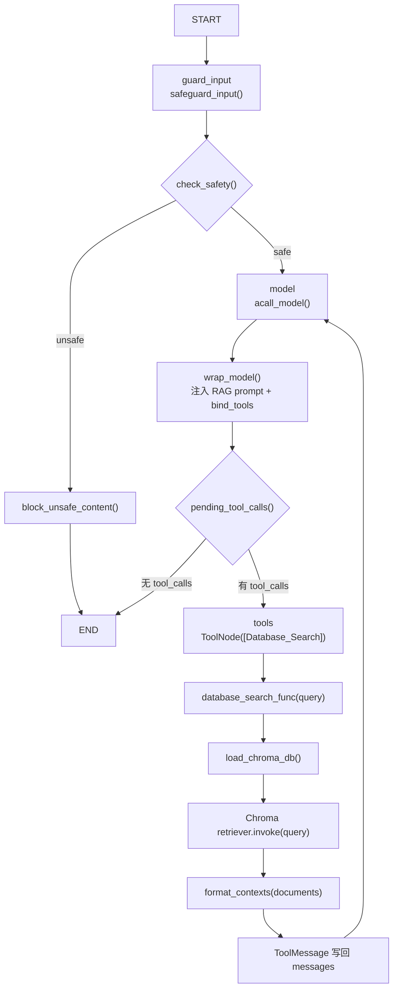

# RAG 专用 Agent 实现逻辑分析

本文分析 `src/agents/rag_assistant.py` 中 RAG 专用 Agent 的实现逻辑。

## 1. 整体作用

`rag_assistant.py` 定义了一个专门面向知识库问答的 LangGraph Agent。

它的核心目标是：

```text
用户提出校园制度 / 学生手册类问题
    ↓
模型判断是否需要检索
    ↓
调用 Database_Search 工具
    ↓
从本地 Chroma 向量库检索相关文档
    ↓
模型基于检索结果生成回答
```

它比默认 `research_assistant.py` 更聚焦，只绑定一个 RAG 检索工具。

## 2. 文件核心结构

```text
1. import 依赖
2. 定义 AgentState
3. 定义 tools = [database_search]
4. 定义 RAG system instructions
5. 定义 wrap_model()
6. 定义 acall_model()
7. 定义 safeguard_input()
8. 定义 block_unsafe_content()
9. 创建 StateGraph
10. 添加 node / edge / conditional edge
11. compile 得到 rag_assistant
```

核心对象：

```python
tools = [database_search]

agent = StateGraph(AgentState)

agent.add_node("model", acall_model)
agent.add_node("tools", ToolNode(tools))
agent.add_node("guard_input", safeguard_input)
agent.add_node("block_unsafe_content", block_unsafe_content)

rag_assistant = agent.compile()
```

## 3. 和 research_assistant.py 的区别

| 对比项 | `rag_assistant.py` | `research_assistant.py` |
| --- | --- | --- |
| 定位 | 专用 RAG 问答 Agent | 默认校园综合 Agent |
| 工具数量 | 只绑定 `Database_Search` | 绑定课程、活动、学习计划、制度 RAG、搜索、计算等 |
| 使用场景 | 校园制度、知识库问答 | 课程、活动、制度、学习计划等综合场景 |
| RAG 工具 | `database_search` | `query_campus_policy` |
| 输出控制 | 主要靠 prompt 要求基于知识库回答 | 工具本身和 prompt 都做了制度问答格式约束 |
| 图结构 | StateGraph | StateGraph |
| 是否有 safeguard | 有 | 有 |
| 是否支持工具调用 | 支持 | 支持 |
| 是否支持流式 | 支持，由后端 `agent.astream()` 调用 |

## 4. 使用的是哪种 LangGraph 写法？

`rag_assistant.py` 使用的是：

```python
StateGraph
```

不是 `@entrypoint()` 写法。

状态定义：

```python
class AgentState(MessagesState, total=False):
    safety: SafeguardOutput
    remaining_steps: RemainingSteps
```

它继承 `MessagesState`，所以核心状态仍然是：

```text
messages
```

额外保存：

```text
safety
remaining_steps
```

## 5. 绑定了哪些工具？

只绑定一个工具：

```python
tools = [database_search]
```

`database_search` 来自：

```python
from agents.tools import database_search
```

实际定义在：

```text
src/agents/tools.py
```

注册名是：

```python
database_search.name = "Database_Search"
```

## 6. Database_Search 工具是如何接入的？

在 `wrap_model()` 中：

```python
bound_model = model.bind_tools(tools)
```

也就是把：

```python
tools = [database_search]
```

绑定给模型。

当模型认为需要查知识库时，会返回一个包含 `Database_Search` 的 `tool_calls`。

随后 `pending_tool_calls()` 判断有工具调用，流程进入：

```python
ToolNode(tools)
```

由 ToolNode 执行 `database_search_func()`。

## 7. Database_Search 和 query_campus_policy 的区别

| 对比项 | `Database_Search` | `query_campus_policy` |
| --- | --- | --- |
| 定义位置 | `src/agents/tools.py` | `src/agents/tools.py` |
| 使用 Agent | `rag_assistant.py` | `research_assistant.py` |
| 函数 | `database_search_func(query)` | `query_campus_policy_func(query)` |
| 返回内容 | 原始检索上下文拼接 | 结构化 Markdown 答案模板 |
| 是否做相关性判断 | 基本不做 | 有 `_has_relevant_policy_context()` |
| 是否有 no-answer 模板 | 没有专门模板 | 有 `_policy_no_answer()` |
| 是否格式化来源 | 使用 `format_contexts()` 拼 source/path/chunk | 使用 `_format_policy_sources()` |
| 定位 | 通用检索工具 | 校园制度问答工具 |

简单说：

```text
Database_Search 更像“把检索结果交给模型”
query_campus_policy 更像“工具内部先整理一版制度问答结构”
```

## 8. RAG prompt 在哪里定义？

RAG prompt 定义在：

```text
src/agents/rag_assistant.py
```

变量名：

```python
instructions
```

它包含：

```python
CAMPUS_AI_AGENT_SYSTEM_PROMPT
```

以及当前文件补充的 RAG 规则。

核心内容包括：

```text
当前 Agent 已接入 Database_Search 工具，用于检索本地知识库内容。
当用户询问请假、奖学金、宿舍、考试纪律、培养方案、课程制度等校园制度问题时，应优先使用 Database_Search。
回答制度问题时，只能基于数据库检索结果或用户已提供资料，不要编造学校规定。
如果数据库中没有找到明确依据，请明确说明当前知识库中没有找到明确依据。
```

## 9. prompt 是否要求只基于知识库回答？

是的。

prompt 明确要求：

```text
回答制度问题时，只能基于数据库检索结果或用户已提供资料，不要编造学校规定。
```

并且要求当没有依据时说明：

```text
当前知识库中没有找到明确依据，建议以学校官方通知或辅导员答复为准
```

不过要注意：这个约束主要依赖模型遵守 prompt。`Database_Search` 本身只是返回检索上下文，并没有像 `query_campus_policy` 那样内置严格的 no-answer 判断模板。

## 10. 用户问题进入 rag_assistant 后的完整执行链路

```text
用户问题
    ↓
FastAPI 后端调用 rag_assistant.astream() / ainvoke()
    ↓
guard_input
    ↓
Safeguard 安全检查
    ↓
check_safety()
    ↓
safe -> model
    ↓
acall_model()
    ↓
wrap_model()
    ↓
注入 system prompt + 绑定 Database_Search
    ↓
模型判断是否需要工具
    ↓
如果有 tool_calls
    ↓
ToolNode 执行 Database_Search
    ↓
database_search_func()
    ↓
load_chroma_db()
    ↓
Chroma retriever.invoke(query)
    ↓
format_contexts(documents)
    ↓
ToolMessage 写回 messages
    ↓
tools -> model
    ↓
模型基于检索上下文生成最终回答
    ↓
END
```

## 11. 执行流程图



## 12. 检索结果如何进入模型上下文？

`database_search_func()` 会返回一个字符串：

```python
context_str = format_contexts(documents)
return context_str
```

`format_contexts()` 会把每个文档格式化为：

```text
--- Source: xxx | Path: xxx | Chunk: xxx ---
文档内容
```

这个字符串会成为工具返回结果，也就是 LangGraph 中的 `ToolMessage`。

随后由于图里有：

```python
agent.add_edge("tools", "model")
```

工具执行完会回到 `model` 节点。

此时模型看到的上下文包括：

```text
HumanMessage 用户问题
AIMessage 工具调用请求
ToolMessage 检索结果
```

于是模型基于 ToolMessage 中的知识库片段生成最终回答。

## 13. 如果检索不到结果，当前 Agent 如何处理？

`database_search_func()` 本身没有显式 no-answer 逻辑。

它执行：

```python
documents = retriever.invoke(query)
context_str = format_contexts(documents)
return context_str
```

如果 `documents` 是空列表，`format_contexts([])` 会返回空字符串。

之后模型会收到一个空的 ToolMessage 或空上下文，再由 prompt 约束它回答：

```text
当前知识库中没有找到明确依据，建议以学校官方通知或辅导员答复为准
```

所以当前 no-answer 处理主要依赖 prompt，而不是工具层强制处理。

这点和 `query_campus_policy_func()` 不同，后者有明确的：

```python
_policy_no_answer()
```

## 14. 是否支持流式输出？

支持。

`rag_assistant` 编译后是 LangGraph graph：

```python
rag_assistant = agent.compile()
```

后端通过统一逻辑调用：

```python
agent.astream(...)
```

或：

```python
agent.ainvoke(...)
```

所以只要在前端选择 `rag-assistant`，它就可以走和默认 Agent 一样的 `/stream` 或 `/invoke` 接口。

流式处理本身不在 `rag_assistant.py` 中，而是在：

```text
src/service/service.py
```

中的：

```python
message_generator()
```

## 15. 和默认 research-assistant 的 RAG 调用方式对比

| 对比项 | `rag-assistant` | `research-assistant` |
| --- | --- | --- |
| RAG 入口工具 | `Database_Search` | `query_campus_policy` |
| 工具返回 | 原始上下文 | 结构化政策答案 |
| Agent 定位 | 专门知识库问答 | 综合校园助理 |
| 工具选择复杂度 | 低，只能选一个 RAG 工具 | 高，有多个工具可选 |
| Prompt 压力 | 需要模型自己基于上下文组织答案 | 工具已组织部分回答结构 |
| no-answer 能力 | 主要靠 prompt | 工具层已有 no-answer 模板 |
| 可控性 | 较弱 | 较强 |
| 灵活性 | 较强，可让模型自由总结上下文 | 较固定，偏制度问答模板 |
| 适合场景 | 实验 RAG 检索与生成 | 真实校园综合问答 |

## 16. 当前实现风险点

### 1. no-answer 逻辑不够强

`Database_Search` 检索为空时不会返回明确的 no-answer 模板。

风险：

```text
模型可能在空上下文下仍然尝试回答
```

### 2. 检索结果没有相关性判断

不像 `query_campus_policy_func()`，这里没有：

```text
_has_relevant_policy_context()
```

风险：

```text
低相关 chunk 也会进入模型上下文
```

### 3. RAG 结果完全交给模型总结

优点是灵活。

风险是：

```text
模型可能遗漏来源
模型可能过度概括
模型可能补充知识库外内容
```

### 4. retriever 每次重新加载

`database_search_func()` 内部调用：

```python
load_chroma_db()
```

当前没有缓存，性能不理想。

### 5. prompt 较依赖模型遵守

“只基于知识库回答”主要是 prompt 约束，不是代码强约束。

## 17. 后续优化切入点

### RAG Trace

适合加入位置：

```text
database_search_func()
load_chroma_db()
format_contexts()
```

记录：

```text
query
检索耗时
返回文档数量
source
chunk_id
上下文长度
```

### Prompt 优化

适合修改位置：

```text
rag_assistant.py 中的 instructions
```

可优化方向：

```text
要求必须列出来源
要求区分“知识库明确说明”和“当前未找到依据”
加入 no-answer 示例
加入引用格式
加入不要使用外部知识的强约束
```

### 异常兜底

适合加入位置：

```text
database_search_func()
load_chroma_db()
create_campus_policy_embeddings()
```

兜底内容：

```text
Chroma 不存在
embedding 模型加载失败
检索异常
检索为空
```

### 检索质量评估

可以增加：

```text
固定测试问题集
top-k 命中文档检查
source 分布统计
人工标注 expected source
召回率评估
```

### 工具返回结构化

可以把 `Database_Search` 从纯字符串改为结构化结果：

```text
documents
source
path
chunk_id
score
content
```

再由模型或服务层统一格式化。

### 缓存优化

重点位置：

```text
load_chroma_db()
create_campus_policy_embeddings()
```

避免每次工具调用都重新加载 embedding 和 Chroma。

## 18. 面试表达

可以这样解释 `rag_assistant.py`：

> `rag_assistant.py` 实现了一个专门用于知识库问答的 LangGraph Agent。它使用 `StateGraph` 构建，入口是 `guard_input`，先通过 `Safeguard` 做输入安全检查。安全后进入 `model` 节点，`model` 节点会通过 `get_model()` 获取模型，并在 `wrap_model()` 中注入 RAG system prompt，同时绑定唯一工具 `Database_Search`。当模型返回 `tool_calls` 时，`pending_tool_calls()` 会把流程路由到 `ToolNode`，执行 `database_search_func()`，从本地 Chroma 向量库检索相关文档。检索结果作为 `ToolMessage` 回到 `messages`，然后通过 `tools -> model` 的边再次进入模型，由模型基于检索上下文生成最终回答。

更简短一点：

> 这是一个专用 RAG Agent：LLM 负责判断是否检索和生成答案，`Database_Search` 负责从 Chroma 中取上下文，LangGraph 负责在模型和工具之间循环，直到模型不再请求工具并输出最终回答。

## 19. 总结

`rag_assistant.py` 的核心链路是：

```text
guard_input
    ↓
model
    ↓
pending_tool_calls
    ↓
tools: Database_Search
    ↓
model
    ↓
END
```

最关键的理解点：

```text
1. 它是 StateGraph 写法，不是 entrypoint
2. 它只绑定 Database_Search 一个工具
3. Database_Search 返回原始检索上下文
4. 检索结果通过 ToolMessage 回到模型上下文
5. no-answer 主要靠 prompt，而不是工具强制处理
6. 它支持后端统一的 ainvoke / astream 调用
7. 后续优化重点是 Trace、no-answer、相关性判断、source citation 和 retriever 缓存
```
