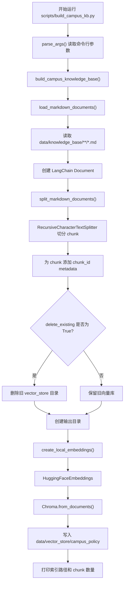

# 校园制度 RAG 向量库构建逻辑分析

本文分析 `scripts/build_campus_kb.py` 中校园制度 RAG 向量库的构建逻辑。

该脚本负责把 `data/knowledge_base` 下的 Markdown 校园制度文档切分成 chunk，生成 embedding，并写入本地 Chroma 向量库。

## 1. 脚本作用

`scripts/build_campus_kb.py` 的作用是构建校园制度知识库索引。

整体流程是：

```text
读取 Markdown 原始文档
    ↓
切分成 chunk
    ↓
为每个 chunk 添加 metadata
    ↓
使用本地 HuggingFace embedding 模型生成向量
    ↓
写入 Chroma 向量库
    ↓
保存到 data/vector_store/campus_policy
```

构建完成后，Agent 中的 RAG 工具会通过 `src/agents/tools.py` 读取这个向量库。

## 2. 输入输出路径

### 原始知识库目录

默认输入目录：

```text
data/knowledge_base
```

代码中定义：

```python
DEFAULT_KNOWLEDGE_BASE_DIR = PROJECT_ROOT / "data" / "knowledge_base"
```

该目录下当前主要是校园制度 Markdown 文件，例如：

```text
data/knowledge_base/leave_policy.md
data/knowledge_base/exam_policy.md
data/knowledge_base/scholarship_policy.md
data/knowledge_base/student_handbook.md
data/knowledge_base/dormitory_policy.md
```

### 向量库输出目录

默认输出目录：

```text
data/vector_store/campus_policy
```

代码中定义：

```python
DEFAULT_VECTOR_STORE_DIR = PROJECT_ROOT / "data" / "vector_store" / "campus_policy"
```

构建完成后，Chroma 数据会保存在该目录中。

## 3. 支持哪些文件格式？

当前脚本只加载 Markdown 文件。

加载逻辑是：

```python
for md_path in sorted(kb_dir.rglob("*.md")):
```

也就是说，它只处理：

```text
*.md
```

不处理：

```text
PDF
DOCX
TXT
JSON
HTML
```

项目里另一个脚本 `scripts/create_chroma_db.py` 支持 PDF / DOCX，但 `build_campus_kb.py` 当前主要面向校园制度 Markdown 知识库。

## 4. 构建流程图



## 5. 关键函数解释

## `load_markdown_documents()`

函数：

```python
def load_markdown_documents(knowledge_base_dir: Path | str) -> list[Document]:
```

作用：

- 检查知识库目录是否存在
- 递归读取目录下所有 `.md` 文件
- 每个 Markdown 文件转成一个 LangChain `Document`
- 给每个 Document 添加基础 metadata

核心逻辑：

```python
for md_path in sorted(kb_dir.rglob("*.md")):
    content = md_path.read_text(encoding="utf-8")
    documents.append(
        Document(
            page_content=content,
            metadata={
                "source": md_path.name,
                "path": str(md_path.resolve()),
            },
        )
    )
```

### 加载后的 Document 结构

每个文档大致是：

```python
Document(
    page_content="Markdown 文件全文",
    metadata={
        "source": "leave_policy.md",
        "path": "/absolute/path/to/leave_policy.md",
    }
)
```

### 是否做了内容清洗？

当前基本没有做清洗。

它只是：

```python
content = md_path.read_text(encoding="utf-8")
```

没有做：

```text
去除多余空行
去除 Markdown 语法
提取标题层级
规范编号
清理表格
去除无效字符
按章节拆分
```

所以当前构建方式是“读取原文后直接切分”。

## `split_markdown_documents()`

函数：

```python
def split_markdown_documents(
    documents: list[Document],
    chunk_size: int = DEFAULT_CHUNK_SIZE,
    chunk_overlap: int = DEFAULT_CHUNK_OVERLAP,
) -> list[Document]:
```

作用：

- 使用 `RecursiveCharacterTextSplitter` 切分 Markdown 文档
- 给每个 chunk 添加稳定的 `chunk_id`

默认参数：

```python
DEFAULT_CHUNK_SIZE = 800
DEFAULT_CHUNK_OVERLAP = 120
```

也就是：

| 参数 | 默认值 | 作用 |
| --- | --- | --- |
| `chunk_size` | `800` | 每个 chunk 最大长度 |
| `chunk_overlap` | `120` | 相邻 chunk 重叠长度 |

切分器：

```python
RecursiveCharacterTextSplitter(
    chunk_size=chunk_size,
    chunk_overlap=chunk_overlap,
    separators=["\n## ", "\n### ", "\n\n", "\n", "。", "，", " ", ""],
)
```

### 分隔符策略

优先级从高到低：

```text
二级标题：\n## 
三级标题：\n### 
段落空行：\n\n
普通换行：\n
中文句号：。
中文逗号：，
空格
任意字符
```

这说明它对 Markdown 有一定感知，但不是严格的 Markdown AST 解析。

## `create_local_embeddings()`

函数：

```python
def create_local_embeddings(model_name: str = DEFAULT_EMBEDDING_MODEL) -> Embeddings:
```

作用：

- 创建本地 HuggingFace embedding 模型
- 不依赖 OpenAI API key

默认 embedding 模型：

```python
DEFAULT_EMBEDDING_MODEL = "sentence-transformers/paraphrase-multilingual-MiniLM-L12-v2"
```

创建逻辑：

```python
HuggingFaceEmbeddings(
    model_name=model_name,
    model_kwargs={"device": "cpu"},
    encode_kwargs={"normalize_embeddings": True},
)
```

特点：

```text
本地模型
CPU 推理
归一化 embedding
适合中英文混合检索
```

## `build_campus_knowledge_base()`

函数：

```python
def build_campus_knowledge_base(
    knowledge_base_dir=DEFAULT_KNOWLEDGE_BASE_DIR,
    vector_store_dir=DEFAULT_VECTOR_STORE_DIR,
    embeddings=None,
    embedding_model=DEFAULT_EMBEDDING_MODEL,
    delete_existing=True,
    chunk_size=DEFAULT_CHUNK_SIZE,
    chunk_overlap=DEFAULT_CHUNK_OVERLAP,
) -> Chroma:
```

这是核心构建函数。

执行流程：

1. 加载 Markdown 文档
2. 切分 chunk
3. 如果 `delete_existing=True`，删除旧向量库
4. 创建输出目录
5. 创建 embedding function
6. 调用 `Chroma.from_documents()`
7. 返回 Chroma vector store

核心写入代码：

```python
vector_store = Chroma.from_documents(
    documents=chunks,
    embedding=embedding_function,
    persist_directory=str(store_dir),
)
```

## `parse_args()`

支持命令行参数：

```text
--knowledge-base-dir
--vector-store-dir
--chunk-size
--chunk-overlap
--embedding-model
--keep-existing
```

其中：

```text
--keep-existing
```

表示不删除旧向量库，而是保留已有 store。

## `main()`

脚本入口：

```python
if __name__ == "__main__":
    main()
```

主要做：

```python
load_dotenv()
args = parse_args()
vector_store = build_campus_knowledge_base(...)
count = vector_store._collection.count()
print(...)
```

## 6. metadata 保留情况

### 原始 Document metadata

在 `load_markdown_documents()` 中，每个原始文档 metadata 包含：

```python
{
    "source": md_path.name,
    "path": str(md_path.resolve()),
}
```

### chunk metadata

在 `split_markdown_documents()` 中，每个 chunk 继承原始 metadata，并额外添加：

```python
chunk.metadata["chunk_id"] = f"{source}::chunk-{source_counts[source]:04d}"
```

所以每个 chunk 最终 metadata 包含：

| metadata 字段 | 是否包含 | 说明 |
| --- | --- | --- |
| `source` | 是 | 原始 Markdown 文件名 |
| `path` | 是 | 原始 Markdown 文件绝对路径 |
| `chunk_id` | 是 | 稳定 chunk 编号 |
| `section` | 否 | 当前没有提取章节标题 |
| `policy_type` | 否 | 当前没有提取制度类型 |
| `title` | 否 | 当前没有单独提取标题 |
| `heading_path` | 否 | 当前没有保留 Markdown 标题层级 |

## 7. embedding 是批量生成还是逐条生成？

从脚本层面看，它调用的是：

```python
Chroma.from_documents(documents=chunks, embedding=embedding_function, ...)
```

这意味着脚本把所有 chunks 一次性交给 Chroma。

具体 embedding 生成是否内部批量处理，取决于：

```text
Chroma.from_documents
HuggingFaceEmbeddings.embed_documents
sentence-transformers 内部实现
```

从当前脚本代码看，没有显式写 for-loop 逐条 embedding，也没有显式配置 batch size。

因此可以理解为：

```text
脚本层面是一次性提交 chunks
底层 embedding 库可能内部批处理
当前脚本没有显式批量参数控制
```

## 8. 重新运行脚本会覆盖还是增量更新？

默认是覆盖旧向量库。

因为：

```python
delete_existing: bool = True
```

且：

```python
if delete_existing and store_dir.exists():
    shutil.rmtree(store_dir)
```

也就是说默认运行：

```bash
python scripts/build_campus_kb.py
```

会删除：

```text
data/vector_store/campus_policy
```

然后重新构建。

如果传入：

```bash
python scripts/build_campus_kb.py --keep-existing
```

则：

```python
delete_existing=not args.keep_existing
```

此时不会删除旧向量库，会在已有向量库基础上追加。

但要注意：当前脚本没有做去重和增量判断，所以 `--keep-existing` 可能导致重复 chunk 被写入。

## 9. chunk 策略说明

当前 chunk 策略：

```text
chunk_size = 800
chunk_overlap = 120
```

使用分隔符：

```python
["\n## ", "\n### ", "\n\n", "\n", "。", "，", " ", ""]
```

优点：

- 简单直接
- 对中文句子有一定支持
- 对 Markdown 二级、三级标题有一定感知
- overlap 可以缓解上下文断裂

不足：

- 没有真正按 Markdown 标题树切分
- 没有保留 section metadata
- chunk 可能跨制度条款
- 表格、编号列表可能被切散
- `##` / `###` 标题文字不一定被完整保留到每个 chunk metadata 中

## 10. embedding 和 Chroma 写入流程

```text
chunks
    ↓
create_local_embeddings()
    ↓
HuggingFaceEmbeddings
    ↓
Chroma.from_documents()
    ↓
对 chunk.page_content 生成 embedding
    ↓
把 embedding + text + metadata 写入 Chroma
    ↓
persist 到 data/vector_store/campus_policy
```

当前使用：

```python
encode_kwargs={"normalize_embeddings": True}
```

这通常有利于相似度检索。

## 11. 当前实现风险点

### 1. 没有文档清洗

当前 Markdown 原文直接进入 splitter。

风险：

```text
多余空行、格式符号、表格、编号噪声会影响 embedding
```

### 2. metadata 不够丰富

当前只有：

```text
source
path
chunk_id
```

缺少：

```text
section
policy_type
heading_path
effective_date
audience
article_id
```

这会影响：

```text
过滤检索
来源展示
答案引用
制度分类召回
```

### 3. 不是严格 Markdown 标题切分

虽然 separators 包含 `\n## ` 和 `\n### `，但它不是基于 Markdown AST 的结构化切分。

风险：

```text
章节边界不稳定
标题和正文可能分离
同一制度条款可能被拆散
```

### 4. 默认覆盖构建

默认会删除旧向量库再重建。

优点是干净。

风险是：

```text
构建中断会导致可用索引被删除
大规模知识库重建成本高
不适合生产环境在线更新
```

### 5. `--keep-existing` 不是严格增量索引

它只是“不删除旧库”，但没有判断：

```text
文件是否变化
chunk 是否已存在
chunk_id 是否重复
旧 chunk 是否需要删除
```

因此可能重复写入。

### 6. 没有显式 batch size 控制

脚本没有暴露 embedding batch size。

风险：

```text
文档量大时内存和耗时不可控
CPU embedding 构建较慢
```

### 7. 没有构建质量评估

脚本只打印 chunk 数量，没有验证：

```text
检索效果
空文档
重复 chunk
过短 chunk
source 分布
召回测试 query
```

## 12. 当前构建方式的性能问题

### 1. CPU embedding 较慢

当前配置：

```python
model_kwargs={"device": "cpu"}
```

文档量大时 embedding 生成会比较慢。

### 2. 每次默认全量重建

默认删除旧库再构建，无法复用历史 embedding。

### 3. 无显式批处理参数

脚本没有配置 batch size，也没有分批写入 Chroma。

### 4. 无缓存

对同一文档重复构建时，不会复用旧 chunk embedding。

### 5. 单进程构建

当前没有并行处理文档、并行清洗或并行 embedding。

## 13. 当前构建方式的召回质量问题

### 1. 缺少结构化 metadata

无法按制度类型过滤，例如：

```text
请假
奖学金
宿舍
考试
学生手册
```

### 2. chunk 可能语义不完整

固定长度切分可能导致：

```text
条款条件在一个 chunk
办理流程在另一个 chunk
注意事项在第三个 chunk
```

模型看到的上下文可能不完整。

### 3. 标题上下文可能丢失

如果正文 chunk 没有携带标题信息，检索结果可能缺少：

```text
这是哪一类制度？
属于哪个章节？
```

### 4. 没有 query rewrite

用户口语化问题可能和制度文档措辞差异较大。

例如：

```text
挂科还能拿奖学金吗？
```

文档可能写：

```text
课程成绩不合格者原则上不得参评
```

仅靠 embedding 可能召回不稳定。

### 5. 没有 reranker

当前直接使用 Chroma retriever 的 top-k。

没有二阶段重排。

### 6. 没有检索测试集

缺少固定问题集验证召回质量。

## 14. 后续优化切入点

### 文档清洗

修改位置：

```text
load_markdown_documents()
```

可以增加：

```text
去除连续空行
规范 Markdown 列表
清理无意义符号
保留表格但转换为可检索文本
统一中文标点
```

### Markdown 标题切分

修改位置：

```text
split_markdown_documents()
```

可以改为：

```text
MarkdownHeaderTextSplitter
或自定义 Markdown AST parser
```

目标是保留：

```text
section
heading_path
article_title
```

### metadata 增强

修改位置：

```text
load_markdown_documents()
split_markdown_documents()
```

可增加 metadata：

```text
policy_type
section
heading_path
source
path
chunk_id
article_id
effective_date
audience
```

例如可根据文件名推断：

```text
leave_policy.md -> policy_type = leave
scholarship_policy.md -> policy_type = scholarship
exam_policy.md -> policy_type = exam
dormitory_policy.md -> policy_type = dormitory
```

### 增量索引

修改位置：

```text
build_campus_knowledge_base()
```

可以增加：

```text
文件 hash
chunk hash
根据 chunk_id upsert
删除过期 chunk
只更新变化文件
```

### 批量 embedding

修改位置：

```text
create_local_embeddings()
build_campus_knowledge_base()
```

可以考虑：

```text
显式 batch_size
分批写入 Chroma
GPU 配置
进度条
```

### 构建前后验证

修改位置：

```text
main()
build_campus_knowledge_base()
```

可以增加：

```text
打印每个 source 的 chunk 数
检查空 chunk
检查超短 chunk
执行 smoke test query
输出检索样例
```

### Chroma 写入安全性

修改位置：

```text
build_campus_knowledge_base()
```

可优化：

```text
先构建到临时目录
构建成功后再替换正式目录
失败时保留旧索引
```

## 15. 面试表达

可以这样描述这个脚本：

> `scripts/build_campus_kb.py` 是校园制度 RAG 的离线索引构建脚本。它默认从 `data/knowledge_base` 读取 Markdown 文件，把每个文件加载成 LangChain `Document`，metadata 中保留 `source` 和 `path`。随后使用 `RecursiveCharacterTextSplitter` 按 800 字符 chunk size 和 120 overlap 切分文本，并为每个 chunk 添加稳定的 `chunk_id`。之后使用本地 HuggingFace 模型 `sentence-transformers/paraphrase-multilingual-MiniLM-L12-v2` 生成 embedding，最后通过 `Chroma.from_documents()` 写入 `data/vector_store/campus_policy`。默认情况下脚本会删除旧向量库并全量重建，也可以通过 `--keep-existing` 保留旧库，但当前还没有严格的增量去重逻辑。

更简短一点：

> 这是一个 Markdown 到 Chroma 的离线构建管道：load documents、split chunks、add metadata、embed、persist。当前实现简单可用，但 metadata 较弱、没有文档清洗、没有标题层级切分、没有增量索引和显式 batch 控制，后续 RAG 优化应重点从这些位置入手。

## 16. 总结

当前 RAG 构建链路是：

```text
data/knowledge_base/*.md
    ↓
load_markdown_documents()
    ↓
split_markdown_documents()
    ↓
create_local_embeddings()
    ↓
Chroma.from_documents()
    ↓
data/vector_store/campus_policy
```

核心参数：

```text
chunk_size = 800
chunk_overlap = 120
embedding_model = sentence-transformers/paraphrase-multilingual-MiniLM-L12-v2
output_dir = data/vector_store/campus_policy
default mode = delete existing and rebuild
```

最重要的理解点：

```text
1. 当前脚本主要处理 Markdown
2. 文档没有明显清洗
3. chunk 保留 source、path、chunk_id
4. 不包含 section、policy_type 等增强 metadata
5. 默认全量覆盖旧向量库
6. --keep-existing 只是保留旧库，不等于可靠增量索引
7. 后续优化重点是清洗、标题切分、metadata、增量索引、批量 embedding 和构建验证
```
