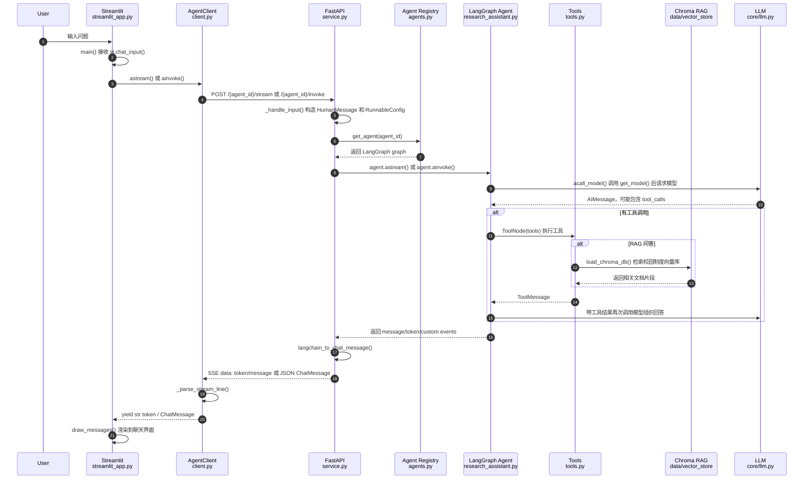

# 一次请求调用链路追踪

本文从 Streamlit 页面用户输入开始，追踪一次 Campus AI Agent 请求如何经过前端、client、FastAPI、Agent、Tool/RAG，最后返回页面展示。

## 涉及文件列表

```text
src/streamlit_app.py              # Streamlit 前端，接收输入、渲染输出
src/client/client.py              # AgentClient，封装 HTTP 请求
src/service/service.py            # FastAPI 后端路由、Agent 调用、SSE 流式响应
src/service/utils.py              # LangChain Message -> ChatMessage 转换
src/schema/schema.py              # UserInput / StreamInput / ChatMessage 等 schema
src/agents/agents.py              # Agent 注册中心，根据 agent_id 获取 graph
src/agents/research_assistant.py  # 默认校园智能助理 Agent，绑定工具并执行 LangGraph
src/agents/rag_assistant.py       # RAG 专用 Agent
src/agents/tools.py               # 课程、活动、学习计划、RAG 等工具定义
src/core/llm.py                   # get_model，根据配置创建 LLM
src/core/settings.py              # 环境变量和默认模型配置
data/campus/*.json                # 本地 mock 课程、活动、学生画像数据
data/vector_store/campus_policy   # 校园制度 Chroma 向量库
```

## 关键函数列表

```text
src/streamlit_app.py
- main()
- draw_messages()
- handle_feedback()
- handle_sub_agent_msgs()

src/client/client.py
- retrieve_info()
- ainvoke()
- invoke()
- astream()
- stream()
- _parse_stream_line()
- get_history()
- acreate_feedback()

src/service/service.py
- info()
- _handle_input()
- invoke()
- stream()
- message_generator()
- history()

src/agents/agents.py
- load_agent()
- get_agent()
- get_all_agent_info()

src/agents/research_assistant.py
- wrap_model()
- acall_model()
- safeguard_input()
- pending_tool_calls()

src/agents/tools.py
- get_course_schedule_func()
- get_campus_events_func()
- generate_study_plan_func()
- query_campus_policy_func()
- load_chroma_db()
- database_search_func()

src/service/utils.py
- langchain_to_chat_message()
- convert_message_content_to_string()
- remove_tool_calls()
```

## Mermaid 调用链路图



## 新手版解释

一次用户提问可以理解为：

```text
页面收到问题
    ↓
前端 client 发 HTTP 请求
    ↓
FastAPI 接住请求
    ↓
根据 agent_id 找到对应 Agent
    ↓
Agent 调用模型
    ↓
模型判断是否需要工具
    ↓
如果需要，ToolNode 执行工具
    ↓
如果是制度问答，工具会查 Chroma 向量库
    ↓
工具结果交回模型
    ↓
模型生成最终回答
    ↓
后端把结果流式返回给前端
    ↓
Streamlit 渲染消息
```

简单说，Streamlit 不直接调用大模型。它只负责页面输入输出。真正调用 Agent 的地方在 FastAPI 后端，真正决定是否调用工具的是 LangGraph Agent 和模型返回的 `tool_calls`。

## 1. 用户输入在哪里被接收？

用户输入在：

```text
src/streamlit_app.py
```

核心函数是：

```python
async def main() -> None
```

普通文本输入来自：

```python
user_input = st.chat_input()
```

如果启用了语音功能，则走：

```python
user_input = voice.get_chat_input()
```

收到输入后，前端会先把用户消息追加到：

```python
st.session_state.messages
```

并用：

```python
st.chat_message("human").write(user_input)
```

展示在页面上。

## 2. 前端如何把请求发送给后端？

前端通过 `AgentClient` 发送请求。

流式模式：

```python
stream = agent_client.astream(
    message=user_input,
    model=model,
    thread_id=st.session_state.thread_id,
    user_id=user_id,
)
await draw_messages(stream, is_new=True)
```

非流式模式：

```python
response = await agent_client.ainvoke(
    message=user_input,
    model=model,
    thread_id=st.session_state.thread_id,
    user_id=user_id,
)
```

也就是说，Streamlit 本身不拼 HTTP 请求，而是交给：

```text
src/client/client.py
```

里的 `AgentClient` 处理。

## 3. client 层封装了哪些请求方法？

`src/client/client.py` 中的 `AgentClient` 封装了这些方法：

```text
retrieve_info()       # GET /info，获取可用 Agent 和模型
invoke()              # 同步 POST /{agent}/invoke
ainvoke()             # 异步 POST /{agent}/invoke
stream()              # 同步 POST /{agent}/stream
astream()             # 异步 POST /{agent}/stream
get_history()         # POST /history
acreate_feedback()    # POST /feedback
```

流式方法会请求：

```text
POST /{agent}/stream
```

非流式方法会请求：

```text
POST /{agent}/invoke
```

流式响应由 `_parse_stream_line()` 解析。它会把后端 SSE 中的：

```text
data: {"type": "token", "content": "..."}
data: {"type": "message", "content": {...}}
data: [DONE]
```

转换成：

```text
str token
ChatMessage
结束信号
```

## 4. FastAPI 后端哪个路由接收请求？

后端路由在：

```text
src/service/service.py
```

流式请求由这里接收：

```python
@router.post("/{agent_id}/stream")
@router.post("/stream")
async def stream(user_input: StreamInput, agent_id: str = DEFAULT_AGENT)
```

非流式请求由这里接收：

```python
@router.post("/{agent_id}/invoke")
@router.post("/invoke")
async def invoke(user_input: UserInput, agent_id: str = DEFAULT_AGENT)
```

如果 URL 里没有指定 `agent_id`，默认使用：

```python
DEFAULT_AGENT = "research-assistant"
```

## 5. 请求体使用了哪些 Pydantic schema？

请求和响应 schema 在：

```text
src/schema/schema.py
```

非流式请求使用：

```python
class UserInput(BaseModel)
```

主要字段：

```text
message       # 用户输入
model         # 选择的模型
thread_id     # 多轮对话线程 ID
user_id       # 用户 ID
agent_config  # 额外 Agent 配置
```

流式请求使用：

```python
class StreamInput(UserInput)
```

它继承 `UserInput`，额外增加：

```text
stream_tokens # 是否流式返回 token
```

后端返回给前端的消息结构是：

```python
class ChatMessage(BaseModel)
```

用于统一表示：

```text
human message
ai message
tool message
custom message
```

## 6. 后端如何选择 Agent？

Agent 注册中心在：

```text
src/agents/agents.py
```

核心注册表是：

```python
agents: dict[str, Agent] = {
    "research-assistant": Agent(...),
    "rag-assistant": Agent(...),
    ...
}
```

后端拿到 `agent_id` 后调用：

```python
agent = get_agent(agent_id)
```

例如前端当前选择的是：

```text
research-assistant
```

则请求路径是：

```text
POST /research-assistant/stream
```

后端就会取出 `research_assistant` 这个 LangGraph graph。

## 7. Agent 如何执行？

默认 Agent 在：

```text
src/agents/research_assistant.py
```

执行入口不是普通函数调用，而是 LangGraph graph：

```python
research_assistant = agent.compile()
```

后端调用时：

流式：

```python
async for stream_event in agent.astream(...):
```

非流式：

```python
response_events = await agent.ainvoke(...)
```

执行流程大致是：

```text
guard_input
    ↓
model
    ↓
tools，如果有 tool_calls
    ↓
model
    ↓
END
```

`model` 节点对应：

```python
async def acall_model(...)
```

它会：

1. 通过 `get_model()` 获取模型
2. 调用 `wrap_model()`
3. 把 system prompt 和历史消息拼起来
4. 让模型生成回复
5. 如果模型返回 tool_calls，则进入工具节点

## 8. 如果发生工具调用，工具调用在哪里触发？

工具调用由模型返回的 `AIMessage.tool_calls` 触发。

判断位置在：

```python
def pending_tool_calls(state)
```

如果最后一条 AIMessage 有：

```python
last_message.tool_calls
```

则 LangGraph 路由到：

```python
ToolNode(tools)
```

工具节点定义在：

```python
agent.add_node("tools", ToolNode(tools))
```

工具列表在 `research_assistant.py` 中：

```python
tools = [
    web_search,
    calculator,
    get_course_schedule,
    get_campus_events,
    generate_study_plan,
    query_campus_policy,
]
```

工具具体实现都在：

```text
src/agents/tools.py
```

## 9. 如果是 RAG 问答，检索流程在哪里触发？

默认 `research-assistant` 中，校园制度类问题会优先调用：

```python
query_campus_policy
```

工具定义在：

```text
src/agents/tools.py
```

核心函数是：

```python
def query_campus_policy_func(query: str) -> str
```

它内部会调用：

```python
retriever = load_chroma_db()
documents = retriever.invoke(query)
```

`load_chroma_db()` 会加载：

```text
data/vector_store/campus_policy
```

并创建 Chroma retriever：

```python
chroma_db.as_retriever(search_kwargs={"k": 5})
```

所以 RAG 检索链路是：

```text
用户制度问题
    ↓
模型产生 query_campus_policy tool_call
    ↓
ToolNode 执行 query_campus_policy_func()
    ↓
load_chroma_db()
    ↓
Chroma retriever.invoke(query)
    ↓
返回相关制度片段
    ↓
模型基于工具结果组织最终回答
```

如果使用 `rag-assistant`，则对应工具是：

```python
database_search
```

它同样在 `tools.py` 中通过 `load_chroma_db()` 查询向量库。

## 10. 最终结果如何返回给 Streamlit 并展示？

### 流式模式

后端 `message_generator()` 从 Agent 收到 LangGraph events 后，会把消息转换成 SSE：

```text
data: {"type": "token", "content": "..."}
data: {"type": "message", "content": {...ChatMessage...}}
data: [DONE]
```

转换 `ChatMessage` 的函数是：

```python
langchain_to_chat_message()
```

位置：

```text
src/service/utils.py
```

client 层 `astream()` 逐行读取 SSE，并用：

```python
_parse_stream_line()
```

解析成：

```text
str token
ChatMessage
```

然后 Streamlit 调用：

```python
await draw_messages(stream, is_new=True)
```

`draw_messages()` 会：

- 如果收到 `str`，当作 token 追加到当前 AI 消息
- 如果收到 `ChatMessage(type="ai")`，渲染 AI 回复
- 如果收到 `ChatMessage(type="tool")`，渲染工具结果
- 如果收到 `ChatMessage(type="custom")`，渲染后台任务状态

### 非流式模式

后端 `invoke()` 返回一个最终的 `ChatMessage`。

前端收到后：

```python
messages.append(response)
```

然后用：

```python
st.chat_message("ai")
```

展示回答。

## 总结

一次完整请求的主路径是：

```text
src/streamlit_app.py
    main()
    ↓
src/client/client.py
    AgentClient.astream() / ainvoke()
    ↓
src/service/service.py
    stream() / invoke()
    ↓
src/service/service.py
    _handle_input()
    ↓
src/agents/agents.py
    get_agent(agent_id)
    ↓
src/agents/research_assistant.py
    agent.astream() / agent.ainvoke()
    ↓
src/agents/research_assistant.py
    acall_model()
    ↓
src/core/llm.py
    get_model()
    ↓
模型返回 AIMessage
    ↓
如果有 tool_calls
    ↓
src/agents/tools.py
    执行工具 / RAG 检索
    ↓
模型生成最终回答
    ↓
src/service/utils.py
    langchain_to_chat_message()
    ↓
src/client/client.py
    _parse_stream_line()
    ↓
src/streamlit_app.py
    draw_messages()
```

最关键的理解点是：

```text
Streamlit 负责输入输出
AgentClient 负责 HTTP 请求
FastAPI 负责接收请求和调用 Agent
agents.py 负责根据 agent_id 找 Agent
research_assistant.py 负责 LangGraph 推理流程
tools.py 负责具体工具和 RAG 检索
schema.py 负责前后端通信数据结构
```
