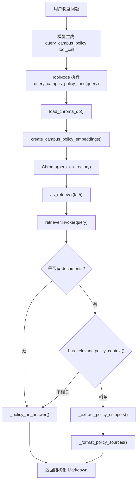

# Campus AI Agent 工具实现逻辑分析

本文重点分析 `src/agents/tools.py` 中 Campus AI Agent 的工具实现逻辑。

该文件是默认 Agent 工具能力的核心来源，主要负责：

- 数学计算
- mock 课程表查询
- mock 校园活动查询
- mock 学习计划生成
- 校园制度 RAG 检索
- 通用知识库检索

## 1. 工具总览表

| 工具名 | 对应函数 | 是否注册为 LangChain Tool | 数据来源 | 主要用途 |
| --- | --- | --- | --- | --- |
| `Calculator` | `calculator_func()` | 是 | 无，本地计算 | 数学表达式计算 |
| `get_course_schedule` | `get_course_schedule_func()` | 是 | `data/campus/course_schedule.json` | 查询课程表 |
| `get_campus_events` | `get_campus_events_func()` | 是 | `data/campus/campus_events.json` | 查询校园活动 |
| `generate_study_plan` | `generate_study_plan_func()` | 是 | `student_profile.json` + `course_schedule.json` | 生成学习计划 |
| `query_campus_policy` | `query_campus_policy_func()` | 是 | `data/vector_store/campus_policy` | 校园制度 RAG 问答 |
| `Database_Search` | `database_search_func()` | 是 | `data/vector_store/campus_policy` | RAG assistant 通用检索 |

## 2. 每个工具的输入输出

### `Calculator`

函数：

```python
def calculator_func(expression: str) -> str
```

参数：

| 参数 | 类型 | 说明 |
| --- | --- | --- |
| `expression` | `str` | numexpr 可执行的数学表达式 |

返回值：

```python
str
```

返回计算结果字符串。

注册方式：

```python
calculator: BaseTool = tool(calculator_func)
calculator.name = "Calculator"
```

### `get_course_schedule`

函数：

```python
def get_course_schedule_func(
    day: str | None = None,
    time_period: str | None = None,
    course_name: str | None = None,
) -> str
```

参数：

| 参数 | 类型 | 说明 |
| --- | --- | --- |
| `day` | `str | None` | 星期过滤，例如“周一”“Monday” |
| `time_period` | `str | None` | 时间段过滤，例如“上午”“下午”“晚上” |
| `course_name` | `str | None` | 课程名关键词，例如“数据结构” |

返回值：

```python
str
```

返回课程查询结果文本。

注册方式：

```python
get_course_schedule: BaseTool = tool(get_course_schedule_func)
get_course_schedule.name = "get_course_schedule"
```

### `get_campus_events`

函数：

```python
def get_campus_events_func(
    keyword: str | None = None,
    date_range: str | None = None,
    event_type: str | None = None,
    target_audience: str | None = None,
) -> str
```

参数：

| 参数 | 类型 | 说明 |
| --- | --- | --- |
| `keyword` | `str | None` | 活动关键词 |
| `date_range` | `str | None` | 日期范围，例如“今天”“明天”“本周”“最近” |
| `event_type` | `str | None` | 活动类型，例如“讲座”“比赛”“招聘” |
| `target_audience` | `str | None` | 适合人群关键词 |

返回值：

```python
str
```

返回活动查询结果文本。

注册方式：

```python
get_campus_events: BaseTool = tool(get_campus_events_func)
get_campus_events.name = "get_campus_events"
```

### `generate_study_plan`

函数：

```python
def generate_study_plan_func(
    goal: str | None = None,
    days: int = 7,
    available_time: str | None = None,
    focus_topics: str | None = None,
) -> str
```

参数：

| 参数 | 类型 | 说明 |
| --- | --- | --- |
| `goal` | `str | None` | 学习目标 |
| `days` | `int` | 计划天数，限制在 1 到 30 天 |
| `available_time` | `str | None` | 可用学习时间 |
| `focus_topics` | `str | None` | 重点学习主题 |

返回值：

```python
str
```

返回 JSON 字符串，不是 Python dict。

注册方式：

```python
generate_study_plan: BaseTool = tool(generate_study_plan_func)
generate_study_plan.name = "generate_study_plan"
```

### `query_campus_policy`

函数：

```python
def query_campus_policy_func(query: str) -> str
```

参数：

| 参数 | 类型 | 说明 |
| --- | --- | --- |
| `query` | `str` | 用户的校园制度问题 |

返回值：

```python
str
```

返回结构化 Markdown 文本。

注册方式：

```python
query_campus_policy: BaseTool = tool(query_campus_policy_func)
query_campus_policy.name = "query_campus_policy"
```

### `Database_Search`

函数：

```python
def database_search_func(query: str) -> str
```

参数：

| 参数 | 类型 | 说明 |
| --- | --- | --- |
| `query` | `str` | 检索问题 |

返回值：

```python
str
```

返回拼接后的检索上下文。

注册方式：

```python
database_search: BaseTool = tool(database_search_func)
database_search.name = "Database_Search"
```

## 3. calculator 是如何实现的？

`calculator_func()` 使用 `numexpr.evaluate()` 执行数学表达式。

核心逻辑：

```python
local_dict = {"pi": math.pi, "e": math.e}
output = str(
    numexpr.evaluate(
        expression.strip(),
        global_dict={},
        local_dict=local_dict,
    )
)
return re.sub(r"^\[|\]$", "", output)
```

关键点：

1. 只允许表达式访问 `local_dict`
2. `global_dict={}` 限制全局变量访问
3. 支持 `pi` 和 `e`
4. 用正则去掉结果外层可能出现的 `[]`
5. 如果计算失败，抛出 `ValueError`

这是规则计算，不涉及 LLM。

## 4. get_course_schedule 如何读取 course_schedule.json？

路径定义：

```python
CAMPUS_DATA_DIR = Path(__file__).resolve().parents[2] / "data" / "campus"
COURSE_SCHEDULE_PATH = CAMPUS_DATA_DIR / "course_schedule.json"
```

读取函数：

```python
def _load_course_schedule() -> list[dict]:
    with COURSE_SCHEDULE_PATH.open(encoding="utf-8") as f:
        data = json.load(f)
    if not isinstance(data, list):
        raise ValueError("course_schedule.json must contain a list of courses")
    return data
```

执行流程：

```text
打开 data/campus/course_schedule.json
    ↓
json.load(f)
    ↓
检查顶层是否是 list
    ↓
返回课程列表
```

## 5. get_course_schedule 如何过滤课程？

入口函数：

```python
get_course_schedule_func(day, time_period, course_name)
```

### 第一步：加载课程

```python
courses = _load_course_schedule()
```

### 第二步：标准化参数

```python
normalized_day = _normalize_day(day)
normalized_time_period = time_period.strip().lower() if time_period else None
normalized_course_name = course_name.strip().lower() if course_name else None
```

`_normalize_day()` 会把中文星期映射为英文：

```text
周一 / 星期一 / 礼拜一 -> monday
周二 / 星期二 / 礼拜二 -> tuesday
...
```

### 第三步：没有过滤条件时返回预览

如果 `day`、`time_period`、`course_name` 都为空：

```text
返回课程总数 + 前 5 门课程示例
```

### 第四步：逐条过滤

```python
for course in courses:
    course_day = str(course.get("day_of_week", "")).strip().lower()
    course_time_period = str(course.get("time_period", "")).strip().lower()
    course_title = str(course.get("course_name", "")).strip().lower()

    if normalized_day and course_day != normalized_day:
        continue
    if normalized_time_period and normalized_time_period not in course_time_period:
        continue
    if normalized_course_name and normalized_course_name not in course_title:
        continue

    matched_courses.append(course)
```

过滤规则：

| 条件 | 逻辑 |
| --- | --- |
| `day` | 精确匹配标准化后的星期 |
| `time_period` | 子串匹配 |
| `course_name` | 子串匹配 |

### 第五步：格式化结果

如果无结果：

```text
没有找到符合条件的课程
```

如果有结果：

```text
找到 N 门符合条件的课程：
- 课程名 | 星期 时间 | 教室 | 教师 | 类型 | 周次 | 备注
```

格式化函数是：

```python
_format_course(course)
```

## 6. get_campus_events 如何读取 campus_events.json？

路径定义：

```python
CAMPUS_EVENTS_PATH = CAMPUS_DATA_DIR / "campus_events.json"
```

读取函数：

```python
def _load_campus_events() -> list[dict]:
    with CAMPUS_EVENTS_PATH.open(encoding="utf-8") as f:
        data = json.load(f)
    if not isinstance(data, list):
        raise ValueError("campus_events.json must contain a list of events")
    return data
```

执行流程：

```text
打开 data/campus/campus_events.json
    ↓
json.load(f)
    ↓
检查顶层是否是 list
    ↓
返回活动列表
```

## 7. get_campus_events 如何过滤活动？

入口函数：

```python
get_campus_events_func(keyword, date_range, event_type, target_audience)
```

### 第一步：加载并排序活动

```python
events = sorted(_load_campus_events(), key=lambda event: (event["date"], event["start_time"]))
```

按照日期和开始时间排序。

### 第二步：标准化参数

```python
normalized_keyword = keyword.strip().lower() if keyword else None
normalized_event_type = event_type.strip().lower() if event_type else None
normalized_target_audience = target_audience.strip().lower() if target_audience else None
start_date, end_date = _get_date_range_bounds(date_range)
```

### 第三步：解析日期范围

`_get_date_range_bounds()` 支持：

```text
今天 / 今日 / today
明天 / tomorrow
本周 / 这周 / this week
最近 / 近期 / 近两周 / recent / upcoming
```

返回：

```python
tuple[date | None, date | None]
```

如果无法识别，则返回：

```python
(None, None)
```

### 第四步：没有过滤条件时返回近期预览

如果所有过滤条件都为空：

```text
返回活动总数 + 近期活动摘要
```

近期活动指：

```python
event_date >= date.today()
```

### 第五步：逐条过滤

```python
for event in events:
    event_date = _parse_event_date(event)
    title = str(event.get("title", "")).lower()
    keywords = " ".join(str(item) for item in event.get("keywords", [])).lower()
    description = str(event.get("description", "")).lower()
    current_event_type = str(event.get("event_type", "")).lower()
    current_target_audience = str(event.get("target_audience", "")).lower()

    if normalized_keyword and normalized_keyword not in f"{title} {keywords} {description}":
        continue
    if normalized_event_type and normalized_event_type not in current_event_type:
        continue
    if normalized_target_audience and normalized_target_audience not in current_target_audience:
        continue
    if start_date and end_date and not (start_date <= event_date <= end_date):
        continue

    matched_events.append(event)
```

过滤规则：

| 条件 | 逻辑 |
| --- | --- |
| `keyword` | 在 title、keywords、description 中做子串匹配 |
| `event_type` | 在 event_type 中做子串匹配 |
| `target_audience` | 在 target_audience 中做子串匹配 |
| `date_range` | 如果能解析，则判断活动日期是否在区间内 |

### 第六步：格式化结果

如果无结果：

```text
没有找到符合条件的校园活动
```

如果有结果：

```text
找到 N 个符合条件的校园活动：
- 标题 | 日期 时间 | 地点 | 类型 | 适合人群 | 主办方 | 报名方式 | 简介
```

格式化函数是：

```python
_format_event(event)
```

## 8. generate_study_plan 如何读取 student_profile.json 和 course_schedule.json？

### 读取 student_profile.json

路径：

```python
STUDENT_PROFILE_PATH = CAMPUS_DATA_DIR / "student_profile.json"
```

读取函数：

```python
def _load_student_profile() -> dict:
    with STUDENT_PROFILE_PATH.open(encoding="utf-8") as f:
        data = json.load(f)
    if not isinstance(data, dict):
        raise ValueError("student_profile.json must contain a student profile object")
    return data
```

### 读取 course_schedule.json

学习计划中会调用：

```python
_load_course_schedule()
```

主要用于 `_preferred_time_for_day()` 中判断当天课程，并在学习时间说明里写：

```text
已参考课程表，避开上课时间：...
```

## 9. generate_study_plan 是规则生成还是 LLM 生成？

当前 `generate_study_plan_func()` 是**规则生成**，不是 LLM 生成。

它没有调用模型，也没有调用 `get_model()`。

核心逻辑是：

```text
读取学生画像
    ↓
确定目标 goal
    ↓
确定计划天数 days，限制在 1 到 30
    ↓
确定 focus_topics
    ↓
确定起始日期
    ↓
逐天生成 daily_plan
    ↓
返回 JSON 字符串
```

### 计划天数限制

```python
normalized_days = max(1, min(int(days or 7), 30))
```

### 目标来源

```python
target_goal = goal or profile.get("current_goal") or "完成阶段性学习目标"
```

### 主题来源

如果用户传了 `focus_topics`，按分隔符拆分。

否则使用：

```python
profile.get("skills_to_improve", [])
```

如果学生画像中也没有，则默认：

```text
基础知识复习
项目实践
面试表达
```

### 学习时间来源

`_preferred_time_for_day()` 优先使用用户传入的 `available_time`。

如果没有，就读学生画像：

```python
profile.get("preferred_study_time")
```

同时会参考课程表，生成避开课程时间的提示。

### 返回格式

最终返回：

```python
json.dumps(plan, ensure_ascii=False, indent=2)
```

所以返回值是 JSON 字符串。

## 10. query_campus_policy 如何加载 Chroma 向量库？

相关路径：

```python
CAMPUS_POLICY_VECTOR_STORE_DIR = (
    Path(__file__).resolve().parents[2] / "data" / "vector_store" / "campus_policy"
)
```

Embedding 模型：

```python
CAMPUS_POLICY_EMBEDDING_MODEL = "sentence-transformers/paraphrase-multilingual-MiniLM-L12-v2"
```

加载流程在：

```python
def load_chroma_db():
```

核心代码：

```python
embeddings = create_campus_policy_embeddings()

chroma_db = Chroma(
    persist_directory=str(CAMPUS_POLICY_VECTOR_STORE_DIR),
    embedding_function=embeddings,
)

retriever = chroma_db.as_retriever(search_kwargs={"k": 5})
return retriever
```

其中 `create_campus_policy_embeddings()` 会创建：

```python
HuggingFaceEmbeddings(
    model_name=CAMPUS_POLICY_EMBEDDING_MODEL,
    model_kwargs={"device": "cpu"},
    encode_kwargs={"normalize_embeddings": True},
)
```

## 11. load_chroma_db 是否每次都会重新加载向量库？

是的。

当前代码中 `load_chroma_db()` 没有缓存。

每次调用：

```python
query_campus_policy_func()
```

或：

```python
database_search_func()
```

都会执行：

```python
retriever = load_chroma_db()
```

这意味着每次 RAG 工具调用都会重新：

```text
创建 HuggingFaceEmbeddings
创建 Chroma 对象
创建 retriever
```

这对性能不友好，后续适合加入缓存。

## 12. query_campus_policy_func 如何处理检索结果？

入口：

```python
def query_campus_policy_func(query: str) -> str:
```

### 第一步：加载 retriever

```python
retriever = load_chroma_db()
```

### 第二步：检索文档

```python
documents = retriever.invoke(query)
```

### 第三步：无结果处理

```python
if not documents:
    return _policy_no_answer("未检索到与该问题直接相关的校园制度文档片段。")
```

`_policy_no_answer()` 会返回统一 Markdown 模板：

```text
简要结论
依据说明
办理流程
注意事项
来源文档
```

### 第四步：相关性判断

```python
if not _has_relevant_policy_context(query, documents):
    return _policy_no_answer("当前检索结果与问题相关性不足，当前依据不足。")
```

`_has_relevant_policy_context()` 会用关键词组做简单相关性判断。

关键词组包括：

```text
请假 / 病假 / 事假
奖学金 / 评奖 / 挂科 / 综测
宿舍 / 晚归 / 大功率 / 电器
考试 / 作弊 / 缺考 / 缓考 / 旷考 / 纪律
学生手册
材料 / 证明
流程 / 申请 / 办理
```

### 第五步：抽取片段

```python
basis_snippets = _extract_policy_snippets(documents, "条件")
process_snippets = _extract_policy_snippets(documents, "流程")
note_snippets = _extract_policy_snippets(documents, "注意")
```

`_extract_policy_snippets()` 会：

```text
优先找包含指定 keyword 的行
如果找不到，就取文档前 3 行
最多返回 6 条
```

### 第六步：格式化来源

```python
_format_policy_sources(documents)
```

来源来自 doc metadata：

```text
source
chunk_id
```

### 第七步：返回 Markdown

返回结构：

```text
## 简要结论
## 依据说明
### 制度明确规定
### 建议性提醒
## 办理流程
## 注意事项
## 来源文档
```

## 13. RAG 工具执行流程图



## 14. 当前异常处理情况

### JSON 文件不存在

例如：

```text
course_schedule.json 不存在
campus_events.json 不存在
student_profile.json 不存在
```

当前代码没有显式 try/except。

会直接抛出：

```python
FileNotFoundError
```

### JSON 格式错误

当前代码没有捕获。

会直接抛出：

```python
json.JSONDecodeError
```

### JSON 顶层类型错误

有显式检查：

```python
if not isinstance(data, list):
    raise ValueError(...)
```

或：

```python
if not isinstance(data, dict):
    raise ValueError(...)
```

### JSON 字段缺失

部分地方使用 `.get()`，比较安全。

例如过滤逻辑：

```python
course.get("day_of_week", "")
event.get("title", "")
```

但格式化函数直接使用方括号：

```python
course["course_name"]
event["title"]
```

如果字段缺失，会抛出：

```python
KeyError
```

### 日期格式错误

活动日期解析：

```python
datetime.strptime(event["date"], "%Y-%m-%d").date()
```

如果格式错误，会抛出：

```python
ValueError
```

当前没有捕获。

### Chroma 加载失败

当前没有显式 try/except。

可能抛出：

```text
embedding model 加载失败
Chroma 目录不存在或损坏
依赖缺失
```

如果 `langchain_huggingface` import 失败，会被包装成：

```python
RuntimeError
```

其他 Chroma 异常会继续向上抛出。

### 检索为空

`query_campus_policy_func()` 有处理：

```python
if not documents:
    return _policy_no_answer(...)
```

这是当前 RAG 工具里比较完整的业务兜底。

## 15. 哪些工具适合后续做模板化响应？

适合模板化的工具：

| 工具 | 是否适合模板化 | 原因 |
| --- | --- | --- |
| `get_course_schedule` | 很适合 | 输出结构稳定：课程名、时间、地点、教师、类型、周次、备注 |
| `get_campus_events` | 很适合 | 输出结构稳定：标题、时间、地点、类型、报名方式 |
| `generate_study_plan` | 很适合 | 当前已经是结构化 JSON，可进一步标准化 schema |
| `query_campus_policy` | 很适合 | 已经按 Markdown 章节输出，可升级为统一 policy answer schema |
| `database_search` | 一般适合 | 当前只是拼接上下文，更适合给 RAG Agent 内部使用 |
| `Calculator` | 不太需要 | 输出单一数值或表达式结果 |

建议后续将工具返回从纯文本升级为结构化对象，例如：

```text
CourseSearchResult
CampusEventSearchResult
StudyPlanResult
PolicyAnswerResult
```

再由模型或前端统一渲染。

## 16. 哪些位置适合加入 Trace？

### 工具入口统一 Trace

适合记录：

```text
tool_name
input_args
start_time
end_time
duration_ms
success / failure
error_type
```

### `get_course_schedule_func()`

记录：

```text
过滤条件
课程总数
匹配数量
耗时
```

### `get_campus_events_func()`

记录：

```text
过滤条件
活动总数
匹配数量
日期范围解析结果
耗时
```

### `generate_study_plan_func()`

记录：

```text
goal
days
focus_topics
生成计划天数
是否使用 profile 默认值
耗时
```

### `query_campus_policy_func()`

记录：

```text
query
retrieved document count
source list
chunk_id list
是否通过相关性判断
耗时
```

### `load_chroma_db()`

记录：

```text
embedding model
vector store path
retriever k
加载耗时
是否命中缓存
```

## 17. 哪些位置适合加入异常兜底？

### JSON 读取函数

适合加入 try/except：

```text
_load_course_schedule()
_load_campus_events()
_load_student_profile()
```

兜底方向：

```text
文件不存在 -> 返回友好错误
JSON 格式错误 -> 返回数据格式错误
字段缺失 -> 返回数据不完整
```

### 格式化函数

适合增强：

```text
_format_course()
_format_event()
```

当前直接用 `course["field"]` 和 `event["field"]`，字段缺失会 `KeyError`。

可以改为 `.get()` 并给默认值。

### 日期解析函数

适合增强：

```text
_parse_event_date()
_get_date_range_bounds()
```

防止日期格式异常导致整个工具失败。

### RAG 相关函数

适合增强：

```text
create_campus_policy_embeddings()
load_chroma_db()
query_campus_policy_func()
database_search_func()
```

兜底方向：

```text
向量库不存在
embedding 加载失败
Chroma 初始化失败
检索超时
检索结果为空
```

## 18. 哪些位置适合加入缓存？

### `load_chroma_db()`

最适合缓存。

当前每次都会重新创建 embeddings、Chroma、retriever。

可优化为：

```text
首次加载 retriever
后续复用
```

### `_load_course_schedule()`

适合缓存。

课程表是本地 mock 静态 JSON，频繁读取文件没有必要。

### `_load_campus_events()`

适合缓存。

活动数据也是本地 JSON，可缓存后按需刷新。

### `_load_student_profile()`

适合缓存。

学生画像当前是静态 JSON。

### `create_campus_policy_embeddings()`

适合缓存。

embedding model 初始化成本较高。

## 19. 当前实现的风险点

### 1. 工具返回都是字符串

优点是简单，容易交给 LLM。

风险是：

```text
前端难以结构化展示
测试粒度较粗
后续模板化困难
```

### 2. JSON 数据字段依赖较强

格式化函数使用直接索引，字段缺失会报错。

### 3. RAG 每次重新加载

`load_chroma_db()` 没有缓存，可能影响响应速度。

### 4. RAG 相关性判断比较规则化

`_has_relevant_policy_context()` 基于关键词组判断，简单但不够语义化。

### 5. 日期逻辑依赖当前系统日期

`get_campus_events` 的“今天”“本周”“最近”基于：

```python
date.today()
```

如果 mock 活动日期固定，随着时间变化，查询结果可能变少或为空。

### 6. generate_study_plan 不是智能规划

当前是规则生成，不调用 LLM。

优点是稳定可控。

缺点是个性化和推理能力有限。

### 7. 异常没有统一包装

工具内部异常可能直接冒泡到 Agent / FastAPI 层。

## 20. 后续优化切入点

### 模板化响应

优先级：

```text
get_course_schedule
get_campus_events
generate_study_plan
query_campus_policy
```

方向：

```text
工具返回结构化 dict / Pydantic model
前端或模型统一渲染
保留 source 和 metadata
```

### Trace

优先级：

```text
query_campus_policy_func
load_chroma_db
get_course_schedule_func
get_campus_events_func
generate_study_plan_func
```

方向：

```text
记录输入参数
记录命中数量
记录耗时
记录异常
记录数据源
```

### 异常兜底

优先级：

```text
_load_course_schedule
_load_campus_events
_load_student_profile
load_chroma_db
query_campus_policy_func
```

方向：

```text
捕获文件错误
捕获 JSON 错误
捕获字段缺失
捕获 Chroma 错误
返回用户可理解的错误信息
```

### 缓存

优先级：

```text
load_chroma_db
create_campus_policy_embeddings
_load_course_schedule
_load_campus_events
_load_student_profile
```

方向：

```text
functools.cache
应用启动时预加载
可配置刷新
```

### RAG 优化

方向：

```text
增加 query rewrite
增加 reranker
优化 chunk size
增加 source citation
增强 metadata
缓存 retriever
改进相关性判断
```

## 21. 面试表达

可以这样描述 `tools.py`：

> `src/agents/tools.py` 是 Campus AI Agent 的工具实现层，里面把校园业务能力封装成 LangChain Tool。课程查询、活动查询和学习计划生成主要基于本地 JSON mock 数据，是规则型工具；校园制度问答基于本地 Chroma 向量库，是 RAG 工具。默认 Agent 在 `research_assistant.py` 中通过 `model.bind_tools(tools)` 将这些工具绑定给模型，模型生成 `tool_calls` 后由 LangGraph 的 `ToolNode` 执行对应工具。

更具体一点：

> `get_course_schedule` 和 `get_campus_events` 会读取本地 JSON，并根据用户传入的过滤条件做规则匹配；`generate_study_plan` 会读取学生画像和课程表，通过规则生成 JSON 格式学习计划；`query_campus_policy` 会加载 HuggingFace Embeddings 和 Chroma 向量库，检索相关制度文档，再按固定 Markdown 模板返回简要结论、依据说明、办理流程、注意事项和来源文档。当前实现简单清晰，但 RAG retriever 没有缓存，JSON 和 Chroma 异常缺少统一兜底，后续可以重点优化缓存、Trace、结构化返回和异常处理。

## 22. 总结

`tools.py` 的核心价值是把“校园业务能力”包装成 Agent 可调用的工具。

当前工具分为三类：

```text
1. 规则查询工具
   - get_course_schedule
   - get_campus_events

2. 规则生成工具
   - generate_study_plan
   - Calculator

3. RAG 检索工具
   - query_campus_policy
   - Database_Search
```

最重要的理解点：

```text
1. 工具本身不主动执行，只有模型产生 tool_calls 后才会被 ToolNode 调用
2. 课程、活动、学习计划都是基于本地 mock JSON 的规则逻辑
3. 学习计划不是 LLM 生成，而是规则生成后返回 JSON 字符串
4. RAG 工具每次调用都会重新 load_chroma_db，没有缓存
5. 当前异常处理不完整，文件缺失、字段缺失、Chroma 失败可能直接抛错
6. 后续最值得优化的是结构化返回、Trace、异常兜底和缓存
```
