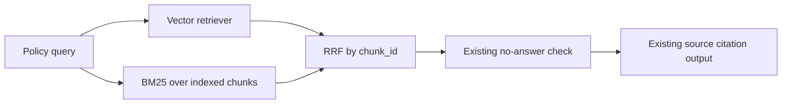

# Phase 3.4: Hybrid Retrieval (BM25 + Vector + RRF)

## 1. Why Vector Retrieval Alone Is Not Enough

校园制度问答既包含语义表达，也包含强关键词。例如“挂科 + 奖学金”“宿舍 + 晚归”“考试 + 作弊”中的制度名和行为词具有直接定位价值。向量检索适合处理同义表达和自然语言改写，但在精确制度词、短查询和关键词组合场景中，排名可能出现波动。

Phase 3.4 在保留原向量检索的基础上增加轻量 BM25 关键词通道，再使用 Reciprocal Rank Fusion (RRF) 合并两路排名。本阶段只改变检索候选的获得方式，不修改 no-answer 规则、来源引用格式、RAG prompt、chunk 策略或前端。

## 2. Design



`src/rag/hybrid_retriever.py` 提供四层能力：

| 能力 | 作用 |
| --- | --- |
| `tokenize_for_bm25()` | 对英文词与中文字符 bigram 做轻量 tokenization |
| `build_bm25_index()` / `bm25_search()` | 在制度 chunk 上计算关键词排名 |
| `reciprocal_rank_fusion()` | 按 `chunk_id` 去重并融合 vector / BM25 排名 |
| `hybrid_search()` | 执行两路检索并返回最终 top-k |

中文 bigram 不需要增加分词依赖，能够覆盖 `请假`、`挂科`、`奖学` / `学金`、`宿舍`、`晚归`、`考试`、`作弊` 等强制度词。它是可测试的基础版本，不等价于成熟中文搜索分词器。

## 3. BM25 Document Source

BM25 语料直接来自已经构建好的 Chroma collection：

- Chroma 的 `get(include=["documents", "metadatas"])` 读取 Phase 3.3 生成的 cleaned / heading-aware chunks。
- `load_bm25_documents()` 与 `load_bm25_index()` 使用进程内缓存，避免每次查询重复加载文档和重复建立 BM25 index。
- `clear_rag_cache()` 同时清理 embedding、vector retriever、BM25 文档和 BM25 index 缓存；知识库重建后应调用该函数或重启服务。

这一方案避免维护第二份 `documents.jsonl`，也保证 BM25 与向量检索使用同一批 chunk 和 metadata。

## 4. RRF Fusion and Metadata

Vector similarity score 与 BM25 score 不在同一数值尺度上，直接加权需要额外标定。RRF 只利用各路排名：

```text
hybrid_score(chunk) = sum(1 / (k + rank))
```

当前默认 `k=60`。同一个 `chunk_id` 如果同时被 vector 和 BM25 召回，会获得两路分数并在融合结果中只保留一次。

融合结果保留已有 metadata，并新增：

| 字段 | 含义 |
| --- | --- |
| `retrieval_source` | `vector`、`bm25` 或 `vector+bm25` |
| `hybrid_score` | RRF 融合分数 |
| `vector_rank` | 该 chunk 在向量结果中的排名，未命中时为空 |
| `bm25_rank` | 该 chunk 在 BM25 结果中的排名，未命中时为空 |

原有 `source`、`chunk_id`、`policy_type`、`section` 和 `heading_path` 均继续保留，可用于引用、trace 与质量分析。

## 5. Configuration

配置通过环境变量进入 `settings.py`：

| 配置项 | 默认值 | 用途 |
| --- | --- | --- |
| `RAG_RETRIEVAL_MODE` | `vector` | `vector` 保持原链路；`hybrid` 启用融合检索 |
| `RAG_TOP_K` | `5` | 最终返回给 no-answer / citation 链路的结果数量 |
| `RAG_VECTOR_K` | `5` | 向量候选数量 |
| `RAG_BM25_K` | `8` | BM25 候选数量 |

默认继续使用 `vector`，以保证部署升级时不自动改变在线排序。需要评估 Hybrid 时可配置：

```bash
RAG_RETRIEVAL_MODE=hybrid
RAG_TOP_K=5
RAG_VECTOR_K=8
RAG_BM25_K=8
```

## 6. Tool and Trace Integration

`query_campus_policy_func()` 与 `database_search_func()` 共享检索选择逻辑：

- `vector` 模式调用已缓存的 Chroma retriever，并保留原输出行为。
- `hybrid` 模式在相同向量检索旁执行 BM25，再使用 RRF 返回 documents。
- Phase 3.2 的低相关 no-answer 与来源引用仍在融合结果之后执行。

RAG trace 的 `retrieved_docs` 现在可记录 `retrieval_source`、`hybrid_score`、`vector_rank`、`bm25_rank` 以及 Phase 3.3 metadata，便于后续区分“来源命中”与“融合排序变化”。

## 7. Retrieval Quality Evaluation

`tests/rag/test_retrieval_quality.py` 保留 vector-only 黄金问题集 baseline，并新增 Hybrid 验证：

| 强关键词问题 | 期望来源 |
| --- | --- |
| 请假流程是什么？ | `leave_policy.md` |
| 挂科还能申请奖学金吗？ | `scholarship_policy.md` |
| 宿舍晚归怎么处理？ | `dormitory_policy.md` |
| 考试作弊有什么后果？ | `exam_policy.md` |

测试同时检查 `policy_type` 与融合 metadata，防止新检索通道破坏来源可解释性。正式性能对比应使用 request-level benchmark：

```bash
uv run python scripts/export_benchmark_run.py --name after_hybrid_retrieval --request-last 5
```

## 8. Limitations and Next Steps

当前实现有明确边界：

- BM25 中文 tokenization 是轻量字符 bigram 规则，不包含领域词典或分词优化。
- RRF 根据排名融合，没有使用 cross-encoder reranker 重新判断语义相关性。
- 默认仍为 vector 模式，启用 Hybrid 前应结合黄金问题集和 request-level benchmark 验证目标部署配置。
- 本阶段不处理增量索引；重建 Chroma 后需要清理缓存或重启服务。

下一阶段如增加 reranker，可以让 Hybrid 先提供高召回候选集，再用轻量 reranker 对 top-N 候选做相关性重排，同时继续以 `source`、`chunk_id`、`section` 和 no-answer 测试守住可信回答边界。

## 9. Interview Talking Points

我先通过向量检索与来源评估建立 baseline，再针对校园制度中的强关键词场景加入 BM25。向量检索负责语义召回，BM25 捕捉“挂科、奖学金、宿舍、晚归、作弊”等精确词，最后用 RRF 融合排名，避免直接混合不同尺度的分数。BM25 直接复用 Chroma 中经过清洗和标题切分的 chunks，并按 `chunk_id` 去重；融合结果记录检索来源和排名，继续经过 no-answer 与来源引用链路。这样优化的是召回稳定性，同时仍可通过黄金问题集和 Trace 证明来源没有退化。
