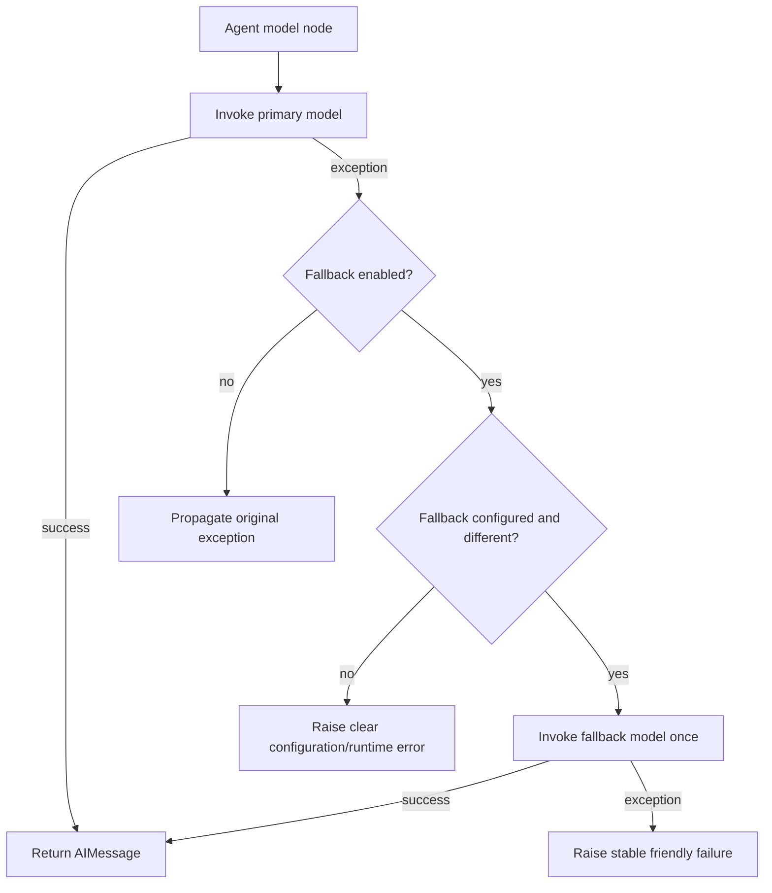

# Phase 4.1: Model Timeout, Retry and Fallback Strategy

## 1. Why Agent Reliability Needs Model Controls

Campus AI Agent 已具备 Trace、Fast Path 与 RAG 优化，但普通 Agent 和 RAG Agent 最终仍依赖外部模型服务。真实运行中，模型服务可能发生超时、瞬时连接错误、限流或供应商短时不可用。如果调用层没有统一边界，一次偶发故障会直接表现为请求失败，也难以从 Trace 中判断故障来自主模型还是候补链路。

Phase 4.1 聚焦模型可靠性：

- 将 temperature、timeout 和 provider 内部 retry 集中到配置层。
- 允许显式开启一个不同的 fallback model。
- 主模型调用失败时，最多执行一次 fallback 调用。
- 在 Trace 中记录模型尝试、故障与 fallback 触发情况。

本阶段不修改 RAG 检索、Hybrid 排序、Prompt Token Budget 或前端展示。

## 2. Environment Variables

| Variable | Default | Purpose |
| --- | ---: | --- |
| `MODEL_TIMEOUT_SECONDS` | `60.0` | 支持 timeout 的模型 provider 单次请求超时时间 |
| `MODEL_MAX_RETRIES` | `2` | 支持 retry 配置的 provider 内部重试上限 |
| `MODEL_TEMPERATURE` | `0.5` | 常规模型生成温度 |
| `ENABLE_MODEL_FALLBACK` | `false` | 是否在主模型失败后尝试候补模型 |
| `FALLBACK_MODEL` | 空 | 候补模型名称，类型与已有模型枚举一致 |

示例：

```env
MODEL_TIMEOUT_SECONDS=30.0
MODEL_MAX_RETRIES=1
MODEL_TEMPERATURE=0.3
ENABLE_MODEL_FALLBACK=true
FALLBACK_MODEL=claude-haiku-4-5
```

`FALLBACK_MODEL` 不绑定固定 provider，可配置为当前项目支持的任一可用模型。若设置 `ENABLE_MODEL_FALLBACK=true` 却没有配置 `FALLBACK_MODEL`，应用配置初始化会返回清晰错误，避免服务以无效容灾配置启动。

## 3. Provider Parameter Mapping

`src/core/llm.py` 继续作为模型构造入口，并根据 provider 支持能力传入配置：

| Provider group | Temperature | Timeout | Retry |
| --- | --- | --- | --- |
| OpenAI / OpenAI-compatible / DeepSeek / OpenRouter / Azure OpenAI | 支持 | `timeout` | `max_retries` |
| Anthropic | 支持 | `timeout` | `max_retries` |
| Groq | 支持；安全模型仍固定低温 | `timeout` | `max_retries` |
| Google Generative AI | 支持 | `request_timeout` | `retries` |
| Vertex AI | 支持 | 未强行注入 | `max_retries` |
| Bedrock / Ollama | 支持 | 未强行注入 | 未强行注入 |
| Fake model | 保持现有测试行为 | 不适用 | 不适用 |

未确认支持的参数不会被强行传入 provider，从而避免为统一形式破坏已有构造流程。

## 4. Fallback Flow

`research_assistant` 与 `rag_assistant` 的模型节点均调用共享的 `ainvoke_with_model_fallback()`：



关键边界：

- 主模型成功时不会构造或调用 fallback。
- Fallback 仅在主模型抛异常时触发。
- `FALLBACK_MODEL` 与 primary model 相同时停止，不会递归重试。
- Fallback 失败后不再继续切换，当前最多两次模型尝试。
- Provider 自己的 `MODEL_MAX_RETRIES` 与跨模型 fallback 是两层控制：前者处理同一 provider 的瞬时失败，后者处理主模型最终失败后的降级。

## 5. Trace Fields

`TraceRecord` 新增以下字段：

| Field | Meaning |
| --- | --- |
| `primary_model` | 本次模型节点最初选择的模型 |
| `fallback_model` | 实际尝试的候补模型；未触发时为空 |
| `fallback_triggered` | 是否实际进入候补调用 |
| `model_error` | 主模型错误，或主/候补均失败时的聚合说明 |
| `model_error_type` | 记录到的模型错误类型 |
| `model_attempt_count` | 该请求中累计执行的模型尝试次数 |
| `llm_time_ms` | 包含主调用及已执行 fallback 调用的模型节点耗时 |
| `prompt_tokens` / `completion_tokens` / `total_tokens` | 成功响应可取得 metadata 时继续累计 |

成功 fallback 的请求可以通过 `fallback_triggered=true` 与 `model_error` 看到“服务已恢复，但主模型发生过失败”，而不需要把恢复成功误记为请求整体错误。

## 6. Test Coverage

`tests/core/test_model_fallback.py` 覆盖：

- Settings 可读取 timeout、retry、temperature 和 fallback 配置。
- 开启 fallback 却未设置模型时会明确报错。
- `get_model()` 将可靠性配置传入 OpenAI 构造器。
- 主模型成功时不触发 fallback。
- 主模型失败且 fallback 关闭时不调用候补模型。
- 主模型失败且 fallback 开启时，`research_assistant` 与 `rag_assistant` 均只尝试一次候补模型。
- Fallback 与 primary 相同时不会循环调用。
- 主模型和 fallback 均失败时返回稳定错误。
- Trace 记录 `fallback_triggered`、`model_error`、`model_error_type` 与尝试次数。

原有 Agent Graph 测试继续验证工具闭环在没有失败时保持不变。

## 7. Limitations and Next Steps

当前策略刻意保持简单：

- 每次模型节点只允许一个 fallback model 和一次跨模型降级。
- 不基于响应质量、成本、限流类型或实时健康状态动态选模型。
- Token 使用量仍依赖 provider 返回 usage metadata。
- 流式请求能够通过现有请求 Trace 观察结果，但前端尚未展示 fallback 状态。

后续如进行模型成本统计，可扩展 Trace 记录每次 attempt 的模型、provider、token 数、延迟、单价快照与估算费用，并在 benchmark 导出中按 `primary_model` / `fallback_model` 聚合成本与恢复率。

## 8. Interview Talking Points

在完成性能与 RAG 优化之后，我进一步处理了外部模型服务的不确定性。我把 timeout、provider 内部 retry 和 temperature 统一配置化，并在两个核心 Agent 的模型节点抽出共享 fallback 执行器：主模型成功时零额外开销，主模型最终失败后才尝试一次不同的候补模型，候补失败则返回稳定错误，不会无限重试。与此同时，Trace 记录主模型、候补模型、失败类型、尝试次数与模型耗时，所以我不仅能说明系统“能降级”，还可以用数据分析降级触发率、延迟代价和后续成本。
