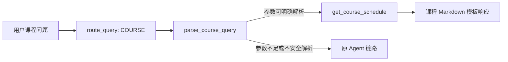
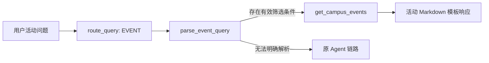

# Phase 2 Fast Path Optimization Summary

## 1. Background

Phase 1 先建立了 Agent Trace 与 Benchmark Run 留痕机制，使一次请求的路由、工具调用、LLM 耗时、总耗时和 token 消耗可以被记录并复盘。

基线数据暴露出的核心问题是：课程查询、校园活动查询属于基于本地结构化数据的确定性问题，但在优化前仍可能进入完整的 LLM / Agent 工具调用链路。对于同一组课程查询，before benchmark 中平均总耗时为 `3535.00 ms`，平均 LLM 耗时为 `3502.92 ms`，平均总 token 为 `5519.00`。这说明简单查表类请求的主要成本来自 LLM 决策与生成，而不是工具本身。

Phase 2 的思路不是替换 Agent，而是为能够可靠识别和解析的确定性查询增加 Fast Path：直接执行已有工具，再用稳定模板组织返回内容；识别或解析不充分时，继续交给原 Agent 处理。

## 2. Optimization Scope

| 查询类型 | Phase 2 处理方式 | 是否调用 LLM | 说明 |
| --- | --- | --- | --- |
| 课程查询 | `course_schedule_fast_path` | Fast Path 命中时否 | 直接调用 `get_course_schedule` |
| 校园活动查询 | `campus_event_fast_path` | Fast Path 命中时否 | 直接调用 `get_campus_events` |
| 学习计划 | 原 Agent 链路 | 是 | 本阶段不接 Fast Path |
| 校园制度 / RAG | 原 Agent / 检索链路 | 是 | 本阶段不改检索与回答策略 |
| 普通聊天与复杂语义问题 | 原 Agent 链路 | 是 | 保留通用能力与兜底行为 |

本阶段没有修改前端协议、RAG 实现、学习计划工具链或原 Agent Graph。Fast Path 是增量入口优化，不是业务能力替换。

## 3. Rule-based Router

规则路由集中在 `src/core/router.py`，提供了三个核心概念：

| 结构 | 作用 |
| --- | --- |
| `RouteIntent` | 统一表示 `course_schedule`、`campus_event`、`study_plan`、`campus_policy`、`general_chat`、`unknown` 六类意图 |
| `RouteDecision` | 返回意图、置信度、命中关键词、判断原因以及 `route_source="rule"` |
| `route_query(query)` | 对原始问题执行轻量规则匹配与优先级判断，不访问网络、不调用模型 |

Router 先以纯函数形式完成并测试，再接入 `service.py`，原因有三点：

1. 路由规则的输入输出清晰，可以先验证误路由边界，而不受 Agent 或接口状态影响。
2. 只有对确定性问题足够保守地识别，Fast Path 才能在降低成本的同时保持回答可靠性。
3. 纯规则模块出现覆盖不足时，会返回 `UNKNOWN` 或由 service 回退原 Agent，不阻断已有能力。

活动路由中特别限制了 `AI` 关键词：`AI` 单独出现不会直接命中校园活动，只有与“讲座”“活动”“比赛”“报名”等活动语境组合时才进入活动路径。因此“AI 是什么？”不会因关键词重合而错误查询活动数据。

## 4. Course Fast Path

课程 Fast Path 在 service 层调用 `parse_course_query(query)` 解析以下参数：

| 参数 | 可识别示例 | 工具参数用途 |
| --- | --- | --- |
| `day` | `周一`、`星期一` 至 `周五`、`星期五` | 按上课日期过滤 |
| `time_period` | `上午`、`下午`、`晚上` | 按时间段过滤 |
| `course_name` | `数据结构`、`操作系统` | 按课程名称过滤 |

当 `route_query()` 判断为 `COURSE`，且至少解析到 `day`、`time_period`、`course_name` 中一个可执行条件时，请求直接调用 `get_course_schedule` 底层函数，并使用课程响应模板返回结果。该路径不会执行原 Agent，也不会触发 LLM。

对于无法安全解析的情况，例如只有笼统课程意图而没有有效过滤参数，或者“今天 / 明天”无法准确映射到具体课表日期时，service 会回退原 Agent 链路，避免以过度简化的规则生成错误查询结果。

## 5. Campus Event Fast Path

校园活动 Fast Path 使用 `parse_event_query(query)` 解析活动查询条件：

| 参数 | 可识别示例 | 工具参数用途 |
| --- | --- | --- |
| `keyword` | `AI`、`人工智能`、`软件工程`、`报名`、`宣讲会` | 文本关键词过滤 |
| `event_type` | `讲座`、`比赛 / 竞赛`、`社团`、`招聘会` | 活动类型过滤 |
| `date_range` | `这周`、`本周`、`最近`、`今天`、`明天` | 时间范围过滤 |

当 Router 判断为 `EVENT` 且解析得到至少一个有效查询条件时，service 直接调用 `get_campus_events`，并套用活动响应模板。比如“这周有什么 AI 相关讲座？”可以进入 Fast Path；而“AI 是什么？”和“什么是 LangGraph？”不会被当作活动查询，仍进入原 Agent 路径。

## 6. Response Templates

Fast Path 的价值在于省去不必要的 LLM 调用，但原始工具字符串直接透传会让展示结构和用户体验不够稳定。`src/core/response_templates.py` 因此增加了轻量 Markdown 包装层：

| 模板能力 | 输出目标 |
| --- | --- |
| `format_course_fast_path_response()` | 展示“课程查询结果”、查询条件、工具结果和下一步提示 |
| `format_event_fast_path_response()` | 展示“校园活动查询结果”、查询条件、工具结果和下一步提示 |
| `format_fast_path_empty_result()` | 没有匹配数据时给出友好提示与调整条件建议 |
| `format_fast_path_error()` | 查询异常时返回可读提示，不暴露 traceback 等底层细节 |

这一层没有改变工具的数据读取和过滤逻辑，也没有额外引入 LLM。它将“低成本执行”与“稳定可展示回答”结合起来，为后续结构化工具返回与前端卡片化展示留下演进空间。

## 7. Trace and Benchmark Evidence

### Benchmark Sources

| 证据文件 | 用途 |
| --- | --- |
| `docs/optimization/benchmark_runs/2026-05-25_before_course_fast_path_same_questions.md` | 五个相同课程问题的优化前记录 |
| `docs/optimization/benchmark_runs/2026-05-25_after_course_fast_path_same_questions.md` | 五个相同课程问题的课程 Fast Path 后记录 |
| `docs/optimization/course_fast_path_comparison.md` | 课程同题前后汇总结论 |
| `docs/optimization/benchmark_runs/2026-05-25_after_phase2_fast_path_templates.md` | 模板化完成后活动 Fast Path 与 fallback 的实际记录 |

### Course Same-question Comparison

五个课程问题保持一致：

- 我周一上午有什么课？
- 我周一有什么课？
- 我周二下午有什么课？
- 数据结构课在哪里上？
- 操作系统课在哪里上？

| 指标 | Before | After | 变化 |
| --- | ---: | ---: | ---: |
| 平均 `total_latency_ms` | `3535.00` | `1.19` | 下降 `3533.81 ms`，约 `99.97%` |
| 平均 `llm_time_ms` | `3502.92` | `0.00` | 下降 `3502.92 ms` |
| 平均 `total_tokens` | `5519.00` | `0.00` | 平均节省 `5519.00` tokens |
| `course_schedule_fast_path` 命中数 | `0 / 5` | `5 / 5` | Fast Path 覆盖全部同题样本 |
| After `get_course_schedule` 调用数 | `-` | `5 / 5` | 工具查询能力被保留 |

Before 原始记录中有 `3 / 5` 条明确展示了 `get_course_schedule` 工具调用，另外 `2 / 5` 条工具字段为 `-`；因此只陈述原始 benchmark 能证明的范围。After 五条记录均为 `course_schedule_fast_path`，且均记录 `get_course_schedule`，`llm_time_ms`、`prompt_tokens`、`completion_tokens` 和 `total_tokens` 均为 `0`。

### Campus Event Observations

当前已有活动 Fast Path 命中后的真实记录，但尚未保存相同活动问题的 before benchmark。因此可以确认命中后的行为，不对活动前后下降比例作推断。

| Query | Route | Tool Calls | `total_latency_ms` | `llm_time_ms` | `tool_time_ms` | `total_tokens` | Error |
| --- | --- | --- | ---: | ---: | ---: | ---: | --- |
| 这周有什么 AI 相关讲座？ | `campus_event_fast_path` | `get_campus_events` | `1.21` | `0` | `0.94` | `0` | `-` |
| 最近有没有比赛可以报名？ | `campus_event_fast_path` | `get_campus_events` | `0.85` | `0` | `0.68` | `0` | `-` |

`TODO`：补充相同活动问题的 before benchmark，之后才能计算活动 Fast Path 的平均耗时与 token 下降比例。

### Fallback Evidence

同一份模板阶段 benchmark 中，“什么是 LangGraph？”记录为 `route=stream`，未进入校园活动 Fast Path；“挂科了还能申请奖学金吗？”记录为 `route=stream` 且调用 `query_campus_policy`。这与实现边界一致：非课程 / 非活动问题以及校园制度 RAG 问题仍走原 Agent / 检索链路。

## 8. Engineering Safety

| 测试文件 | 保护的行为 |
| --- | --- |
| `tests/core/test_router.py` | 路由意图、优先级、关键词元数据，以及 `AI` 单词不误命中活动 |
| `tests/service/test_course_fast_path.py` | 课程解析、`/invoke` 与 `/stream` Fast Path、Trace 零 token、无法解析时 fallback |
| `tests/service/test_event_fast_path.py` | 活动解析、`/invoke` 与 `/stream` Fast Path、非活动问题 fallback、Trace 行为 |
| `tests/core/test_response_templates.py` | 课程 / 活动 Markdown 模板、空结果与错误信息安全输出 |
| `tests/service/test_fast_path_templates.py` | service Fast Path 确实返回模板内容，且不重新调用 Agent / LLM |
| `tests/service/test_trace_metadata.py` | Trace 写入、正常与异常请求指标、SSE 与 RAG trace 元数据 |
| `tests/optimization/test_export_benchmark_run.py` | JSONL 到 Markdown benchmark 的汇总导出、空值与坏行处理 |

这些测试覆盖了“识别 -> 解析 -> 工具执行 -> 模板返回 -> Trace 留痕 -> Benchmark 导出”的主要保护面，同时保留 fallback 作为复杂问题的安全出口。

## 9. Limitations

1. 当前只优化课程与校园活动查询，学习计划仍通过原 Agent 处理。
2. RAG 制度问答仍使用原检索链路，本阶段没有做缓存、混合检索或 no-answer 策略调整。
3. Router 是规则驱动方式，复杂表达、隐含条件和长上下文问题仍需要 fallback 到 Agent。
4. 工具结果目前主要是字符串，模板层基于既有字符串包装，还不是完整结构化响应对象。
5. 课程有同题 before / after benchmark，活动目前只有 after 实际样本；活动性能收益的严格前后量化仍为 `TODO`。
6. 当前 benchmark 样本量较小，适合验证优化方向与功能边界，后续仍需要更系统的问题集与重复运行统计。

## 10. Interview Talking Points

在这个项目里，我没有直接凭感觉去优化 Agent，而是先在 Phase 1 建立 Trace 和可导出的 benchmark，确认简单课程查询在原链路中仍要承担完整 LLM 的耗时和 token 成本。随后我在 Phase 2 引入保守的 Rule-based Router，只对能够明确解析的课程和校园活动查询开启 Fast Path：直接调用原有工具，并通过模板化响应保证输出稳定；无法确认意图或参数时继续回退原 Agent，从而降低误路由风险。课程同题 benchmark 显示，Fast Path 命中后平均总耗时从 `3535.00 ms` 降到 `1.19 ms`，平均总 token 从 `5519.00` 降到 `0`，同时仍保留 `get_course_schedule` 的真实工具调用。活动查询也已观察到 Fast Path 下 LLM 与 token 为 `0` 的真实运行记录，后续会补齐同题 before 样本进行严格前后比较。
