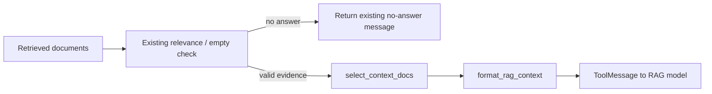

# Phase 3.5: Prompt Splitting and RAG Token Budget

## 1. Why Token Budget Follows Hybrid Retrieval

Phase 3.4 使用 Vector + BM25 + RRF 提升了制度类问题的召回稳定性。更高的候选召回能力并不意味着应将所有 chunk 全部放入 LLM 上下文：重复章节、长片段和排名靠后的补充证据会增加 `prompt_tokens`、响应耗时与模型注意力噪声。

Phase 3.5 将“检索候选集合”和“送给模型的 evidence context”拆开处理：

- 检索与 Hybrid 排序保持不变。
- no-answer 仍依据原检索结果与低相关规则判定。
- 只有有效 evidence 才进入 token budget 选择。
- 送入模型的上下文继续保留 `source` 与 `chunk_id`，不牺牲可追溯性。

## 2. Prompt Splitting

RAG 专用约束从 `rag_assistant.py` 中拆到 `src/prompts/rag_prompts.py`：

| Prompt fragment | 作用 |
| --- | --- |
| `RAG_POLICY_SYSTEM_PROMPT` | 要求制度回答只基于知识库上下文或用户资料 |
| `RAG_NO_ANSWER_INSTRUCTION` | 工具返回 no-answer 时禁止补充制度结论 |
| `RAG_SOURCE_CITATION_INSTRUCTION` | 有证据时保留 `source / chunk_id`，不虚构来源 |

`rag_assistant` 仍在系统消息中组合这三段约束，因此没有改变 Agent Graph 或工具调用闭环；拆分后的 prompt 更容易单独测试与后续迭代。

## 3. Context Selection Strategy

`src/core/token_budget.py` 提供轻量上下文控制：

| Function | Responsibility |
| --- | --- |
| `estimate_tokens(text)` | 以中文字符与非中文字符比例估算 token 数 |
| `trim_text_to_budget(text, max_chars)` | 裁剪过长 chunk，并附带可读截断提示 |
| `select_context_docs(docs, ...)` | 保持当前检索顺序选择 evidence，并限制数量与字符数 |
| `format_rag_context(docs)` | 格式化模型可见的 evidence context |

默认限制为：

| Budget | Default |
| --- | ---: |
| 最大上下文文档数 | `5` |
| 总格式化 context 字符数 | `6000` |
| 单个 chunk 字符数 | `1500` |

选择策略不重新排序 documents。Vector 或 Hybrid 返回的排名越靠前，就越先占用上下文预算；本阶段不引入 reranker，也不修改 RRF 排序逻辑。

## 4. Source and Chunk Preservation

每个保留的 evidence chunk 都复制原始 metadata，并在模型上下文中显式格式化：

```text
--- Source: leave_policy.md | Chunk: leave_policy.md::chunk-0001 | Section: 请假流程 | Heading Path: 学生请假制度 > 请假流程 | Policy Type: leave ---
<evidence text>
```

因此预算裁剪只减少低优先级或过长正文，不会丢失保留片段的 `source`、`chunk_id`、`section`、`heading_path` 与 `policy_type`。现有回答末尾的来源引用继续从进入上下文的 evidence 生成，避免引用模型没有看到的片段。

## 5. No-answer Safety

预算控制仅应用于通过相关性校验的 evidence documents：



空检索或低相关结果仍直接返回 Phase 3.2 的 no-answer 文案，包含“当前知识库中没有找到明确依据”和官方核验建议，不会被字符预算截掉安全提示。

## 6. Trace Metrics

RAG retrieval event 与请求级 Trace 现在可记录：

| Field | Meaning |
| --- | --- |
| `context_docs_count` | 实际进入模型上下文的 evidence 数量 |
| `context_chars` | 格式化 evidence context 的字符数 |
| `estimated_context_tokens` | 轻量估算的 evidence token 数 |
| `dropped_context_docs_count` | 被预算排除的已召回 documents 数量 |

这些字段与已有 `returned_doc_count`、`source_list`、`chunk_id_list` 和真实模型上报的 `prompt_tokens` 配合使用：

- `returned_doc_count` 观察检索召回规模。
- `context_docs_count` / `context_chars` 观察实际 prompt 输入规模。
- `prompt_tokens` / `total_tokens` 在真实请求 benchmark 中检验成本是否下降或更稳定。

## 7. Benchmark Approach

正式对比应使用 request-level 导出，避免 child retrieval event 混入汇总：

```bash
uv run python scripts/export_benchmark_run.py --name after_rag_token_budget --request-last 5
```

重点比较：

- `prompt_tokens` 是否下降或波动收窄。
- `total_tokens` 是否下降或波动收窄。
- `retrieved_docs`、`source_list` 与回答来源是否继续保留。
- `context_docs_count` 与 `dropped_context_docs_count` 是否符合预期。

本阶段没有生成新的真实请求 benchmark，因此不预先声称 token 已下降。

## 8. Test Coverage

| Test file | Coverage |
| --- | --- |
| `tests/core/test_token_budget.py` | token 估算、裁剪、文档数/字符预算、metadata 格式化、空输入 |
| `tests/agents/test_rag_prompt_budget.py` | 工具预算接入、Trace 指标、no-answer 保全、prompt fragment 组合 |
| `tests/agents/test_database_search_tool.py` | 增强上下文中的 source / chunk / section / heading / policy type |
| `tests/agents/test_rag_assistant.py` | 原有 model -> Database_Search -> model 链路兼容 |
| `tests/rag/test_retrieval_quality.py` | Vector 与 Hybrid 黄金问题来源召回保持通过 |

## 9. Limitations and Next Steps

当前 `estimate_tokens()` 是无依赖的近似估算，适合做预算保护和趋势观测，但不等同于具体 provider 的 tokenizer 结果。进一步优化可以：

- 根据实际所用模型接入对应 tokenizer，如 `tiktoken` 或 provider tokenizer。
- 将 budget 变为配置项，并结合真实 `prompt_tokens` benchmark 调整默认值。
- 在有评估集之后引入 reranker，对受限上下文预算下的 top-N evidence 做更精确选择。
- 增加答案引用覆盖评估，确认裁剪后每条确定性结论仍可对应来源片段。

## 10. Interview Talking Points

在 Hybrid Retrieval 提高召回后，我没有直接把更多片段交给 LLM，而是区分了“被召回的文档”和“真正进入 prompt 的证据”。我拆分了 RAG 约束 prompt，并在工具输出给模型前增加 token budget：沿用检索排序，限制文档数、单片段长度和总上下文字符，同时保留 `source` 与 `chunk_id`。no-answer 在预算之前判定，避免裁剪影响安全拒答。最后通过 Trace 同时记录召回规模与实际上下文规模，并保留黄金问题集测试，为真实 benchmark 中验证 `prompt_tokens` 变化提供依据。
