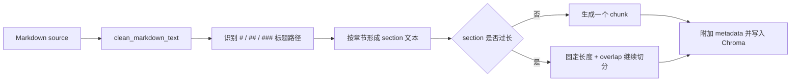

# Phase 3.3: RAG Document Cleaning and Metadata Enhancement

## 1. Why Clean Knowledge Base Documents

RAG 的回答质量不只取决于模型和检索器，也取决于索引输入是否稳定。校园制度 Markdown 文档中，多余空白、换行格式差异或缺少章节信息都会增加无意义的切片差异，使检索结果难以解释和比较。

Phase 3.3 将优化集中在离线建库层：

- 在写入索引前做保守的 Markdown 清洗。
- 以 Markdown 标题边界优先生成 chunk。
- 为每个 chunk 附加可用于引用和评估的 metadata。

本阶段不修改在线回答逻辑、RAG prompt、BM25、Hybrid Retrieval、rerank、增量索引或前端展示。

## 2. Markdown Cleaning

`src/rag/document_cleaner.py` 提供 `clean_markdown_text(text)`，只处理不会改变制度含义的格式噪声：

| 清洗规则 | 目的 |
| --- | --- |
| 去除首尾空白 | 避免首尾产生无意义内容 |
| 将 `CRLF` / `CR` 统一为 `LF` | 让不同环境构建出的文本一致 |
| 去除每行末尾多余空格 | 减少无意义 embedding 差异 |
| 将连续三个及以上空行合并为两个 | 保留段落分隔，同时避免空白膨胀 |

清洗不会删除 Markdown 标题、列表、引用或表格结构，也不会改写正文内容。

## 3. From Fixed-size to Heading-aware Chunking

此前 `build_campus_kb.py` 直接对整份文档做固定字符切分，chunk 能保留 `source` 与 `chunk_id`，但无法说明片段来自哪个章节。

当前 `src/rag/chunking.py` 提供两层策略：

1. `markdown_heading_chunk()` 先依据 `#` / `##` / `###` 标题建立章节边界与标题路径。
2. 如果某个章节文本超过 `chunk_size`，内部继续使用 `fixed_size_chunk()` 按原有字符长度与 overlap 切分。
3. 只有标题、没有自身正文的父章节不单独生成检索 chunk；其标题仍保留在子章节的 `heading_path` 中，避免空语义容器占用 top-k。



这样既保留制度章节的语义边界，也保留对长章节的长度控制。

## 4. Metadata Schema

每个索引 chunk 现在至少包含：

| 字段 | 示例 | 作用 |
| --- | --- | --- |
| `source` | `exam_policy.md` | 标识来源文档 |
| `path` | `/.../data/knowledge_base/exam_policy.md` | 本地核验定位 |
| `chunk_id` | `exam_policy.md::chunk-0003` | 文档内稳定递增片段编号 |
| `section` | `考试作弊处理流程` | 最近的 Markdown 标题 |
| `heading_path` | `考试纪律与缓考管理规定 > 四、办理流程或处理流程 > 考试作弊处理流程` | 标题层级上下文 |
| `policy_type` | `exam` | 制度分类标签 |

没有标题的文档仍可被切分，其 `section` 与 `heading_path` 均为 `未分节`。

## 5. Policy Type Mapping

`infer_policy_type(source)` 使用稳定文件名映射：

| Source | `policy_type` |
| --- | --- |
| `leave_policy.md` | `leave` |
| `exam_policy.md` | `exam` |
| `scholarship_policy.md` | `scholarship` |
| `dormitory_policy.md` | `dormitory` |
| `student_handbook.md` | `handbook` |
| 其他文件 | `general` |

`policy_type` 不是新的检索过滤逻辑，而是为质量评估、来源展示和未来可控检索策略准备的结构化信号。

## 6. Build Script Compatibility

`scripts/build_campus_kb.py` 保留现有入口与参数：

```bash
.venv/bin/python scripts/build_campus_kb.py
.venv/bin/python scripts/build_campus_kb.py --keep-existing
```

保持不变的行为包括：

- 默认知识库输入目录仍为 `data/knowledge_base`。
- 默认向量库输出目录仍为 `data/vector_store/campus_policy`。
- 默认 `chunk_size=800`、`chunk_overlap=120`。
- 默认全量重建，`--keep-existing` 继续保留已有目录并追加写入。

新增行为包括：

- `load_markdown_documents()` 在读取后调用 Markdown 清洗。
- `split_markdown_documents()` 改为 heading-aware 策略。
- 命令执行结束后额外输出每个 `source` 生成的 chunk 数量，便于留痕和检查文档切分规模变化。

## 7. Benefits for Citation and Retrieval Quality

增强 metadata 可以让来源解释从“某文件被召回”进一步走向“某制度中的某章节片段被召回”：

- `source` 与 `chunk_id` 支撑 Phase 3.2 已有来源引用。
- `section` 与 `heading_path` 便于后续展示具体制度章节，而不是只展示文件名。
- `policy_type` 可用于黄金问题集中的类别召回校验，也可为未来 Hybrid Retrieval 的过滤或融合评估提供维度。

当前测试在保留 `correct_doc_recall` 的同时，新增了 `correct_policy_type_recall` 断言，防止 metadata 增强过程中出现制度类别错误。

## 8. Test Coverage

| 测试文件 | 覆盖范围 |
| --- | --- |
| `tests/rag/test_document_cleaner.py` | 换行、空行、行尾空格与 Markdown 结构保留 |
| `tests/rag/test_chunking.py` | 标题切分、长章节继续切分、稳定 chunk ID、无标题兼容与 policy type 映射 |
| `tests/rag/test_build_campus_kb.py` | 清洗接入、增强 metadata 写入 Chroma、无空 chunk |
| `tests/rag/test_retrieval_quality.py` | 黄金问题 source 召回不下降，且 policy type metadata 命中正确 |

## 9. Limitations and Next Steps

当前 heading-aware 切分仍是规则版本：

- 只依据标准 Markdown 标题层级，不理解表格语义或跨章节关联。
- `section` / `heading_path` 已进入 metadata，但在线回答暂未专门展示章节路径。
- `policy_type` 目前用于标注与测试，不参与检索排序。
- 本阶段没有处理 BM25、Hybrid Retrieval、rerank 或增量索引。

进入 Hybrid Retrieval 前，建议继续补充 section-level 评估问题集，记录期望 `source`、`policy_type` 与可接受 `section`，并用 request-level benchmark 分离性能变化与召回质量变化。

## 10. Interview Talking Points

我在 RAG 优化中不仅关注在线调用耗时，也处理离线索引质量。原始 Markdown 直接固定长度切分时，虽然能够检索到文件，但很难解释命中了哪一章制度。我增加了保守文本清洗与 heading-aware chunking：先按标题保存章节语义，对过长章节再做长度切分，并为每个 chunk 附加 `source`、`chunk_id`、`section`、`heading_path` 和 `policy_type`。这样既增强了来源可追溯性，也为后续的 section-level 召回评估和 Hybrid Retrieval 准备了结构化基础；同时我用黄金问题集继续验证 source 与 policy type 召回没有退化。
