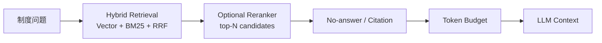

# Phase 3.6: RAG Reranker

## 1. Why Add a Reranker After Hybrid Retrieval

Hybrid Retrieval 的任务是提高召回：Vector 处理语义相近表达，BM25 捕捉“挂科 + 奖学金”“宿舍 + 晚归”“考试 + 作弊”等强关键词，RRF 将两路候选合并。它能找到更多可能相关的 chunk，但不等于最适合进入 LLM 上下文的 chunk 一定排在最前面。

Phase 3.6 在 Hybrid Retrieval 与 Token Budget 之间增加一个可选 reranker。它只对候选 chunk 重排，最终仍交给原有 no-answer、source citation 与 token budget 链路处理。



## 2. Responsibilities

| Layer | Responsibility | Does Not Do |
| --- | --- | --- |
| Hybrid Retrieval | 尽量召回正确来源的候选 chunks | 不精细判断最终 evidence 次序 |
| Reranker | 在候选中提升与 query、标题、制度类型最匹配的 chunks | 不新增检索来源、不改正文 |
| Token Budget | 控制最终进入模型的 context 数量和字符预算 | 不重新判断相关性 |

## 3. Lightweight Reranker Design

`src/rag/reranker.py` 第一版采用无新增模型依赖的 heuristic reranker：

- query 与 `page_content` 的 BM25 风格轻量 token 重合度；
- query 与 `section` / `heading_path` 的重合度，并提高标题信号权重；
- `policy_type` 与制度问题词的映射匹配，例如 `考试/作弊 -> exam`；
- 已有 `hybrid_score` 作为辅助信号。

每个被成功重排的 `Document` 会复制原 metadata 并增加 `rerank_score`。原有 `source`、`chunk_id`、`section`、`heading_path`、`policy_type`、`retrieval_source` 与 `hybrid_score` 均保留。

如果 reranker 执行异常，系统返回原候选顺序的前 `RAG_FINAL_TOP_K` 条，并在 metadata / Trace 中记录 `rerank_error`，不让可选优化阻断制度问答。

## 4. Configuration

| Environment Variable | Default | Meaning |
| --- | ---: | --- |
| `ENABLE_RAG_RERANKER` | `false` | 是否启用重排；默认关闭以保持现有线上行为 |
| `RAG_RERANK_TOP_N` | `10` | 进入 reranker 的候选数量 |
| `RAG_FINAL_TOP_K` | `5` | 重排后交给 no-answer 与 token budget 的最大文档数 |
| `RAG_RERANKER_MODEL` | empty | 预留可选模型标识；当前轻量实现不强制加载模型 |

启用示例：

```bash
RAG_RETRIEVAL_MODE=hybrid
ENABLE_RAG_RERANKER=true
RAG_RERANK_TOP_N=10
RAG_FINAL_TOP_K=5
```

关闭时，工具检索链路沿用原有结果顺序和 `RAG_TOP_K`，不会因为新增模块改变默认回答行为。

## 5. Trace Fields

RAG retrieval event 与请求级 Trace 可记录：

| Field | Meaning |
| --- | --- |
| `reranker_enabled` | 本次检索是否启用了 reranker |
| `rerank_input_count` | 参与重排的候选 chunk 数 |
| `rerank_output_count` | 重排后保留的 chunk 数 |
| `rerank_latency_ms` | reranker 的执行时间 |
| `rerank_error` | 降级时的错误信息 |
| `reranked_source_list` | 重排后来源列表 |
| `reranked_chunk_id_list` | 重排后 chunk 标识列表 |

`retrieved_docs` 中还会保留 `rerank_score`，可和已有 `retrieval_source`、`hybrid_score` 一起分析排序变化。

## 6. Verification and Benchmark

本阶段测试覆盖：

- 默认关闭时保持原顺序；
- 开启时根据 evidence 与标题/制度类型信号重排；
- 重排后 metadata 与来源字段不丢失；
- `top_k` 限制生效；
- reranker 失败时安全降级；
- Hybrid 黄金问题集在启用 reranker 后正确 source 仍位于 top-k。

正式 benchmark 建议对同一组制度问题分别采集关闭与开启 reranker 的 request-level trace：

```bash
uv run python scripts/export_benchmark_run.py --name before_rag_reranker --request-last 5
uv run python scripts/export_benchmark_run.py --name after_rag_reranker --request-last 5
```

重点比较：

- 正确来源在 top-k 和 top-1 中的稳定性；
- `rerank_latency_ms` 增量；
- `context_docs_count`、`prompt_tokens` 与 `total_tokens` 是否更稳定；
- no-answer 与来源引用是否仍保持正确行为。

## 7. Limitations

- 当前知识库与黄金问题集规模较小，reranker 的收益可能有限。
- 当前为轻量规则打分，不是 cross-encoder 语义重排模型。
- `RAG_RERANKER_MODEL` 为后续扩展位，当前没有下载或加载外部大模型。
- 后续若接入 cross-encoder，应继续保留异常降级、来源测试与 request-level benchmark。

## 8. Interview Talking Points

在完成 Vector + BM25 + RRF 后，我把“召回更多候选”和“选择最值得交给 LLM 的证据”拆成两个职责。Hybrid Retrieval 解决召回稳定性，Reranker 在它返回的 top-N chunks 上使用正文关键词、Markdown 标题、`policy_type` 和已有融合分数重排，再由 Token Budget 控制 prompt 成本。第一版选择轻量实现并默认关闭，避免引入模型下载成本和线上行为变化；启用后通过 Trace 记录输入数量、延迟、重排后的来源和 chunk，并用 retrieval quality 黄金问题集验证正确来源没有退化。这样既能逐步提升 evidence 质量，也保留了可观测、可回退的工程边界。
