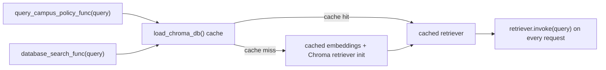

# Phase 3.1: RAG Retriever Cache and Trace Enhancement

## 1. Why Cache the Retriever

校园制度 RAG 的每次用户查询都必须执行向量检索：只有将当前问题传给 `retriever.invoke(query)`，才能得到针对该问题的制度片段。这部分是必要成本。

优化前，`query_campus_policy_func()` 与 `database_search_func()` 每次调用都会经过 `load_chroma_db()`，重新创建本地 embedding 对象、重新连接持久化 Chroma 并重新构造 retriever。Phase 1 的真实 Trace 已观察到制度查询存在较高检索链路耗时，因此 Phase 3.1 先移除这部分重复初始化成本，而不改变检索内容与回答行为。

## 2. Necessary Cost vs Repeated Cost

| 环节 | 是否每次查询必须执行 | Phase 3.1 处理 |
| --- | --- | --- |
| 用户 query 进入 retriever | 是 | 每次仍执行 `retriever.invoke(query)` |
| 向量相似度检索 | 是 | 不改变 |
| 文档格式化 / 既有 no-answer 判断 | 是 | 不改变 |
| 创建 HuggingFace embedding 对象 | 否 | 缓存单实例 |
| 连接持久化 Chroma 并创建 retriever | 否 | 缓存单实例 |

该优化面向服务进程内的重复请求。首次冷查询仍需承担本地 embedding 与 Chroma 初始化成本，后续热查询复用已构造的资源。

## 3. Cached Objects

缓存实现位于 `src/agents/tools.py`，使用轻量的 `functools.lru_cache(maxsize=1)`：

| 函数 | 缓存对象 | 作用 |
| --- | --- | --- |
| `create_campus_policy_embeddings()` | 本地 HuggingFace embedding 实例 | 避免重复加载 embedding 模型对象 |
| `load_chroma_db()` | 基于 Chroma 创建的 retriever | 避免重复连接向量库与重复创建检索器 |

两个 RAG 工具共享同一个 retriever 缓存：

- `query_campus_policy_func()`：默认 Agent 中的校园制度工具，保留当前组织化回答格式。
- `database_search_func()`：RAG 专用 Agent 的底层上下文检索工具，保留当前 `format_contexts()` 输出格式。



## 4. Cache Invalidation

新增 `clear_rag_cache() -> None`，用于清除 embedding 与 Chroma / retriever 缓存：

```python
from agents.tools import clear_rag_cache

clear_rag_cache()
```

应在以下场景调用该函数，或直接重启服务进程：

1. 重新构建或替换 `data/vector_store/campus_policy` 下的知识库索引之后。
2. 修改 embedding 模型配置后。
3. 测试需要隔离缓存状态时。

当前没有实现自动监听索引目录变化；因此知识库更新后若既不清缓存也不重启进程，运行中的 retriever 仍可能持有更新前的资源状态。

## 5. RAG Trace Metrics

Phase 3.1 保留已有 `rag_retrieval` 子事件，并将资源加载耗时与真实检索耗时拆分：

| 字段 | 含义 | 记录位置 |
| --- | --- | --- |
| `query` | 本次制度查询原文 | 查询事件 |
| `rag_load_time_ms` | 获取缓存 retriever 的耗时；冷请求包含初始化成本 | 查询事件与请求聚合记录 |
| `retrieval_time_ms` | 每次 `retriever.invoke(query)` 的执行耗时 | 查询事件与请求聚合记录 |
| `returned_doc_count` | retriever 返回文档数 | 查询事件 |
| `source_list` | 返回文档中的 `source` 列表 | 查询事件 |
| `chunk_id_list` | 返回文档中的 `chunk_id` 列表 | 查询事件 |
| `retrieved_docs` | source / path / chunk_id 元数据集合 | 查询事件与请求聚合记录 |
| `is_empty_result` | 是否没有召回文档 | 查询事件 |
| `error_message` | 初始化或检索异常信息 | 异常事件及请求记录 |

`load_chroma_db` 自身只会在缓存未命中、真正发生初始化时执行并产生初始化子事件。两个工具每次调用仍产生查询检索事件，因此可以区分冷启动成本、热请求检索成本和空结果 / 异常情况。

## 6. Behavior Kept Stable

本阶段只做资源复用和观测增强，没有改变下列行为：

- 没有修改 `query_campus_policy_func()` 的用户可见回答格式。
- 没有修改 `database_search_func()` 的上下文输出格式。
- 没有修改空检索结果的现有处理方式。
- 没有修改 RAG prompt、文档 chunk、metadata 或召回算法。
- 没有引入 BM25、Hybrid Retrieval 或前端展示变化。

## 7. Benchmark Comparison Plan

后续可用固定的制度问题集分别采集冷启动与热请求 benchmark：

| 类别 | 示例问题 | 对比重点 |
| --- | --- | --- |
| 请假制度 | 请假流程是什么？ | `rag_load_time_ms`、`retrieval_time_ms`、召回 source |
| 奖学金制度 | 挂科还能申请奖学金吗？ | 热请求耗时与 `scholarship_policy.md` 召回保持 |
| 宿舍制度 | 宿舍晚归怎么处理？ | 热请求耗时与来源稳定性 |
| 考试制度 | 考试作弊有什么后果？ | 热请求耗时与 `exam_policy.md` 召回保持 |
| 跨制度问题 | 生病缺考怎么办？ | 多个可接受来源的召回不下降 |

建议记录方式：

1. 调用 `clear_rag_cache()` 后运行一轮，记录冷启动基线。
2. 不清缓存重复运行同一问题集，记录热请求表现。
3. 对比 before / after 的 `rag_load_time_ms`、`retrieval_time_ms`、`total_latency_ms` 与召回 source。
4. 始终同时运行 `tests/rag/test_retrieval_quality.py`，保证性能变化没有牺牲黄金问题的正确文档召回。

### Benchmark Export Selection

`--last N` 保留原有行为，适合查看日志末尾的原始 trace 窗口，其中可能同时包含 request 与 RAG child event。正式做优化前后对比时，建议使用 `--request-last N`，让报告稳定选择最近的 request-level 请求，避免 child event 占用样本窗口：

```bash
.venv/bin/python scripts/export_benchmark_run.py \
  --name after_rag_retriever_cache_request_level \
  --request-last 5
```

`--request-only --last N` 也会排除 child event，再取最近 `N` 条请求；`--request-last N` 的意图更直接，推荐作为后续正式 benchmark 的默认写法。若当前 trace 中可用 request 数少于目标数量，导出的 Run Metadata 会同时展示请求数量差异并给出说明。

## 8. Future Work

Phase 3.1 刻意不处理回答质量与召回策略。后续可在独立阶段评估 no-answer 行为、Markdown 标题切分、metadata 增强、检索评估扩展或 Hybrid Retrieval；这些改动需要各自的召回质量与回答质量基线，不能与本次缓存收益混为一谈。
